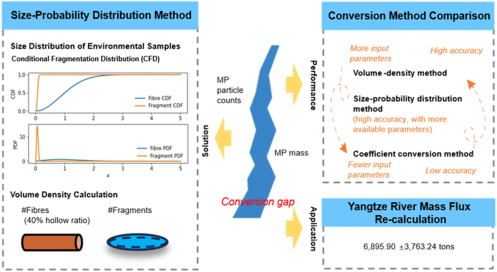
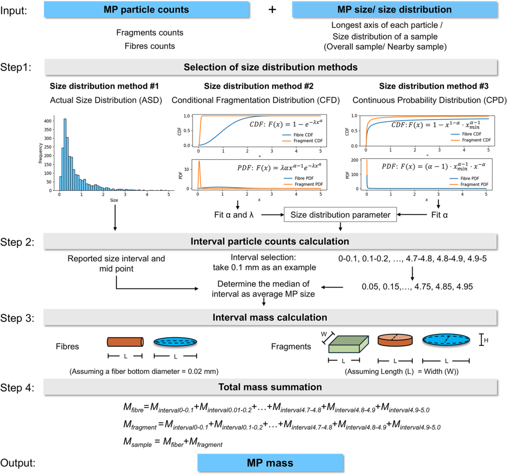
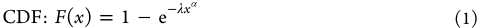
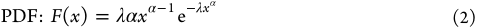
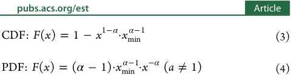
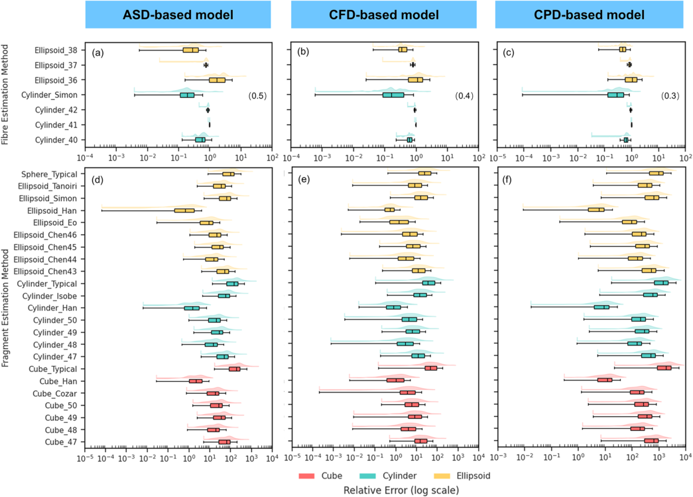
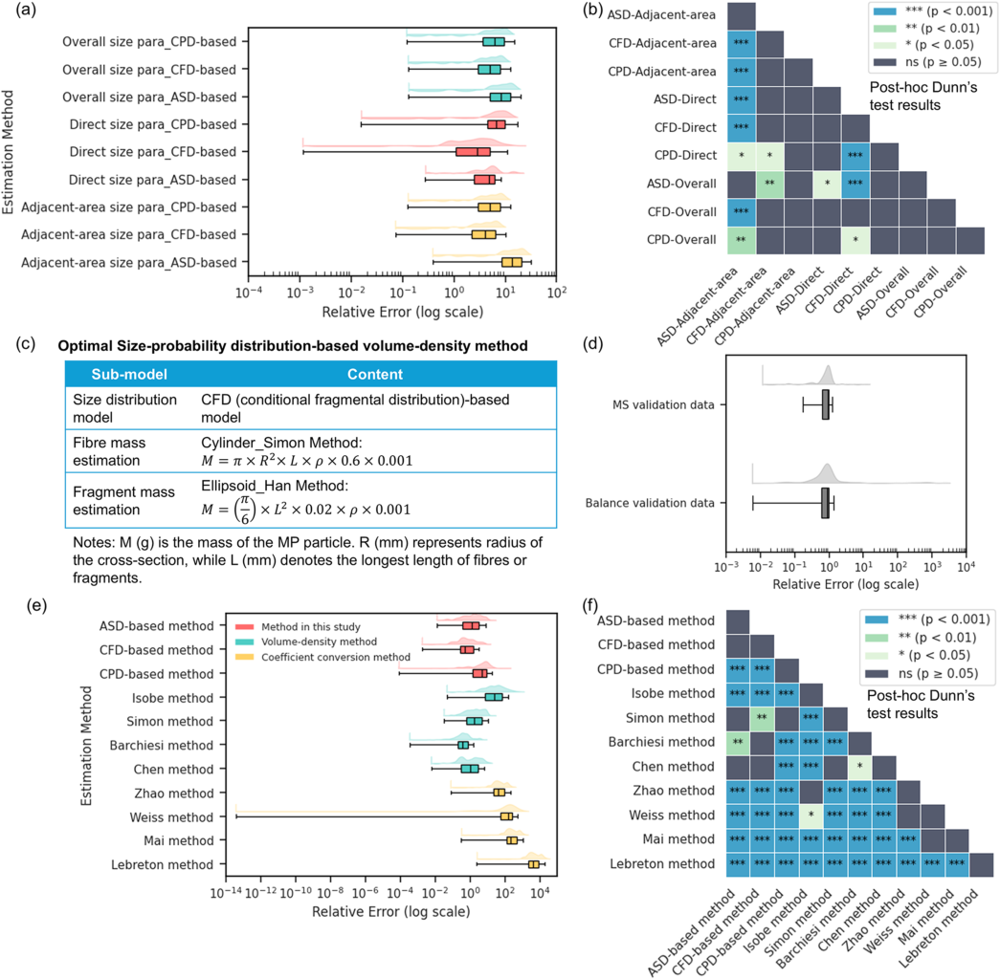
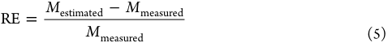
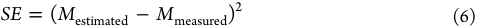

Article 

**[Image: Chen_et_al._-_2026_-_An_Accurate_Size-Probability_Distribution_Method_for_Converting_Microplastic_Counts_to_Mass.pdf-0001-02.png (367x143, 10.5KB)]**

pubs.acs.org/est 

## **An Accurate Size-Probability Distribution Method for Converting Microplastic Counts to Mass** 

Hongyu Chen, Jianguo Tao, Teng Wang, Yongcheng Ding, Yuyang Song, Kyle Weston, Feng Yuan, Guanghe Fu, David Taylor,* and Xinqing Zou* 

**Cite This:** _Environ. Sci. Technol._ 2026, 60, 1263−1274 

**Read Online** 

**[Image: Chen_et_al._-_2026_-_An_Accurate_Size-Probability_Distribution_Method_for_Converting_Microplastic_Counts_to_Mass.pdf-0001-08.png (999x28, 8.4KB)]**

**----- Start of picture text -----** 
ACCESS Metrics & More Article Recommendations * sı Supporting Information **----- End of picture text -----** 

ABSTRACT: Microplastic (MP) mass is a key metric for understanding transport and fate of MPs in the environment, yet reliable estimation methods remain limited, particularly when detailed morphological data are unavailable. To address this, a sizeprobability distribution method is proposed that integrates empirical size distribution characteristics with volume-density models. The optimal configuration was identified by combining a conditional fragmentation distribution (CFD)-based size model with suitable volume approximations and evaluating it against measured mass from balance and mass spectrometry data. This method outperformed coefficient-based conversion approaches and achieved comparable accuracy with the results of direct volumedensity calculations. When applied to empirical MP data from the 

**[Image: Chen_et_al._-_2026_-_An_Accurate_Size-Probability_Distribution_Method_for_Converting_Microplastic_Counts_to_Mass.pdf-0001-10.png (497x272, 69.3KB)]**

Yangtze River, the method estimated annual mass fluxes ranging from 1950.00 to 12,655.58 tons, with a mean of 6895.90 ± 3763.24 tons. Overall, the proposed method provides a reliable and efficient means of estimating MP mass from particle counts data, yielding accurate, comparable mass estimates across different size classes. 

KEYWORDS: _microplastic pollution, monitoring methodology, particle size distribution, volume-density conversion, Yangtze River Basin_ 

## **1. INTRODUCTION** 

Global plastic production reached a record high of 413.80 million tons in 2023, with over 90% derived from fossil-based sources that are difficult to degrade.[1] Mass plastic production has significantly improved the quality of life, while being the source of severe environmental challenges.[2] Microplastics (MPs)�plastic debris smaller than 5 mm�can be classed as an emerging pollutant, posing serious threats to environmental and human health,[3][,][4] as well as altering biogeochemical cycling.[5] Given that plastics and MPs will remain in use for the foreseeable future, understanding their environmental transport and flux is essential for effective management.[6] This requires accurate and cost-effective means of environmental quantification. 

Particle counts and mass are two fundamental metrics for characterizing the concentration of environmental MPs.[7] However, results expressed in terms of number and mass can differ significantly. For instance, in the upper reaches of the Yangtze River, MP flux peaks in autumn and winter when measured by count, but in summer when measured by mass.[8] This discrepancy is caused by variations in particle size, shape, and density across samples. Organisms such as filter-feeding animals are particularly vulnerable to MP quantity, as they tend to ingest numerous small particles rather than a few larger ones.[9] Quantification by count, or concentration in terms of 

number per unit volume is widely used in empirical studies because it directly reflects the ingestion risk of MPs, providing valuable insights into their ecological impacts.[10] Additionally, it is more suited to techniques utilizing laboratory approaches that are relatively straightforward such as microscopy, Fourier Transform Infrared spectroscopy (FTIR), and Raman spectroscopy.[11] In contrast, MP mass is less frequently reported, as the lightweight nature of MPs makes direct measurement with a balance challenging,[12] although recent advances in mass spectrometry techniques are promising.[13] Nevertheless, the mass of MPs is equally, if not more, important than raw numbers, as it remains unaffected by the fragmentation process, making it a more stable parameter for assessing MP pollution levels and transport flux.[14] Furthermore, expressing environmental MP levels as mass accords with toxicology experiments, which typically use mass-based concentrations.[15] 

Various conversion methods have been employed to estimate mass from particle counts. One common approach 

**[Image: Chen_et_al._-_2026_-_An_Accurate_Size-Probability_Distribution_Method_for_Converting_Microplastic_Counts_to_Mass.pdf-0001-18.png (80x121, 18.2KB)]**

Received: September 2, 2025 Revised: December 17, 2025 Accepted: December 18, 2025 Published: December 25, 2025 

https://doi.org/10.1021/acs.est.5c12243 _Environ. Sci. Technol._ 2026, 60, 1263−1274 

© 2025 American Chemical Society 

**1263** 

**Environmental Science & Technology pubs.acs.org/est** 

Article 

**[Image: Chen_et_al._-_2026_-_An_Accurate_Size-Probability_Distribution_Method_for_Converting_Microplastic_Counts_to_Mass.pdf-0002-02.png (1045x981, 241.4KB)]**

Figure 1. Workflow for the size-probability distribution method for converting the number of MP particles to their mass equivalent. (The illustrated size distribution is based on a surface water sample from the Yangtze River, used in the case study). 

involves multiplying by an assumed average MP mass.[16] However, current estimations of average mass vary by up to 3 orders of magnitude, ranging from 0.001 mg to 3 mg per fragment, with fibers often treated separately in only a few studies.[16][−][19] These discrepancies, combined with methodological uncertainties, can lead to substantial differences in results, as is evident in estimates of global riverine plastic flux into the ocean.[16][,][20][,][21] Given the substantial variation in the physical characteristics of MPs across different environments, average mass values cannot be directly applied in comparisons between sites. The volume-density method is another widely used approach that approximates MPs as idealized threedimensional geometric shapes, such as cylinders, ellipsoids, or cubes.[22][−][24] It requires measuring multiple parameters of MP particles�including longest length, shortest length, circum� ference, cross-sectional area, etc before estimating volume by 

incorporating height.[25][−][27] This method is labor-intensive and time-consuming, however. Despite their widespread use, neither of these approaches offers a standardized or scalable framework that balances practicality with accuracy. 

A simpler and more efficient method of quantifying MPs in the environment through the accurate conversion of MP counts into MP mass would be of great value, including for flux estimation. The size of MPs is directly linked to their mass, and their size distribution often follows a power-law or Weibull distribution pattern. Such relationships can be effectively described using probability models.[28][−][30] However, limited attention has been paid to probabilistic approaches that account for size distributions in estimating total mass. To address this gap, here we introduce a volume-density method incorporating size-probability distribution that is validated 

**1264** 

https://doi.org/10.1021/acs.est.5c12243 _Environ. Sci. Technol._ 2026, 60, 1263−1274 

**Environmental Science & Technology** 

using an integration of published mass measurements and size distribution data. 

To demonstrate applicability, the new method was applied to MP particle count data from the Yangtze River in China, which is often cited as a major source of ocean plastic waste.[19][,][20] Results were compared with existing estimates of mass MP flux derived from particle count and average particle mass data.[19][,][31] Given the limitations of this approach, we tested whether applying our method would yield a revised estimate of MP mass discharge and help explore whether systematic over- or underestimates may exist in current riverine MP flux estimates. 

## **2. METHODS AND MATERIALS** 

## **2.1. Framework of Size-Probability Distribution** 

**Method.** The size-probability distribution method for estimating MP mass in environmental samples establishes a coupled framework that effectively integrates particle count data with size distribution information by linking sizedistribution and volume-density models. This model estimates the mass of MP particles after their identification and classification as plastics. The method comprises four main steps: “Selection of size distribution methods�Interval-based particle counts calculation�Interval mass calculation�Total mass summation” (Figure 1). 

The data preparation stage involves determining the number of MP particles as well as their size distribution. Particle counts should be categorized into fragments and fibers separately for independent calculations. The raw size data, typically represented by the longest axis of each particle in a sample, must be converted into a Probability Density Function (PDF) or Cumulative Distribution Function (CDF) format with a reasonable size interval (an interval of 0.10 mm was adopted in the study, with further details provided in Text S1 and Figures S1−S2). We also investigate the impact of employing size distribution information from either the overall sample or sample from adjacent area to accommodate those cases where measurements of particle size are unavailable. 

In Step 1, the optimal size distribution method is selected from three possible models. Method #1 (Actual Size Distribution [ASD]-based model) directly applies the actual size distribution of the MP sample, whereas Methods #2 (Conditional Fragmentation Distribution [CFD]-based model) and #3 (Continuous Probability Distribution, [CPD]-based model) employ the conditional fragmentation distribution and the continuous probability distribution, respectively. As proposed by Wang et al.,[28] the CFD approach posits that the size distribution of MPs in a sample is primarily governed by environmental-determined fragmentation processes using a Weibull distribution. The CDF and PDF of the CFD-based method are defined by the following equation 

**[Image: Chen_et_al._-_2026_-_An_Accurate_Size-Probability_Distribution_Method_for_Converting_Microplastic_Counts_to_Mass.pdf-0003-08.png (480x28, 3.0KB)]**

**[Image: Chen_et_al._-_2026_-_An_Accurate_Size-Probability_Distribution_Method_for_Converting_Microplastic_Counts_to_Mass.pdf-0003-09.png (478x28, 3.5KB)]**

where _x_ represents the longest axis of the particle, the parameters _α_ and _λ_ determine the relative location, height and shape of the CDF and PDF. A smaller _α_ corresponds to a higher and narrower PDF peak, whereas a smaller _λ_ produces a shorter peak that tends to shift toward the right. 

The CPD model is a power-law distribution proposed by Kooi and Koelmans,[29] which could be expressed as follows 

**[Image: Chen_et_al._-_2026_-_An_Accurate_Size-Probability_Distribution_Method_for_Converting_Microplastic_Counts_to_Mass.pdf-0003-12.png (480x124, 10.5KB)]**

Here, _x_ represents the MP size measured along its longest dimension, _x_ min denotes the minimum particle size for which the equation remains valid, set to 0.1 mm in this study. The shape parameter _α_ determines the steepness and position of the distribution curve. To obtain the best-fitting parameters, the actual size measurements were used to estimate both _α_ and _λ_ for the CFD model, and _α_ for the CPD model. Three fitting methods were compared. Of these, the least-squares method was selected due to its relatively better overall performance (Figure S3). Only data fits with a _p_ -value less than 0.05 were considered statistically significant and included in subsequent analyses. 

In Step 2, the number of particles in each size interval was determined. The midpoint of each size interval was used as the average MP size for mass estimation. For Size Distribution Method #1, both the midpoint and the number of particles in each interval were determined from the observed data. As for Methods #2 and #3, the size interval was uniformly set to 0.1 mm (the rationale for this selection is covered in Text S1 and Figures S1−S2), resulting in 50 intervals in the range from 0 to 5 mm. The best-fit parameters derived from the fitted size distribution models were then used to estimate the proportion and particle counts within each interval. 

In Step 3, a volume-density-based approach, was applied to estimate the approximate volume and mass of MPs in each interval. The approach has been adopted in other studies, e.g., Chen et al.[25] and Isobe et al.[32] The masses of fibers and fragments were calculated separately. For fibers, four cylinderfitting methods and three ellipsoid-fitting methods were compared to identify the optimal fiber mass estimation approach, as summarized in Table S1.[14][,][25] The Simon cylinder model, which assumes a 40% void fraction based on empirical evidence, is the most commonly used. To explore the sensitivity of this void fraction, we simulated fiber mass across a range of hollow ratio ( _φ_ ) from 0.10 to 0.90, in increments of 0.10. The average diameter of the fiber cross-section was set to 20 _μ_ m.[22] For fragments, seven cube models, six cylinder models, and nine ellipsoid models were applied to identify the most suitable geometric representation (Table S2). A simplified assumption was made that fragment length equals width. The densities of fibers and fragments were set to 1.35 and 0.92 g/cm[3] , respectively.[8][,][11][,][33] Finally, in Step 4, the total mass of the sample was obtained by summing the fiber and fragment mass across all intervals. 

**2.2. Data Set Preparation.** _2.2.1. Establishment of the Empirical Data Set and QC/QA._ An empirical data set was established comprising results of analyses of environmental samples collected during fieldwork in the Yangtze River in 2021 and the Yangtze Estuary in 2023. The environmental samples collected comprised surface water, sediment, and atmospheric samples. Water samples were pretreated following Chen et al.,[22] while sedimentary MPs were extracted according to Nuelle et al.[34] After extraction, the polymer composition of each MP was determined using _μ_ -FTIR in a nondestructive reflection mode (Thermo Nicolet iN 10, USA), accepting a matching rate ≥80% as the corresponding material. Visible surface attachments were removed from each selected MP with fine needles, followed by soaking in 30% H2O2 to eliminate impurities (e.g., biofilms). The cleaned MPs were then air- 

**1265** 

https://doi.org/10.1021/acs.est.5c12243 _Environ. Sci. Technol._ 2026, 60, 1263−1274 

**Environmental Science & Technology** 

Article 

**[Image: Chen_et_al._-_2026_-_An_Accurate_Size-Probability_Distribution_Method_for_Converting_Microplastic_Counts_to_Mass.pdf-0004-02.png (120x17, 1.6KB)]**

**----- Start of picture text -----** 
pubs.acs.org/est **----- End of picture text -----** 

**[Image: Chen_et_al._-_2026_-_An_Accurate_Size-Probability_Distribution_Method_for_Converting_Microplastic_Counts_to_Mass.pdf-0004-03.png (1045x751, 216.5KB)]**

Figure 2. Comparison of RE for different fiber and fragment volume-density estimation methods under three types of size distribution models. Panels (a−c) show RE for fiber estimation methods under the ASD-, CFD-, and CPD-based models, respectively. The number in brackets represents the hollow ratio adopted by the Cylinder_Simon method. Panels (d−f) show RE for fragment estimation methods. 

dried for one month at room temperature until no visible moisture remained.[35][,][36] Particle counting was subsequently performed,[35] and each MP particle was imaged under a microscope to capture its 2D projection in a lying-flat orientation, with the height assumed to correspond to the shortest principal axis. ImageJ, a Java-based image processing program, was used to measure fiber lengths manually. Fragment characteristics such as Feret diameter, cross-sectional area, perimeter, and circularity were obtained using the threshold method. Between 1 to 30 MPs were combined into a single sample based on their total balance mass, and each sample was weighed using a precision balance (Mettler Toledo) with a readability of 10[−][6] g after microscopy. One hundred and seventy-four water, 22 sediment, and 10 air samples (206 samples in total) were analyzed. Results were categorized into fiber, fragment, or mixed groups according to the shape distribution of the MPs. To achieve a broad range of balanced data, these samples were merged in 50-particle increments, and this process was repeated until all data were had been categorized. 

During laboratory experiments, all procedures were performed in a fume hood. Glassware, sieves, and other equipment were thoroughly rinsed with ultrapure water. Laboratory personnel wore nitrile gloves, face masks, and lab coats to minimize contamination. Two parallel procedural 

blanks were included, with an average of 0.5 MP particles detected, which was considered negligible in the subsequent analysis. 

_2.2.2. Establishment of Collected Validation Data Sets._ A systematic literature search was carried out to gather published MP sample data containing both mass measurements and size distribution information, with the aim of validating the optimal model. The search employed the following keywords using Web of Science: (“microplastic*”) AND (“mass” OR “weigh*” OR “balance”) AND (size) AND (“water” OR “sediment” OR “soil” OR “atmosphere”) and target articles published before January 31, 2025. A total of 953 peer-reviewed articles was identified. The inclusion criteria used comprised: (1) articles reported either balance data or mass spectrometry (MS) measurements; (2) the mass data referred to dry mass; (3) MP data were categorized into at least four categories of size distribution, each forming a closed interval that allowed for midpoint calculation; and (4) the MPs were identified using recognized techniques such as _μ_ -FTIR, Raman spectroscopy, or comparable mass spectrometry-based methods. In total, 247 balanced data records and 65 mass spectrometry data records were extracted from 15 publications (Table S3). The size intervals for mass calculations were consistent with those reported in the original studies. 

**1266** 

https://doi.org/10.1021/acs.est.5c12243 _Environ. Sci. Technol._ 2026, 60, 1263−1274 

**Environmental Science & Technology pubs.acs.org/est** Article 

**[Image: Chen_et_al._-_2026_-_An_Accurate_Size-Probability_Distribution_Method_for_Converting_Microplastic_Counts_to_Mass.pdf-0005-01.png (1045x1024, 325.5KB)]**

Figure 3. RE Performance of the size-probability distribution estimation method. (a) Comparison of RE using direct, overall size parameters, and adjacent-area size parameters in three size distribution models. (b) Posthoc Dunn’s test results for the groups in a following the Kruskal−Wallis test. (c) The optimal size-probability distribution method proposed in this study. (d) The RE distribution in balance validation data and MS validation data. (e) Comparison of RE across the main volume-density methods, coefficient conversion methods, and the method proposed in this study. (f) Posthoc Dunn’s test results for the groups in e following the Kruskal−Wallis test. 

**2.3. Statistics Analysis.** Relative error (RE) and squared error (SE) were adopted to evaluate and compare the performance of different size-probability distribution models and other MP mass estimation approaches, including the average mass method and the volume-density method. These metrics are widely used to assess the accuracy of predictive models.[27][,][37] RE was used to quantify the deviation from the measured mass, while SE was applied to emphasize the impact of larger deviations. The formulas are defined as follows 

**[Image: Chen_et_al._-_2026_-_An_Accurate_Size-Probability_Distribution_Method_for_Converting_Microplastic_Counts_to_Mass.pdf-0005-04.png (478x53, 4.9KB)]**

**[Image: Chen_et_al._-_2026_-_An_Accurate_Size-Probability_Distribution_Method_for_Converting_Microplastic_Counts_to_Mass.pdf-0005-05.png (478x28, 3.9KB)]**

where _M_ estimated represents the mass calculated by each method and _M_ mearsured is the actual mass determined by balance or mass spectrometry. 

The mass flux of MPs in the Yangtze River was estimated by multiplying the mass concentration of MPs by the corresponding annual, seasonal or monthly water discharge. Runoff data were obtained from the Changjiang Water Resources Commission of the Ministry of Water Resources (http:// www.cjw.gov.cn/zwzc/bmgb/) and the Shanghai Water Resource Bulletin (https://swj.sh.gov.cn/szy/). The monthly 

**1267** 

https://doi.org/10.1021/acs.est.5c12243 _Environ. Sci. Technol._ 2026, 60, 1263−1274 

**Environmental Science & Technology** 

**pubs.acs.org/est** 

Article 

water discharge at the mouth of the Yangtze estuary was based on the multiyear average (1997−2011) recorded at the Xuliujing Station.[38] 

All analyses were performed using Python. The associated code and data are available as described in Text S2. The SciPy library was employed to fit the CFD and CPD data and to assess intergroup differences using the Kruskal−Wallis test, given the non-normality of the RE and SE data. Where significant differences were found, Dunn’s test with Bonferroni correction was applied as a post hoc method. The coefficient of variation (CV) was used to quantify the relative dispersion of the data and is defined as the ratio of the standard deviation to the mean. 

## **3. RESULTS AND DISCUSSION** 

**3.1. Selection of the Optimal Method.** _3.1.1. The Optimal Fiber and Fragment Method._ The optimal fiber hollow ratio in the Simon cylinder model was assessed (Figure S4). The average RE varied across three models: from 0.33− 1.05 for the ASD-based model, 0.33−0.82 for the CFD-based − model, and 0.36 0.87 for the CPD-based model. Among these models, the smallest average RE occurred at hollow ratios of 0.50 (ASD-based), 0.40 (CFD-based), and 0.30 (CPD-based), respectively. These optimal hollow ratios (0.3−0.5) closely align with the void fraction of 0.40 reported by Simon et al.[14] The average SE exhibited a similar pattern, with the lowest values observed at hollow ratios of 0.40 (ASD-based), 0.30 (CFD-based), and 0 (CPD-based). Accordingly, hollow ratios of 0.50, 0.40, and 0.30 were identified as optimal for the ASD-, CFD-, and CPD-based models, respectively, and were adopted for subsequent analyses. 

For fiber estimation, besides the Cylinder_Simon method, the ellipsoid and cylinder methods proposed by Chen et al.[25] were also compared. Ellipsoid_38 performed best among the ellipsoid methods, with average RE ± SD values of 0.42 ± 0.51, 0.42 ± 0.34, and 0.47 ± 0.21 for the ASD-, CFD-, and CPD-based models, respectively. The Cylinder_Simon method demonstrated the best performance among cylinder methods and all fiber estimation methods (Figure 2a−c). Its average RE was significantly lower than other methods, except for Ellipsoid_38 (Kruskal−Wallis test, _p_ < 0.05). The SE results further confirmed that the Cylinder_Simon method provided the most accurate estimation. 

For fragment estimation, the Ellipsoid_Han, Cylinder_Han, and Cube_Han methods demonstrated the best performance within the ellipsoid, cylinder, and cube groups across the three types of size distribution models with their RE significantly lower than other methods ( _p_ < 0.05) (Figures 2d−f; and S5d− f). Both the Ellipsoid_Han and Cylinder_Han methods are variants of Cube_Han.[8] Unlike other estimation methods that assume particle height is proportionally related to length or width, these three methods adopt a fixed height of 20 _μ_ m� reflecting the typical thickness of MP films or flakes observed under microscopy.[22] This fixed-height approach helps reduce the impact on volume estimates of biased or noisy height data associated with techniques that assume a numerical relationship exists between a particle’s height and measurements of its length or width. Ellipsoid_Han performed the best, yielding average RE ± SD values of 1.31 ± 0.67, 0.82 ± 0.52, and 6.35 ± 5.34 for the ASD-, CFD-, and CPD-based models, respectively. Compared to fibers, fragment mass estimation exhibited higher RE values, reflecting their greater shape variability and geometric uncertainty. 

_3.1.2. Assessment of the Optimal Size Distribution Model._ To evaluate the optimal size distribution model, a mixed sample from the Yangtze River was analyzed (Figures 3a and S6a). Among the models, the CFD-based model using direct size parameters�derived directly from the sample being measured�achieved the best performance, with an average RE ± SD of 3.86 ± 4.43. This was followed by the ASD-based model (5.45 ± 4.81) and the CPD-based model (7.03 ± 4.01). Compared to the ASD-based model, the CFD-based method helps smooth local noise and mitigates the cubic amplification of outlier deviations during the particle size-to-mass conversion process, leading to more stable and accurate estimates.[39][,][40] The better performance of the CFD-based model over the CPDbased model likely reflects the dominance of single-stage degradation processes in the river system (e.g., UV weathering and mechanical abrasion), rather than cascade fragmentation typically observed under high-energy conditions.[30] 

We also explored whether overall or adjacent-area (regionally determined) size parameters could serve as alternatives to direct measurements of particle size. For the Yangtze River, the overall size parameters were _α_ = 0.97 and _λ_ = 1.60 for the CFD-based model, and _α_ = 1.60 for the CPD-based model. For adjacent-area size parameters, the ASD-based method used the distribution data from Zhao et al.[31] The CFD- and CPDbased models adopted average parameters from the middle and lower reaches of the Yangtze River: _α_ = 0.81, _λ_ = 1.87 for CFD, and _α_ = 1.79 for CPD.[22][,][31][,][41][−][45] The CFD-based model still outperformed the others, achieving REs of 5.15 ± 3.15 and 4.10 ± 2.54 for, respectively, overall and adjacent-area parameter values. Although these values are slightly higher than when using direct parameters, the differences are not statistically significant (Figure 3b), indicating strong transferability and generalizability of the method. 

The CFD-based model, when combined with the Cylinder_Simon fiber method (hollow ratio = 0.40) and the Ellipsoid_Han fragment method, thus provides the optimum size-probability distribution approach (Figure 3c). To assess − whether model performance varied by sample type, a Kruskal Wallis test was conducted. The results showed no statistically significant differences in RE across water, sediment, and atmospheric samples (H = 5.07, _p_ = 0.07) within the CFDbased model. Although direct size distributions are preferred � for optimal accuracy, in their absence such as when analyzing published number concentrations without detailed size distribution data�using overall or regionally averaged size parameters serves as a practical and reliable alternative. 

**3.2. Evaluation of Validation Data Sets Using CFDBased Model.** According to the CFD-based model, the average RE ± SD was 0.76 ± 0.34 for the balance validation data (outliers were removed using the interquartile range method), and 1.22 ± 2.22 for the MS validation data, which is comparable to the error level observed in the Yangtze River data (Figure 3d). The median RE and SE values (Figures 3d and S6b) were 0.87 and 2.56 × 10[−][7] for the balance validation data, and 0.91 and 3.37 × 10[−][8] for the MS validation data. In the absence of direct size distribution data, overall size distribution data were included in the balanced data set, resulting in a higher number of extreme RE values. Furthermore, the intervals in the validation data set ranged from 0.015 to 4.90. Given that the choice of size distribution interval can impact the accuracy of the estimation, further research is needed to enable the use of finer intervals when reporting particle size distribution data. 

**1268** 

https://doi.org/10.1021/acs.est.5c12243 _Environ. Sci. Technol._ 2026, 60, 1263−1274 

**Environmental Science & Technology** 

**pubs.acs.org/est** 

Article 

|references|49,54,55||||50,56,57||||16,31,52||||14,25,27||||this study|||||
|---|---|---|---|---|---|---|---|---|---|---|---|---|---|---|---|---|---|---|---|---|---|
|limitations|Includes nonplastic debris if not properly|separated.|Small particles require high precision in the|balance.|Expensive and requires specialized equipment.|Destructive method.|||Accuracy depends on the reliability of empirical|coefcients.|May introduce signifcant uncertainty.||Needs 2D or 3D measured data of each particle||Density variability among same polymer|introduces uncertainty.|The size distribution of the sample and the ratio|of fbres to fragments are required.|The mass of an individual particle cannot be|obtained.||
|advantages|Simple and precise.||Suitable for quantifying total plastic mass.||High specifcity, accurately identifes polymer composition.|Can detect chemical additives within|plastics.|Detection limit ranged from 10−6to 10−9g.|Rapid estimation of MP mass from particle|counts.|Useful when direct weighing is not feasible.|Does not require expensive equipment.|Allows estimation of individual particle|mass.|More precise that coefcient conversion.||Accounts for size distribution variability.||Not require width, height or other shape|parameter of individual particles.|More precise than coefcient conversion.|
|method details|Balance method Use a balance with an accuracy of 10−2 to 10−7g for direct|measurement|||Mass spectrometry method (e.g., Pyr-GC- MS, TED-GC-MS, TGA-GC-MS) Establish a frst-order equation to retroactively calculate MPs mass using one of the predominant products.||||Coefcient/Equation conversion method MP number multiplied by an average MP mass assumed by specifc samples or established regression equation||||Volume-density Method Estimating mass using particle volume and assumed density||||Size-probability distribution method Using statistical models to estimate total MP mass|||||

**1269** 

https://doi.org/10.1021/acs.est.5c12243 _Environ. Sci. Technol._ 2026, 60, 1263−1274 

**Environmental Science & Technology** 

**pubs.acs.org/est** 

Article 

|number|ID location sampling year method concentration (n/m3) converted mass concentration (g/m3) annual runof (108 m3) estimated annual MP number fux (1012 n) estimated annual MP mass fux (t) references|1 Yangtze Estuary 2013 Pump, 32 _μ_m 4137.30 0.006 7884.00 3261.85 4999.82 Zhao et al.45|2 Wuhan 2016 Pump, 50 _μ_m 2516.10 0.009 7484.00 1883.05 6413.83 Wang et al.43|3 Middle and Lower Yangtze River 2017 Plankton net, 60 _μ_m 2113.00 0.002 9378.00 1981.57 1724.61 Xiong et al.42|4 Yangtze Estuary 2017 Pump, 60 _μ_m 18.20 (surface 30 cm) 40.95 (surface 30 cm); 1950.00 (whole cross-sectional profle) Zhao et al.31|5 Datong 2019 Filter, 48 _μ_m 858.00 0.005 9334.00 800.85 4724.29 He et al.41|6 Xuliujing 2019 Filter, 48 _μ_m 1829.31 0.006 9114.00 1667.23 5692.66 He et al.41|7 Mainstream of Yangtze River 2019 Steel Sampler, 48 _μ_m 1220.00 8199.67 Yuan et al.59|8 Chizhou 2019 Steel Sampler, 48 _μ_m 1728.00 0.012 9334.00 1612.92 10840.47 Yuan et al.59|9 Chizhou to Wuhu 2019 Steel Sampler, 48 _μ_m 2017.33 0.016 9334.00 1882.98 12655.58 Yuan et al.59|10 Jiangsu 2019 Steel Sampler, 48 _μ_m 1990.00 0.010 9334.00 1857.47 9117.44 Yuan et al.59|11 Shanghai 2019 Steel Sampler, 48 _μ_m 2180.00 0.014 9114.00 1986.85 12882.21 Yuan et al.59|12 Datong 2021 Pump, 48 _μ_m 2779.00 0.004 9646.00 2680.62 4320.74 Chen et al.22|13 Downstream of Yangtze River 2021 Pump, 48 _μ_m 2409.67 0.003 9646.00 2324.36 2990.84 Chen et al.22|14 South Branch of 2021 Water Sampler, 5975.00 0.010 9646.00 5954.69 10030.43 Ge et al.44|Yangtze Estuary 20 _μ_m|_a_Number concentrations for the middle and lower reaches of the Yangtze River were obtained from the original references. Converted mass concentrations, estimated annual MP number fuxes, and|mass fuxes were calculated using these concentrations and corresponding runof data. Exceptions include the estimated MP number fuxes for IDs 4 and 7, which were directly taken from the original|sources.|
|---|---|---|---|---|---|---|---|---|---|---|---|---|---|---|---|---|---|---|---|

**1270** 

https://doi.org/10.1021/acs.est.5c12243 _Environ. Sci. Technol._ 2026, 60, 1263−1274 

**Environmental Science & Technology** 

**pubs.acs.org/est** 

Article 

**3.3. Comparison with Other Mass Calculation Methods.** We compared results from the size-probability distribution method with several other methods: the volumedensity methods (Isobe method, Simon method, Barchiesi method, and Chen method)[14][,][25][,][27][,][32] and the coefficient conversion methods (Zhao method, Weiss method, Mai method and Lebreton method)[16][,][19][,][31][,][46] (equations are shown in Table S4). The size-probability distribution method shows similar performance to the volume-density methods (Figures S4d,e and S6c). Specifically, the RE of the ASD-based and CFD-based methods is of the same magnitude as that of the volume-density methods with an RE below 3, with the exception of the Isobe method. 

The coefficient conversion methods exhibit significantly higher RE values than all the size-probability distribution methods and most of the volume-density models, again with the exception of the Isobe method. The coefficient conversion methods tend to overestimate the MP mass in the samples from the Yangtze River, with RE values ranging from 69.60 to 6415.02, due to the use of relatively higher average mass values. For instance, the average MP masses used by Lebreton et al.[19] and Schmidt et al.[20] were set at 3 mg and 1 mg, respectively�values that were not achieved in any of the samples in this study. The heaviest particle measured was a PE particle with a maximum size of 2.52 mm and a mass of 0.61 mg. These high average values likely reflect methodological weaknesses, such as limited empirical data, coarse mesh sizes, and an inability to identify the polymers involved accurately[47][,][48] Furthermore, the lack of differentiation between fibers and fragments in most coefficient-conversion methods contributes to increased errors. Specifically, the average fiber mass in the Yangtze River sample ranged from 0.08 to 1.40 _μ_ g, while the average fragment mass was significantly higher, ranging from 0.10 _μ_ g to 0.13 mg. 

Advantages and limitations of the five main mass acquisition methods are summarized in Table 1. The balance and mass spectrometry methods are two direct and accurate approaches for obtaining mass data, both of which require sophisticated laboratory equipment and complex procedures for sample preparation.[49][,][50] The particle counts-to-mass conversion method serves as a necessary complement. The coefficient/ equation conversion method leverages the potential positive correlation between particle counts and mass in certain environments.[51] The relationship is indirect, however, as other characteristics such as particle size, shape, and density are also important. As a result, this method offers a means of rapid estimation, especially when incorporated into MP estimation models, though it comes with a large degree of uncertainty.[16][,][31][,][52] The volume-density method provides a relatively accurate means of determining the mass of each particle, with low error when compared to actual weight, as it comprehensively considers particle size, shape, and density, which allow for accurate mass estimation in empirical studies. However, acquiring shape parameters is labor-intensive.[27][,][53] By combining the size-probability and volume-density models, the new size-probability distribution method maximizes the advantages of the volume-density method for accurate volume estimation and eliminates the need for additional measurements. The proposed method substantially reduces the RE to a level comparable to that of the volume-density method and can be applied to empirical data with limited accompanying morphological information. We provide an example of such an application in the subsection that follows. 

**3.4. Re-Estimation of MP Flux in the Yangtze River.** MP data from existing empirical studies conducted in the middle and lower reaches of the Yangtze River were compiled to re-estimate flux using the improved CFD-based method (Table 2 and Figure S7). The re-estimated annual mass flux of MP ranged from 1950.00 tons to 12,655.58 tons, with an average of 6895.90 ± 3763.24 tons. When expressed in terms of the number of particles, the re-estimated annual flux of MP ranged from 1.82 × 10[13] to 5.96 × 10[15] particles. The former estimate aligns with the 7020 tons reported by Li et al.[58] who used an input-output model. In contrast, global model estimates for the MP outflow from the Yangtze River are significantly higher�ranging from 85,440 to 1,469,481 tons per year or more.[19][,][20] Yuan et al.[59] reported much higher fluxes than He et al.,[41] despite sampling in the same year (2019) and at the same location (Datong Station, also referred to as Chizhou Station). The discrepancy between the two sets of published results likely reflects intrayear (seasonal) differences in MP pollution. Data referenced in He et al.[41] were collected in October−November (mostly in dry season), when concentrations of MPs are high but water discharge is low, leading to potential overestimation if scaled annually. Conversely, sampling for He et al.[41] took place in July (wet season) and yielded lower estimated concentrations, which when extrapolated to an entire year could have resulted in annual flux being underestimated. Moreover, variations in MP flux may reflect changes in plastic production levels. Notably, our interannual analysis indicates a decline in MP flux in 2017, based on data converted from Zhao et al.[31] and Xiong et al.[42] This trend aligns with the short-term decline in plastic production within the Yangtze River Basin (Figure S8, National Bureau of Statistics of China), and may also be partially attributed to the use of a larger sampling aperture. 

Monthly and seasonal variations are shown in Tables S5−S7. The wet season (May−October) had a higher average flux (3182.55 tons) than the dry season (2973.01 tons), likely due to increased runoff in wet season transporting terrestrially sourced MPs.[60][,][61] However, the difference was relatively modest. This may be explained by the attenuation of upstream erosion signals due to long-distance transport and sedimentation.[62][,][63] Among the seasons, autumn (2015.87 tons) and summer (1935.59 tons) had the highest fluxes, with July recording the monthly peak (815.24 tons) compared to an average of 506.40 tons for other months. Overall, the estimated flux is considerably lower than those reported in global-scale models, indicating that such models may overestimate MP loads in individual river systems due to oversimplified or generalized assumptions. Applying the size-probability distribution method to samples from the Yangtze River serves as a case study that improves consistency across empirical studies, facilitating more robust interstudy comparison. This also demonstrates the potential of the size-probability distribution method to enhance the accuracy of global MP mass flux models. 

**3.5. Implication and Limitation.** The size-probability distribution method proposed here offers a novel approach for converting MP number to mass. Requiring only particle counts and size distribution�typically the longest axis data, this model is well-suited for most routine MP studies, where detailed morphological information is often unavailable. Having strong transferability and generalizability across similar regions mitigates concerns about incomplete size distribution data, thereby enabling broader application of the method in 

**1271** 

https://doi.org/10.1021/acs.est.5c12243 _Environ. Sci. Technol._ 2026, 60, 1263−1274 

**pubs.acs.org/est** 

Article 

## **Environmental Science & Technology** 

global estimates of MP riverine flux. However, the method currently adopts simplified assumptions regarding particle morphology and density. For instance, spheres were not treated separately due to their rarity in the data set, and density was assigned based on general morphology, which may introduce uncertainty in specific cases. For applications in samples dominated by spheres or other morphotypes (e.g., beach sediments[64] ) or with polymer characteristics differing from those in typical aquatic environments, the method should be appropriately extended and calibrated, such as by incorporating corresponding volume formulas and adjusting density values.[64] Notably, the estimated mass reflects only the mass of MPs larger than the mesh size used during sampling, while the contribution of smaller particles, including nanoplastics, is inherently excluded. The development and application of techniques such as mass spectrometry for measuring MP mass, including the smallest particles that pose potential risks to human and ecosystem health, ought to thus be a priority.[65] 

Beyond methodological innovation, this work contributes to harmonizing MP monitoring efforts by enabling standardized estimates of mass from particle count data�critical for crossstudy comparisons, plastic mass budgeting, and ecological risk assessments. The flexibility and low data requirements of the method make it particularly suitable for large-scale or resourcelimited applications. Moving forward, broader adoption could support more coherent assessments of plastic pollution across aquatic systems and strengthen the scientific basis for policy responses to global plastic contamination. 

## ■ **[ASSOCIATED][CONTENT]** 

## * **sı Supporting Information** 

The Supporting Information is available free of charge at https://pubs.acs.org/doi/10.1021/acs.est.5c12243. 

- Interval selection description (Text S1); reproducibility statement (Text S2); relationship between estimated mass or RE and interval size (Figure S1 and S2); comparison of different fitting methods (Figure S3); comparison of different hollow ratio (Figure S4); SE Performance of Size-probability distribution estimation method (Figure S5 and S6); sketch map of locations involved in this study (Figure S7); temporal trends in primary plastic production in the Yangtze River Basin (Figure S8); volume-density equations used in this study (Tables S1, S2 and S4); detailed data information on included articles for validation (Table S3); re-estimation of MP flux in the Yangtze River (Tables S5−S7) (PDF) 

## ■ **[AUTHOR][INFORMATION]** 

## **Corresponding Authors** 

- David Taylor − _Department of Geography, National University of Singapore, 117570, Singapore_ ; Email: geodmt@nus.edu.sg 

- Xinqing Zou − _School of Geography and Ocean Science, Nanjing University, Nanjing 210093, China; Ministry of Education Key Laboratory for Coast and Island Development and Collaborative Innovation Center of South China Sea Studies, Nanjing University, Nanjing 210093, China;_ orcid.org/0000-0003-3314-9701; Email: zouxq@ 

- nju.edu 

## **Authors** 

- Hongyu Chen − _School of Geography and Ocean Science, Nanjing University, Nanjing 210093, China; Ministry of Education Key Laboratory for Coast and Island Development and Collaborative Innovation Center of South China Sea Studies, Nanjing University, Nanjing 210093, China_ 

- Jianguo Tao − _School of Geography and Ocean Science, Nanjing University, Nanjing 210093, China; Ministry of Education Key Laboratory for Coast and Island Development and Collaborative Innovation Center of South China Sea Studies, Nanjing University, Nanjing 210093, China_ 

- Teng Wang − _College of Oceanography, Hohai University, Nanjing 210013, China;_ orcid.org/0000-0002-93667335 

- Yongcheng Ding − _Shanghai Academy of Environmental Sciences, Shanghai 200233, China_ 

- Yuyang Song − _School of Geography and Ocean Science, Nanjing University, Nanjing 210093, China; Ministry of Education Key Laboratory for Coast and Island Development, Nanjing University, Nanjing 210093, China_ 

- Kyle Weston − _Department of Geography, National University of Singapore, 117570, Singapore_ 

- Feng Yuan − _School of Geography and Ocean Science, Nanjing University, Nanjing 210093, China; Ministry of Education Key Laboratory for Coast and Island Development, Nanjing University, Nanjing 210093, China_ 

- Guanghe Fu − _School of Geography and Ocean Science, Nanjing University, Nanjing 210093, China; Ministry of Education Key Laboratory for Coast and Island Development, Nanjing University, Nanjing 210093, China_ 

Complete contact information is available at: https://pubs.acs.org/10.1021/acs.est.5c12243 

## **Author Contributions** 

H.C.: conceptualization, methodology, formal analysis, investigation, writing�original draft preparation, and writing� review and editing; J.T.: methodology, formal analysis, and writing�review and editing; T.W.: conceptualization, funding acquisition, and writing�review and editing; Y.D.: investigation, and writing�review and editing; Y.S.: methodology, and writing�review and editing; K.W.: writing�review and editing; F.Y.: investigation, and writing�review and editing; G.F.: writing�review and editing; D.T.: supervision and writing�review and editing; X.Z.: supervision, conceptualization, funding acquisition, and writing�review and editing. 

## **Notes** 

The authors declare no competing financial interest. 

## ■ **[ACKNOWLEDGMENTS]** 

We would like to thank the anonymous reviewer’s constructive suggestions for improving the manuscript. We would like to thank Chenglong Wang,Yameng Wang, Ziyue Feng, Qihang Liao, Ying Wang, Song Zhao, and Chuchu Zhang for their fieldwork. This study was supported by the Fundamental Research Funds for the Central Universities (0209-14370410), the Natural Resources Science and Technology Project of Jiangsu Province (JSZRKJ202423), the National Natural Science Foundation of China (42576210, 42107385), and the Innovation Platform for Academicians of Hainan Province and Its Specific Research Fund (YSPTZX202128). 

**1272** 

https://doi.org/10.1021/acs.est.5c12243 _Environ. Sci. Technol._ 2026, 60, 1263−1274 

**Environmental Science & Technology** 

**pubs.acs.org/est** 

Article 

## ■ **[REFERENCES]** 

(1) Plastics Europe. _Plastics_ � _the fast Facts 2024_ ; Plastics Europe, 2024. 

(2) Thompson, R. C.; Courtene-Jones, W.; Boucher, J.; Pahl, S.; Raubenheimer, K.; Koelmans, A. A. Twenty years of microplastic pollution research�what have we learned? _Science_ 2024, _386_ (6720), No. eadl2746. 

(3) Vethaak, A. D.; Legler, J. Microplastics and human health. _Science_ 2021, _371_ (6530), 672−674. 

(4) Yuan, F.; Chen, H.; Ding, Y.; Wang, Y.; Liao, Q.; Wang, T.; Fan, Q.; Feng, Z.; Zhang, C.; Fu, G.; Zou, X. Effects of microplastics on the toxicity of co-existing pollutants to fish: a meta-analysis. _Water Res._ 2023, _240_ , No. 120113. 

(5) Huang, W.; Xia, X. Element cycling with micro (nano) plastics. _Science_ 2024, _385_ (6712), 933−935. 

(6) Wang, T.; Li, B.; Shi, H.; Ding, Y.; Chen, H.; Yuan, F.; Liu, R.; Zou, X. The processes and transport fluxes of land-based macroplastics and microplastics entering the ocean via rivers. _J. Hazard. Mater._ 2024, _466_ , No. 133623. 

(7) Nihei, Y.; Yoshida, T.; Kataoka, T.; Ogata, R. High-resolution mapping of Japanese microplastic and macroplastic emissions from the land into the sea. _Water_ 2020, _12_ (4), No. 951. 

(8) Han, N.; Ao, H.; Mai, Z.; Zhao, Q.; Wu, C. Characteristics of (micro) plastic transport in the upper reaches of the Yangtze River. _Sci. Total Environ._ 2023, _855_ , No. 158887. 

(9) Kahane-Rapport, S. R.; Czapanskiy, M. F.; Fahlbusch, J. A.; Friedlaender, A. S.; Calambokidis, J.; Hazen, E. L.; Goldbogen, J. A.; Savoca, M. S. Field measurements reveal exposure risk to microplastic ingestion by filter-feeding megafauna. _Nat. Commun._ 2022, _13_ (1), No. 6327. 

(10) D’Avignon, G.; Gregory-Eaves, I.; Ricciardi, A. Microplastics in lakes and rivers: an issue of emerging significance to limnology. _Environ. Rev._ 2022, _30_ (2), 228−244. 

(11) Hidalgo-Ruz, V.; Gutow, L.; Thompson, R. C.; Thiel, M. Microplastics in the marine environment: A review of the methods used for identification and quantification. _Environ. Sci. Technol._ 2012, _46_ (6), 3060−3075. 

(12) Medina Faull, L. E.; Zaliznyak, T.; Taylor, G. T. Assessing diversity, abundance, and mass of microplastics (∼1−300 _μ_ m) in aquatic systems. _Limnol. Oceanogr.:Methods_ 2021, _19_ (6), 369−384. 

(13) Pipkin, W.; Sato, M.; Kumagai, S.; Watanabe, C.; Watanabe, A.; Teramae, N.; Yoshioka, T. Into the Nanograms−Sensitive Detection of Microplastics in Passively Sampled Indoor Air Using F-Splitless Pyrolysis Gas Chromatography Mass Spectrometry. _ACS ES&T Air_ 2024, _1_ (4), 234−246. 

(14) Simon, M.; van Alst, N.; Vollertsen, J. Quantification of microplastic mass and removal rates at wastewater treatment plants applying Focal Plane Array (FPA)-based Fourier Transform Infrared (FT-IR) imaging. _Water Res._ 2018, _142_ , 1−9. 

(15) Xiong, F.; Liu, J.; Xu, K.; Huang, J.; Wang, D.; Li, F.; Wang, S.; Zhang, J.; Pu, Y.; Sun, R. Microplastics induce neurotoxicity in aquatic animals at environmentally realistic concentrations: A meta-analysis. _Environ. Pollut._ 2023, _318_ , No. 120939. 

(16) Weiss, L.; Ludwig, W.; Heussner, S.; Canals, M.; Ghiglione, J.F.; Estournel, C.; Constant, M.; Kerhervé, P. The missing ocean plastic sink: Gone with the rivers. _Science_ 2021, _373_ (6550), 107−111. (17) Turrell, W. R. Estimating a regional budget of marine plastic litter in order to advise on marine management measures. _Mar. Pollut. Bull._ 2020, _150_ , No. 110725. 

(18) Mai, L.; Sun, X. F.; Xia, L. L.; Bao, L. J.; Liu, L. Y.; Zeng, E. Y. Global riverine plastic outflows. _Environ. Sci. Technol._ 2020, _54_ (16), 10049−10056. 

(19) Lebreton, L. C. M.; van der Zwet, J.; Damsteeg, J.-W.; Slat, B.; Andrady, A.; Reisser, J. River plastic emissions to the world’s oceans. _Nat. Commun._ 2017, _8_ (1), No. 15611. 

(20) Schmidt, C.; Krauth, T.; Wagner, S. Export of plastic debris by rivers into the sea. _Environ. Sci. Technol._ 2017, _51_ (21), 12246−12253. (21) Zhang, Y.; Wu, P.; Xu, R.; Wang, X.; Lei, L.; Schartup, A. T.; Peng, Y.; Pang, Q.; Wang, X.; Mai, L.; Wang, R.; Liu, H.; Wang, X.; 

Luijendijk, A.; Chassignet, E.; Xu, X.; Shen, H.; Zheng, S.; Zeng, E. Y. Plastic waste discharge to the global ocean constrained by seawater observations. _Nat. Commun._ 2023, _14_ (1), No. 1372. 

(22) Chen, H.; Wang, T.; Ding, Y.; Yuan, F.; Zhang, H.; Wang, C.; Wang, Y.; Wang, Y.; Song, Y.; Fu, G.; Zou, X. A catchment-wide microplastic pollution investigation of the Yangtze River: The pollution and ecological risk of tributaries are non-negligible. _J. Hazard. Mater._ 2024, _466_ , No. 133544. 

(23) Brahney, J.; Mahowald, N.; Prank, M.; Cornwell, G.; Klimont, Z.; Matsui, H.; Prather, K. A. Constraining the atmospheric limb of the plastic cycle. _Proc. Natl. Acad. Sci. U.S.A._ 2021, _118_ (16), No. e2020719118. 

(24) Eo, S.; Hong, S. H.; Song, Y. K.; Han, G. M.; Shim, W. J. Spatiotemporal distribution and annual load of microplastics in the Nakdong River, South Korea. _Water Res._ 2019, _160_ , 228−237. 

(25) Chen, Q.; Yang, Y.; Qi, H.; Su, L.; Zuo, C.; Shen, X.; Chu, W.; Li, F.; Shi, H. Rapid mass conversion for environmental microplastics of diverse shapes. _Environ. Sci. Technol._ 2024, _58_ , 10776−10785. 

(26) Medina Faull, L. E.; Zaliznyak, T.; Taylor, G. T. Assessing diversity, abundance, and mass of microplastics (∼ 1−300 _μ_ m) in aquatic systems. _Limnol. Oceanogr.:Methods_ 2021, _19_ (6), 369−384. 

(27) Barchiesi, M.; Kooi, M.; Koelmans, A. A. Adding depth to microplastics. _Environ. Sci. Technol._ 2023, _57_ (37), 14015−14023. 

(28) Wang, L.; Li, P.; Zhang, Q.; Wu, W.-M.; Luo, J.; Hou, D. Modeling the conditional fragmentation-induced microplastic distribution. _Environ. Sci. Technol._ 2021, _55_ (9), 6012−6021. 

(29) Kooi, M.; Koelmans, A. A. Simplifying microplastic via continuous probability distributions for size, shape, and density. _Environ. Sci. Technol. Lett._ 2019, _6_ (9), 551−557. 

(30) Aoki, K.; Furue, R. A model for the size distribution of marine microplastics: A statistical mechanics approach. _PLoS One_ 2021, _16_ (11), No. e0259781. 

(31) Zhao, S.; Wang, T.; Zhu, L.; Xu, P.; Wang, X.; Gao, L.; Li, D. Analysis of suspended microplastics in the Changjiang Estuary: Implications for riverine plastic load to the ocean. _Water Res._ 2019, _161_ , 560−569. 

(32) Isobe, A.; Iwasaki, S.; Uchida, K.; Tokai, T. Abundance of nonconservative microplastics in the upper ocean from 1957 to 2066. _Nat. Commun._ 2019, _10_ (1), No. 417. 

(33) Lenaker, P. L.; Baldwin, A. K.; Corsi, S. R.; Mason, S. A.; Reneau, P. C.; Scott, J. W. Vertical distribution of microplastics in the water column and surficial sediment from the Milwaukee River Basin to Lake Michigan. _Environ. Sci. Technol._ 2019, _53_ (21), 12227−12237. 

(34) Nuelle, M.-T.; Dekiff, J. H.; Remy, D.; Fries, E. A new analytical approach for monitoring microplastics in marine sediments. _Environ. Pollut._ 2014, _184_ , 161−169. 

(35) Masura, J.; Baker, J.; Foster, G.; Arthur, C. _Laboratory Methods for the Analysis of Microplastics in the Marine Environment: Recommendations for Quantifying Synthetic Particles in Waters and Sediments_ ; NOAA Marine Debris Division, 2015. 

(36) Wang, Q.; Li, S.; Ding, Y. Characteristics, influencing factors, and ecological risks of microplastics in the north branch tidal marshes of the Yangtze River estuary. _Environ. Pollut._ 2025, _374_ , No. 126230. 

(37) Tanoiri, H.; Nakano, H.; Arakawa, H.; Hattori, R. S.; Yokota, M. Inclusion of shape parameters increases the accuracy of 3D models for microplastics mass quantification. _Mar. Pollut. Bull._ 2021, _171_ , No. 112749. 

(38) Yan, Q.; Chen, L.; Guo, W.; Jiang, H. Variation of flow rate and water quality of Changjiang river at Xuliujing Section in 1997−2011. _J. Ecol. Rural Environ._ 2013, _29_ (5), 577−580. 

(39) Bayat, H.; Rastgo, M.; Zadeh, M. M.; Vereecken, H. Particle size distribution models, their characteristics and fitting capability. _J. Hydrol._ 2015, _529_ , 872−889. 

(40) Babick, F.; Ullmann, C. Error propagation at the conversion of particle size distributions. _Powder Technol._ 2016, _301_ , 503−510. 

(41) He, D.; Chen, X.; Zhao, W.; Zhu, Z.; Qi, X.; Zhou, L.; Chen, W.; Wan, C.; Li, D.; Zou, X.; Wu, N. Microplastics contamination in the surface water of the Yangtze River from upstream to estuary based on different sampling methods. _Environ. Res._ 2021, _196_ , No. 110908. 

**1273** 

https://doi.org/10.1021/acs.est.5c12243 _Environ. Sci. Technol._ 2026, 60, 1263−1274 

**Environmental Science & Technology** 

**pubs.acs.org/est** 

Article 

(42) Xiong, X.; Wu, C.; Elser, J. J.; Mei, Z.; Hao, Y. Occurrence and fate of microplastic debris in middle and lower reaches of the Yangtze River−from inland to the sea. _Sci. Total Environ._ 2019, _659_ , 66−73. 

(43) Wang, W.; Ndungu, A. W.; Li, Z.; Wang, J. Microplastics pollution in inland freshwaters of China: A case study in urban surface waters of Wuhan, China. _Sci. Total Environ._ 2017, _575_ , 1369−1374. 

(44) Ge, X.; Xu, F.; Li, B.; Liu, L.; Lu, X.; Wang, L.; Zhang, Y.; Li, J.; Li, J.; Tang, Y. Unveiling microplastic distribution and interactions in the benthic layer of the Yangtze River Estuary and East China Sea. _Environ. Sci. Ecotechnol._ 2024, _20_ , No. 100340. 

(45) Zhao, S.; Zhu, L.; Wang, T.; Li, D. Suspended microplastics in the surface water of the Yangtze Estuary System, China: First observations on occurrence, distribution. _Mar. Pollut. Bull._ 2014, _86_ (1−2), 562−568. 

(46) Mai, L.; You, S.-N.; He, H.; Bao, L.-J.; Liu, L.-Y.; Zeng, E. Y. Riverine microplastic pollution in the Pearl River Delta, China: Are modeled estimates accurate? _Environ. Sci. Technol._ 2019, _53_ (20), 11810−11817. 

(47) Eriksen, M.; Lebreton, L. C. M.; Carson, H. S.; Thiel, M.; Moore, C. J.; Borerro, J. C.; Galgani, F.; Ryan, P. G.; Reisser, J. Plastic pollution in the world’s oceans: more than 5 trillion plastic pieces weighing over 250,000 tons afloat at sea. _PLoS One_ 2014, _9_ (12), No. e111913. 

(60) Chen, H.; Cheng, Y.; Wang, Y.; Ding, Y.; Wang, C.; Feng, X.; Fan, Q.; Yuan, F.; Fu, G.; Gao, B.; et al. Microplastics: A potential proxy for tracing extreme flood events in estuarine environments. _Sci. Total Environ._ 2024, _918_ , No. 170554. 

(61) Hurley, R.; Woodward, J.; Rothwell, J. J. Microplastic contamination of river beds significantly reduced by catchment-wide flooding. _Nat. Geosci._ 2018, _11_ (4), 251−257. 

(62) Nizzetto, L.; Bussi, G.; Futter, M. N.; Butterfield, D.; Whitehead, P. G. A theoretical assessment of microplastic transport in river catchments and their retention by soils and river sediments. _Environ. Sci.:Processes Impacts_ 2016, _18_ (8), 1050−1059. 

(63) Watkins, L.; McGrattan, S.; Sullivan, P. J.; Walter, M. T. The effect of dams on river transport of microplastic pollution. _Sci. Total Environ._ 2019, _664_ , 834−840. 

(64) Turner, A.; Wallerstein, C.; Arnold, R. Identification, origin and characteristics of bio-bead microplastics from beaches in western Europe. _Sci. Total Environ._ 2019, _664_ , 938−947. 

(65) Ali, N.; Katsouli, J.; Marczylo, E. L.; Gant, T. W.; Wright, S.; Bernardino de la Serna, J. The potential impacts of micro-and-nano plastics on various organ systems in humans. _eBioMedicine_ 2024, _99_ , No. 104901. 

(48) Faure, F.; Demars, C.; Wieser, O.; Kunz, M.; De Alencastro, L. F. Plastic pollution in Swiss surface waters: nature and concentrations, interaction with pollutants. _Environ. Chem._ 2015, _12_ (5), 582−591. 

(49) Yonkos, L. T.; Friedel, E. A.; Perez-Reyes, A. C.; Ghosal, S.; Arthur, C. D. Microplastics in four estuarine rivers in the Chesapeake Bay, USA. _Environ. Sci. Technol._ 2014, _48_ (24), 14195−14202. 

(50) Sefiloglu, F. y.; Stratmann, C. N.; Brits, M.; van Velzen, M. J. M.; Groenewoud, Q.; Vethaak, A. D.; Dris, R.; Gasperi, J.; Lamoree, M. H. Comparative microplastic analysis in urban waters using _μ_ - FTIR and Py-GC-MS: A case study in Amsterdam. _Environ. Pollut._ 2024, _351_ , No. 124088. 

(51) Bond, A. L.; Lavers, J. L. Can the mass of plastic ingested by seabirds be predicted by the number of ingested items? _Mar. Pollut. Bull._ 2023, _188_ , No. 114673. 

(52) Cózar, A.; Echevarría, F.; González-Gordillo, J. I.; Irigoien, X.; Ubeda, B.; Hernández-León, S.; Palma, A. T.; Navarro, S.; García-deLomas, J.; Ruiz, A.; Fernández-de-Puelles, M. L.; Duarte, C. M. Plastic debris in the open ocean. _Proc. Natl. Acad. Sci. U.S.A._ 2014, _111_ (28), 10239−10244. 

(53) Contreras, L.; Edo, C.; Rosal, R. Mass concentration of plastic particles from two-dimensional images. _Sci. Total Environ._ 2024, _946_ , No. 173849. 

(54) Kataoka, T.; Nihei, Y.; Kudou, K.; Hinata, H. Assessment of the sources and inflow processes of microplastics in the river environments of Japan. _Environ. Pollut._ 2019, _244_ , 958−965. 

(55) Esiukova, E.; Lobchuk, O.; Fetisov, S.; Bocherikova, I.; Kantakov, G.; Chubarenko, I. Baltic plastic soup recipe: Presence of paraffin increases micro- and mesoplastic contamination. _Regional Stud. Mar. Sci._ 2024, _74_ , No. 103554. 

(56) Lee, J.-H.; Kim, M. J.; Kim, C.-S.; Cheon, S.-J.; Choi, K. I.; Kim, J.; Jung, J.; Yoon, J.-K.; Lee, S.-H.; Jeong, D.-H. Detection of microplastic traces in four different types of municipal wastewater treatment plants through FT-IR and TED-GC-MS. _Environ. Pollut._ 2023, _333_ , No. 122017. 

(57) Evans, K. S.; Baqer, D.; Mafina, M.-K.; Al-Sid-Cheikh, M. Qualitative and quantitative analysis of tire wear particles (TWPs) in road dust using a novel mode of operation of TGA-GC/MS. _Environ. Sci. Technol. Lett._ 2025, _12_ (1), 79−84. 

(58) Li, S.; Wang, H.; Liang, D.; Li, Y.; Shen, Z. How the Yangtze River transports microplastic to the east China sea. _Chemosphere_ 2022, _307_ , No. 136112. 

(59) Yuan, W.; Christie-Oleza, J. A.; Xu, E. G.; Li, J.; Zhang, H.; Wang, W.; Lin, L.; Zhang, W.; Yang, Y. Environmental fate of microplastics in the world’s third-largest river: basin-wide investigation and microplastic community analysis. _Water Res._ 2022, _210_ , No. 118002. 

**[Image: Chen_et_al._-_2026_-_An_Accurate_Size-Probability_Distribution_Method_for_Converting_Microplastic_Counts_to_Mass.pdf-0012-27.png (500x674, 251.2KB)]**

**1274** 

https://doi.org/10.1021/acs.est.5c12243 _Environ. Sci. Technol._ 2026, 60, 1263−1274 

---

## Extracted Images

| # | File | Dimensions | Size |
|---|------|------------|------|
| 1 | Chen_et_al._-_2026_-_An_Accurate_Size-Probability_Distribution_Method_for_Converting_Microplastic_Counts_to_Mass.pdf-0001-02.png | 367x143 | 10.5KB |
| 2 | Chen_et_al._-_2026_-_An_Accurate_Size-Probability_Distribution_Method_for_Converting_Microplastic_Counts_to_Mass.pdf-0001-08.png | 999x28 | 8.4KB |
| 3 | Chen_et_al._-_2026_-_An_Accurate_Size-Probability_Distribution_Method_for_Converting_Microplastic_Counts_to_Mass.pdf-0001-10.png | 497x272 | 69.3KB |
| 4 | Chen_et_al._-_2026_-_An_Accurate_Size-Probability_Distribution_Method_for_Converting_Microplastic_Counts_to_Mass.pdf-0001-18.png | 80x121 | 18.2KB |
| 5 | Chen_et_al._-_2026_-_An_Accurate_Size-Probability_Distribution_Method_for_Converting_Microplastic_Counts_to_Mass.pdf-0002-02.png | 1045x981 | 241.4KB |
| 6 | Chen_et_al._-_2026_-_An_Accurate_Size-Probability_Distribution_Method_for_Converting_Microplastic_Counts_to_Mass.pdf-0003-08.png | 480x28 | 3.0KB |
| 7 | Chen_et_al._-_2026_-_An_Accurate_Size-Probability_Distribution_Method_for_Converting_Microplastic_Counts_to_Mass.pdf-0003-09.png | 478x28 | 3.5KB |
| 8 | Chen_et_al._-_2026_-_An_Accurate_Size-Probability_Distribution_Method_for_Converting_Microplastic_Counts_to_Mass.pdf-0003-12.png | 480x124 | 10.5KB |
| 9 | Chen_et_al._-_2026_-_An_Accurate_Size-Probability_Distribution_Method_for_Converting_Microplastic_Counts_to_Mass.pdf-0004-02.png | 120x17 | 1.6KB |
| 10 | Chen_et_al._-_2026_-_An_Accurate_Size-Probability_Distribution_Method_for_Converting_Microplastic_Counts_to_Mass.pdf-0004-03.png | 1045x751 | 216.5KB |
| 11 | Chen_et_al._-_2026_-_An_Accurate_Size-Probability_Distribution_Method_for_Converting_Microplastic_Counts_to_Mass.pdf-0005-01.png | 1045x1024 | 325.5KB |
| 12 | Chen_et_al._-_2026_-_An_Accurate_Size-Probability_Distribution_Method_for_Converting_Microplastic_Counts_to_Mass.pdf-0005-04.png | 478x53 | 4.9KB |
| 13 | Chen_et_al._-_2026_-_An_Accurate_Size-Probability_Distribution_Method_for_Converting_Microplastic_Counts_to_Mass.pdf-0005-05.png | 478x28 | 3.9KB |
| 14 | Chen_et_al._-_2026_-_An_Accurate_Size-Probability_Distribution_Method_for_Converting_Microplastic_Counts_to_Mass.pdf-0012-27.png | 500x674 | 251.2KB |
