Microplastics and Nanoplastics 

Segur _et al. Microplastics and Nanoplastics_ (2026) 6:45 https://doi.org/10.1186/s43591-026-00205-5 

## **RESEARCH** 

## Using the power law size distribution to extrapolate and compare microplastic number and mass concentrations in environmental media 

## **Open Access** 

**[Image: Segur_et_al._-_2026_-_Using_the_power_law_size_distribution_to_extrapolate_and_compare_microplastic_number_and_mass_concen.pdf-0001-05.png (59x60, 2.6KB)]**

Théo Segur[1*] , Ian Hough[2] , Nela Dobiasova[2] , Didier Voisin[2] , Camille Richon[3] , Hélène Angot[2] , Jennie L. Thomas[2] and Jeroen E. Sonke[1*] 

## **Abstract** 

Studies reporting environmental microplastic (MP) concentrations typically do so for variable MP size ranges, depending on sampling, processing and analytical detection methods. However, MP number concentrations in the environment increase exponentially with decreasing particle size. This leads to difficulties in intercomparison and extrapolation of studies, which is critical for data reviews, plastic dispersion modeling, and environmental and human health risk assessment. In this study, we summarize the current understanding of environmental MP particle size distribution (PSD), based on the power law model. We highlight how standard linear regression of the power law slope is strongly biased by data binning, and show that fitting a cumulative PSD (C-PSD) removes the binning bias. The existing MP size-alignment framework is extended to C-PSDs to extrapolate observed MP number and mass concentrations to the full MP size range (1 to 5000 μm, noted _MP_ 1 _−_ 5000 _µ m_ ), or any other sub-size range. We confront the C-PSD power law model with 81 published ocean and atmosphere PSDs from the literature, compiled in the MPsizeBase open access database. We find that fitted power law slopes for fragments (-2.66 ± 0.68) are steeper than for fibers (-1.86 ± 0.36), reflecting fragmentation dimensionality. Among MP fragments, PSD slopes do not vary significantly between the atmosphere, surface and subsurface ocean. We further demonstrate that the large discrepancy between surface ocean MP concentrations measured by net tows and discrete, pumped samples arise primarily from their different minimum detectable MP sizes. After aligning datasets to a common size range, net tow and pumped MP fragment concentrations converge satisfactorily, while MP fiber concentration alignment is more uncertain due to fiber sampling loss and detection limitations. Across all 81 MP PSD datasets analysed, size-aligned _MP_ 1 _−_ 5000 _µ m_ number and mass concentrations are respectively 700x and 3x higher than reported concentrations, reflecting the high abundance of small particles predicted by the power law PSD. Together, these findings imply that size extrapolation to a common range is essential to intercompare datasets and to distinguish environmental patterns from methodological artifacts. 

* C o r r e s p o n d e n c e : Théo Segur theo.segur@get.omp.eu Jeroen E. Sonke jeroen.sonke@cnrs.fr Full list of author information is available at the end of the article 

> © The Author(s) 2026. **Open Access** This article is licensed under a Creative Commons Attribution 4.0 International License, which permits use, sharing, adaptation, distribution and reproduction in any medium or format, as long as you give appropriate credit to the original author(s) and the source, provide a link to the Creative Commons licence, and indicate if changes were made. The images or other third party material in this article are included in the article’s Creative Commons licence, unless indicated otherwise in a credit line to the material. If material is not included in the article’s Creative Commons licence and your intended use is not permitted by statutory regulation or exceeds the permitted use, you will need to obtain permission directly from the copyright holder. To view a copy of this licence, visit  h t t p : / / c r e a t i v e c o m m o n s . o r g / l i c e n s e s / b y / 4 . 0 / . 

Page 2 of 19 

Segur _et al. Microplastics and Nanoplastics_ (2026) 6:45 

**Keywords** Contaminant, Pollution, Alignment, Harmonization, Atmosphere, Ocean, Soil, Sediment, Biota, Seawater, Freshwater, Risk, Nanoplastic, Macroplastic 

## **Introduction** 

Microplastics (MPs) are typically defined as plastic particles with length ranging from 1 to 5,000 μm. However, observations of MPs in the environment rarely cover this formal size range. More specifically, each combination of sampling and analytical detection methods permits quantification of MP in a certain size range. In the surface ocean, a typical method for sampling MP is by plankton, neuston or manta net tows with a mesh size of around 300–330 μm retaining large MP above this cutoff. In air, high volume samplers can filter the thousands of m[3] needed to retrieve larger airborne MP. Initially, large MP identification in net tows or on high volume filter samples was done by manual sorting and counting under optical microscopes [17]. The subsequent use of analytical tools such as spectroscopy and mass spectrometry has enabled the quantification of ever smaller MP particles sampled with smaller net mesh down to 25 μm or pumped filtration down to 10, 5, or even < 1 μm. FTIR protocols have been developed to determine the number of MPs and identify polymers down to 10–20 μm (Nava et al. 2021; Rathore et al. 2023). Raman spectroscopy techniques lowered the limit of MP detection down to 1–2 μm (Nava et al. 2021). Finally, pyrolysis-gas chromatography-MS can identify and quantify the mass of all MP sizes, and in addition nanoplastics (NPs) smaller than 1 μm; however, it does not provide detailed information on MP or NP particle size distribution. Since smaller MP (< 25 μm) are far more abundant than larger MP, lower sample volumes are generally needed to identify small MP, using in situ pumps or Niskin bottles to explore the deep ocean, and low volume airborne pumped samples to achieve daily time resolution [11]. The observed MP size range for each sampling and detection method combination is dictated by the limit of detection (LOD) of the specific methods on the lower end, or by the sample volume and occurrence of less abundant, larger MPs on the higher end. 

The variability in reported MP size ranges, alongside the exponential increase in MP count with decreasing MP size [31], complicates MP concentration intercomparison. Studies reporting an abundance of small MPs cannot be directly compared to those reporting a smaller number of larger MPs [23], as the difference in MP concentration reflects the underlying exponential particle size distribution (PSD) rather than the actual level of MP pollution. To make robust comparisons of MP pollution in the environment, MP data must be expressed on the same number or mass concentration scale, i.e. over the same particle size range. This is crucial for any MP 

concentration comparison, whether for estimating the mass balance of MPs in the environment, conducting risk assessment analyses, or determining environmentally relevant concentrations for exposure experiments. 

Microscopy-based studies have repeatedly shown the exponentially increasing number of MP particles with decreasing size. The power law is the most commonly used model to describe the PSD of environmental MP, as first reported by Cózar et al. [9] for global surface ocean MP observations. Since then, this model has been used to describe PSDs of MPs in water, sediment, soil, the atmosphere, and biota ([9, 22, 25, 26, 53]). A formal PSD analysis framework based on the power law has been proposed and used to intercompare PSDs and extrapolate MP concentration data to default MP size ranges [25, 26]. This framework has been employed in environmental risk assessments [6, 7, 39], human risk assessments [23, 53] and marine MP mass balance studies [22]. However, complications arise for PSDs that aggregate MP counts in binned histograms. Binned MP size histograms, reported by the majority of studies, lead to biased power law fits that depend on bin size [27]. As most studies do not provide their raw data [21], i.e. the size of each observed MP particle, or do not formally define their effective limit of detection (upper and lower LOD), wider use of the current power law framework to extrapolate and size-align MP concentrations is difficult. 

Building on previous research on MP PSD [25–27] and power law fitting [5, 52], our objective is to examine bias in power law fitting due to variations in reported MP PSD bin size and adapt and validate a method for fitting cumulative MP PSD data that removes binning bias. We apply the method to extrapolate observed microplastic number and mass concentrations over a restricted range to any MP size range of choice (e.g. the usual 1–5000 μm MP size range). To this end, we utilise the recently compiled MPsizeBase database [44], comprising 44 microscopy studies reporting 81 MP PSDs, and 113 MP concentration data points for fibres and fragments in various environmental compartments, including the atmosphere (both indoor and outdoor), the surface ocean, and the deep ocean. We confront these PSDs with the power law model to gain insight into methodological artifacts, plastic fragmentation and particle size sorting processes. Finally, we examine PSD and size-aligned MP concentration variability in the natural environment. 

The remainder of this paper is structured as follows: We first introduce the theoretical basis of power law PSDs and their relevance for microplastic fragmentation (Sect. "Power law theory"). We then describe how 

Page 3 of 19 

Segur _et al. Microplastics and Nanoplastics_ (2026) 6:45 

microplastic concentrations and PSDs from different studies can be intercompared using the power law framework and illustrate it with a fictional example (Sect. "Intercomparing MP concentrations and PSDs"), before examining how binning choices introduce systematic bias in power law fitting (Sect. "Binning bias"). Using reference datasets, we introduce and validate an alternative approach to PSD fitting that removes binning bias. We subsequently address the conversion of MP number concentrations to mass concentrations (Sect. "MP number to mass conversion"). Building on this methodological framework, we analyze environmental MP PSDs, focusing on the influence of detection limits, MP shape and environmental compartments on PSD properties (Sect. "Properties of environmental MP PSD"). Finally, we apply our approach to extrapolate and intercompare environmental MP concentrations across common size ranges, focussing on aligning different sampling methods (Sect. "Extrapolating and intercomparing environmental MP concentrations") and conclude on future recommendation for MP PSD observation and research (Sect. "Conclusions and recommendations"). 

## **Power law theory** 

Natural and engineered materials fragment due to weakening of molecular surface structure by UV radiation, and chemical or enzymatic oxidation and hydrolysis, followed by erosion along microcracks which is accelerated by physical abrasion and temperature oscillations. Such fragmentation of large plastic objects and debris produces smaller plastic particles, including MP and nanoplastic. The particle size distribution (PSD) of MP particles often follows a particular statistical relationship (the probability density function) between particle size, _L_ (length), and abundance, _N_ (number), called a power law [22, 25, 27]. The power law probability density function is: 

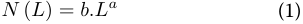

**[Image: Segur_et_al._-_2026_-_Using_the_power_law_size_distribution_to_extrapolate_and_compare_microplastic_number_and_mass_concen.pdf-0003-05.png (303x24, 2.1KB)]**

where _a_ and _b_ are the slope and the intercept of the power law model, respectively. In a log-log space, Eq. (1) describes a straight line of slope _a_ and intercept _log_ ( _b_ ). 

To understand why the power law appears during fragmentation processes, we build a simplified MP fractal fragmentation model based on Kaandorp et al. [22]. Figure 1.a illustrates the repeated fragmentation of three simplified plastic shapes of dimension _d_ : fibers ( _d = 1_ ), sheets, representing bottles, containers, bags, mulch and wrappings ( _d = 2_ ), and fragments, representing various 3-dimensional debris ( _d = 3_ ). At each fragmentation step, the main length of the particles is divided by _f = 2_ , and the number of plastic particles increases exponentially in order to keep the total volume (and mass) of plastic 

constant. Because the volume expressions for fibers, sheets and fragments are proportional to _L_ , _L[2]_ and _L[3]_ respectively, the number of particles during fragmentation increases faster for fragments, than for sheets, than for fibers with decreasing particle size. This can be visualized by plotting log( _N_ ) as a function of log( _L_ ) (Fig. 1.b), which linearizes the power law so that the exponent _a_ can be estimated from the linearized slope. Under these idealized fragmentation circumstances, the slope coefficient for the fiber ( _a = -1_ ), sheet ( _a = -2_ ), and fragment ( _a = -3_ ) PSD corresponds to the dimension of the shape, _d_ . Note that the power law distribution holds for any fragmentation factor f > 1. We acknowledge that this simplified cascading fragmentation model is used here only as a first approximation to generate shape dependent power law PSDs. Real fragmentation processes are far more complex and involve the simultaneous release of small MP particles, NP and dissolved organic carbon (DOC) [32, 36]. 

## **Intercomparing MP concentrations and PSDs** 

As indicated in the introduction, measurements of MP in the environment are often made over different MP size ranges, depending on the sampling and analytical techniques. In addition, studies tend to bin MP number observations in widely variable bin ranges to report PSD histograms. This variability leads to difficulties for intercomparison of studies, which is critical in MP science. Previous studies have suggested that binned PSD data can be normalized for bin size and extrapolated using the power law, so that different studies can be compared on an identical numeric basis [22, 27]. To illustrate this, we generate a fictional dataset of 4 samples whose distribution follows Eq. (1): two fragment samples of different measured size range, ( _a_ = -3), one for films ( _a_ = -2) and _a_ one for fibers ( = -1). The intercept is the same for all samples ( _b =_ 10[6] ). Figure 2.a shows how fragmentation produces different PSD histograms, and how the use of variable size bins (1, 10, 25, 50 μm) affects visualization of the PSD, with a wider bin size for fibers and films leading to an apparent increase in MP number concentration (MP# m[− 3] ). In addition, the 4 chosen samples deliberately cover different MP size ranges, reflecting potentially different analytical techniques. This disparity implies that the MP concentrations of 29957, 900, 4950 and 2 MP# m[− 3] reported alongside the histograms are not directly comparable. Sample Frag 1 seems to be 2000 times more concentrated than sample Frag 2. To allow intercomparison of the measurements, we first normalize the reported MP concentration in each bin by dividing it by its bin size, and plot the log of the normalized MP concentration (MP# m[− 3] μm[− 1] ) as a function of the log of MP size (µm, geometric mean of the bin boundaries, following 

Page 4 of 19 

Segur _et al. Microplastics and Nanoplastics_ (2026) 6:45 

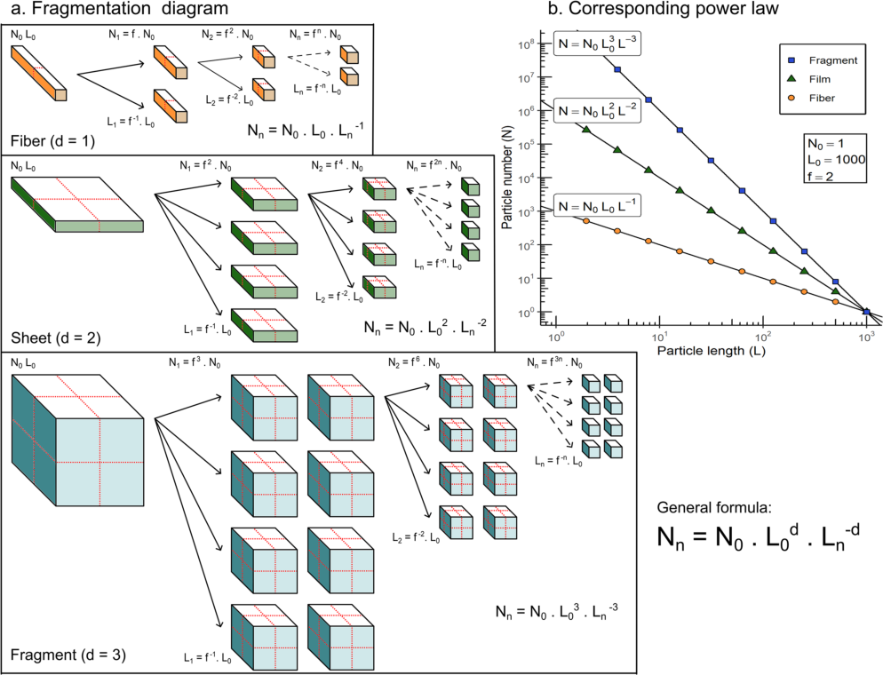

**[Image: Segur_et_al._-_2026_-_Using_the_power_law_size_distribution_to_extrapolate_and_compare_microplastic_number_and_mass_concen.pdf-0004-02.png (994x760, 193.7KB)]**

**Fig. 1** Fractal plastic fragmentation model that produces ever smaller plastic and eventually microplastic (MP) particles, assuming that plastic breaks into smaller pieces in a self-similar manner, i.e., the size distribution follows a power law. ( **a** ) Three MP shapes of simplified dimension, d, are considered: fibers (d = 1), sheets, representing bottles, containers, bags, mulch and wrappings (d = 2), and fragments, representing various 3-dimensional debris (d = 3). Nn is the number of particles of size Ln. N0 and L0 is the initial number and size of the particles, respectively. ( **b** ) Particle size distributions for fiber, film and fragment shapes. Image and model inspired by [9, 22, 50]. Note that this is a simplified MP fragmentation model that does not reflect the complexity of natural fragmentation processes, but is used here to illustrate the link between MP shape and power law slope 

Leusch et al. [27]) (Fig. 2.b). The PSD thus obtained will be referred to as Bin-Normalized PSD (BN-PSD). 

In order to intercompare the MP number concentrations of the four normalized sample PSDs, we can use the power law to extrapolate the sample observations (data points in Fig. 2.b) to a shared MP size range, such as the full MP size range (1–5000 μm) or any sub-range [23]. To do so, we integrate the power law PSD, Eq. (1), between the chosen particle size limits: 

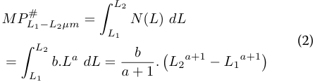

**[Image: Segur_et_al._-_2026_-_Using_the_power_law_size_distribution_to_extrapolate_and_compare_microplastic_number_and_mass_concen.pdf-0004-06.png (447x117, 8.7KB)]**

Where _MP_[#] _L_ 1 _− L_ 2 _µ m_[ [MP# m][− 3][] is the MP num-] ber concentration within size range _L_ 1 to _L_ 2 [µm]. _b_ [MP# m[− 3] μm[− a−1] ] and _a_ [-] are the intercept and the slope of the power law model, as illustrated in Fig. 2.b, respectively. _L_ is the MP length [µm]. Note that in practice, the slope coefficient _a_ should be lower than − 1 for this integral to converge. Applying Eq. (2) to our 4 fictional examples for the size range of _L_ 1 = 1 µm to _L_ 2 = 5000 µm, we obtain the following directly comparable _MP_[#] 1 _−_ 5000 _µ m_[ concentrations of: 85 172 MP# m][− 3] for fibers, 9 998 MP# m[− 3] for films, 5 000 MP# m[− 3] for fragment analysis 1 and 5 000 MP# m[− 3] for fragment analysis 2 (Table 1). We thus observe that extrapolated _MP_[#] 1 _−_ 5000 _µ m_[ are higher for films than for fragment ] 1, contrary to the originally reported concentrations. Importantly, even though the two fragment samples 

Page 5 of 19 

Segur _et al. Microplastics and Nanoplastics_ (2026) 6:45 

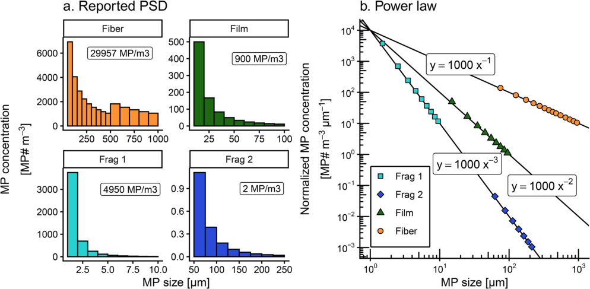

**[Image: Segur_et_al._-_2026_-_Using_the_power_law_size_distribution_to_extrapolate_and_compare_microplastic_number_and_mass_concen.pdf-0005-02.png (994x487, 108.8KB)]**

**Fig. 2** Fictional example of reported MP PSD in the literature (a., MP# m[−3] ) and the corresponding power laws in bin-normalized MP number concentrations (b., MP# m-3 µm-1). Fragment size range (Frag 1, Frag 2) is varied on purpose, and so is bin size for fibers (a) 

**Table 1** Fictional MP fragmentation example. Four samples are considered (Frag 1, Frag 2, Film, and Fiber), corresponding to the 3 MP shapes considered in this study (fiber dimension, d = 1, film d = 2 and fragment d = 3). A particle size distribution (PSD) for each sample was generated following the power law distribution in Eq. (1) with b = 10[6] and a=-d. Each PSD is deliberately sampled in a different size range, and the observed number concentration (MP# m[− 3] ) is reported. Using the power law coefficients in Eq. (2), the extrapolated _MP_[#] 1 _−_ 5000µ _m_[ number concentration is ] calculated. As samples Frag 1 and Frag 2 were generated with the same PSD, they have the same _MP_[#] 1 _−_ 5000µ _m_[ concentrations. ] However, as their observation ranges were different, their original reported MP concentrations were different 

|**Sample** Frag 1|**Observa-** **tion size** **range** **[µm]** 1–10|**Reported** **concentra-** **tion** **[MP# m− 3]** 4 950|**Power law** **parameters** **y = bxa** a=-3, b = 1000|**Extrapolated** **_MP_ #** **1****_−_5000****_µ m_** **concentration** **[ MP# m− 3]** 5 000|
|---|---|---|---|---|
|Frag 2|50–250|2|a=-3, b = 1000|5 000|
|Film|10–100|900|a=-2,|9 998|
|Fiber|250–1 000|29 957|b = 1000 a=-1,|85 172|
||||b = 1000||

reported different MP size ranges, used different bin sizes to report the data, and reported different MP concentrations, the extrapolated _MP_[#] 1 _−_ 5000 _µ m_[ are identi-] cal. This is a direct consequence of the underlying power 

law distribution being identical for both Frag1 and Frag2 (by design), and initially observed as different MP size ranges. In summary, this fictional example illustrates how to compare proverbial apples and oranges, by converting them all into bananas. 

Unfortunately, real world published MP PSD histograms do not behave like ideal PSDs, and it has been observed that power law slope depends directly on the chosen PSD bin size [27]. That is dramatic because an inaccurate slope directly leads to erroneous MP concentration extrapolation using Eq. (2), and it makes it impossible to compare slopes between datasets to understand MP PSD in nature. If the raw data is available, it is possible to fit the power law to an unbinned, raw particle number PSD [5] as applied by Kooi et al. [26]. However, since most published MP observations do not provide this raw data, we explore an alternative method to overcome binning bias based on Virkar and Clauset [52]. 

## **Binning bias** 

## **Datasets of reference** 

To further evaluate the effect of bin size on the BN-PSD slope, we obtained three raw MP number data sets from Lu et al. [30], Perera et al. [35] and Ueda et al. [51], for stormwater, indoor air, and coastal marine surface water respectively. Descriptions of these three datasets are available in Supporting Information 1. By raw data we mean that the authors reported the length and other dimensions of each individual MP particle observed. Publication of raw MP data is rare, and encouraged here and by others [21, 40]. For Ueda et al. [51], we selected 

Page 6 of 19 

Segur _et al. Microplastics and Nanoplastics_ (2026) 6:45 

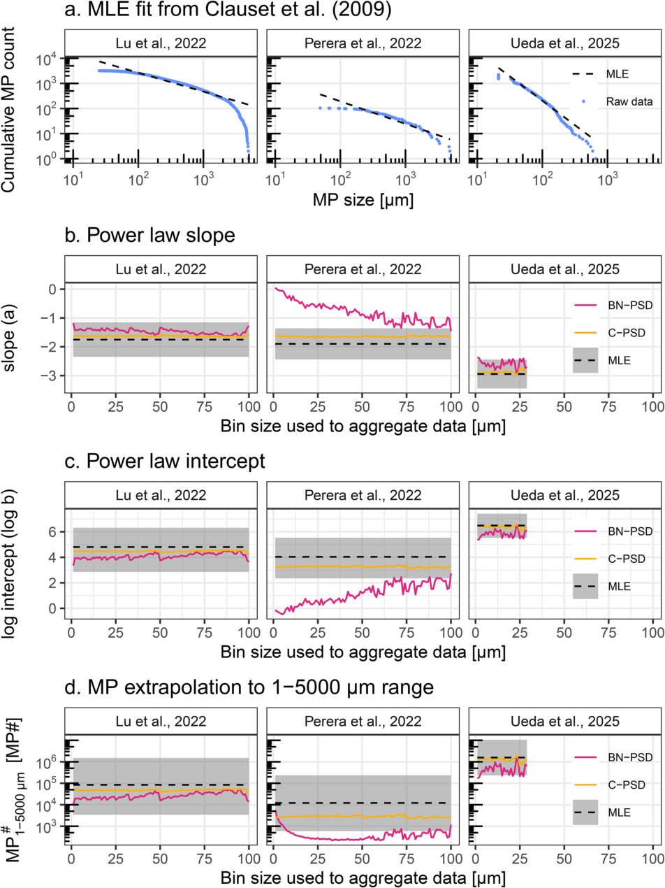

**[Image: Segur_et_al._-_2026_-_Using_the_power_law_size_distribution_to_extrapolate_and_compare_microplastic_number_and_mass_concen.pdf-0006-02.png (952x1270, 277.1KB)]**

**Fig. 3** (See legend on next page.) 

Page 7 of 19 

Segur _et al. Microplastics and Nanoplastics_ (2026) 6:45 

(See figure on previous page.) 

**Fig. 3** Examples of binning bias for three raw MP datasets: Lu et al. [30] and Perera et al. [35] were discussed and provided by Leusch et al. [27]. For Ueda et al. [51], we selected the subsample ‘site D’ with the most MP fragments obtained by a water pump. **a** . Visualisation of the maximum likelihood estimation (MLE) fit from Clauset et al. [5] on the 3 raw datasets. **b** - **d** . The BN-PSD (in red) and C-PSD (in yellow) fitting methods presented in Sect. "Bin-normalized PSD method" and "Cumulative PSD method" were tested as a function of bin size from 1 to 100 μm, and compared to the MLE (dotted lines) reference fitting method. MLE uncertainty (1 sd, bootstrap) is indicated by the shaded area. The binning bias is illustrated in ( **b** ) for the slope, in ( **c** ) for the intercept and in ( **d** ) for the extrapolated concentration _MP_[#] 1 _−_ 5000µ _m_ 

the sub-dataset with the most particles (Fragment in Site D, sampled with a pump system). The Lu et al. [30] and Perera et al. [35] datasets were provided by Leusch et al. [27]. To obtain a reference slope and intercept for each dataset, we use the Clauset et al. [5] maximum likelihood estimation (MLE) method that derives a power law fit to raw particle size data (R package poweRlaw). The MLE reference slopes are − 1.75, -1.90 and − 2.94 for Lu et al. [30], Perera et al. [35] and Ueda et al. [51] respectively (see Fig. 3.a and Table 2). The MLE intercept is calculated according to the formula provided by Clauset et al. [5]: 

100 μm bins (Table 2; Fig. 3.a). As bin size increases, the BN-PSD slope estimate gets closer to the MLE estimation. No regression was performed if the number of bins was less than 3. The observed BN-PSD deviations from the theoretical MLE slope (Fig. 3.a) propagate to the estimation of the intercept (Fig. 3.b) and to the extrapolated concentration (Fig. 3.c). Knowing that bin dependence and bias may arise in any binned dataset without warning signs, we explore in the next section an alternative method to derive accurate power law fits for binned data. 

## **Cumulative PSD method** 

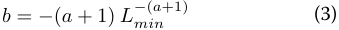

**[Image: Segur_et_al._-_2026_-_Using_the_power_law_size_distribution_to_extrapolate_and_compare_microplastic_number_and_mass_concen.pdf-0007-07.png (339x30, 2.9KB)]**

where _Lmin_ is the lower size bound of the power law, i.e. the lower MP size limit for which the power law applies. An estimation of _Lmin_ is provided by the MLE algorithm [5]. 

## **Bin-normalized PSD method** 

Once the reference parameters are known for each of the 3 raw datasets, we apply to each of them the classic BNPSD method. First, we generated binned PSD histograms with bin size incrementing from 1 μm to 100 μm for each raw data set. We then plot the BN-PSD (x = log of the geometric mean size of each bin, y = log of the bin MP concentration divided by the bin width) and use standard linear regression to derive power law slope ( _a_ ) and intercept ( _b_ ). We use these parameters to extrapolate the observed MP# concentrations to the full 1–5000 μm MP size range using Eq. (2). Table 2 summarises the parameters obtained as a function of bin size. Bin size does not affect every dataset in the same way. Figure 3.b clearly illustrates how the BN-PSD power law slope for all three datasets is systematically higher (less negative) than the MLE reference slopes. Consequently, the BN-PSD intercept and extrapolated _MP_[#] 1 _−_ 5000 _µ m_[ concentrations are ] also offset and therefore inaccurate. The Lu et al. [30] et Ueda et al. [51] slopes are relatively invariant with bin size, with an average RSD of 6% and 5% respectively. The BN-PSD method overestimated the Lu et al. [30] et Ueda et al. [51] MLE reference slopes by + 0.28 (+ 16%) and + 0.36 (+ 12%) respectively. In the case of Perera et al. [35], the bin size used to aggregate data had a strong impact on the slope by the BN-PSD method: at bin size 1 μm, the slope was − 0.05, and this estimate decreases to -1.46 for 

One alternative method to the BN-PSD is apparent in Virkar and Clauset ([52]; Fig. 1) who showed that power law fitting of a cumulative binned PSD (C-PSD) returns acceptably precise and accurate slope values, similar to the MLE. Note that Virkar and Clauset [52] propose an MLE method designed for binned data, but we do not use it here since it produced unrealistic slope results for numerous PSDs that we tested (see Supporting Information 2). 

The C-PSD curve corresponds to the number (or concentration) of MP with length greater than _L1_ . In a C-PSD the number of MP counts (or number concentrations) is added up in each successively smaller bin, and the obtained concentration is plotted against the lower bound of each bin in log-log space. The resulting distribution is linear over most of the PSD, and far less sensitive to bin size. The C-PSD is defined as: 

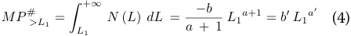

**[Image: Segur_et_al._-_2026_-_Using_the_power_law_size_distribution_to_extrapolate_and_compare_microplastic_number_and_mass_concen.pdf-0007-13.png (448x46, 4.7KB)]**

where _MP_[#] _>L_ 1[ [MP# m][− 3][] is the cumulative number ] concentration of MP whose size is greater than _L1_ [µm] (lower size of any bins). In log-log space, the C-PSD also follows a power law of slope _a[′]_ = _a_ + 1 (meaning the original BN-PSD slope is shifted by + 1) and intercept of _b[′]_ = _−b/_ ( _a_ + 1). The parameters _a_ and _b_ are computed from the slope _a[′]_ and log-intercept _log_ 10 ( _b[′]_ ) obtained from the linear regression of the C-PSD: _a_ = _a[′] −_ 1 and _b_ = _−b[′] .a[′]_ . The MP number concentration within the size range _L_ 1 to _L_ 2 [µm] is given by: 

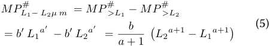

**[Image: Segur_et_al._-_2026_-_Using_the_power_law_size_distribution_to_extrapolate_and_compare_microplastic_number_and_mass_concen.pdf-0007-15.png (451x78, 7.3KB)]**

Page 8 of 19 

Segur _et al. Microplastics and Nanoplastics_ (2026) 6:45 

**Table 2** Average estimated parameters (slope, log intercept, log _MP_[#] 1 _−_ 5000 _µ m_[ concentration) for three power law PSD fitting ] methods: bin-normalized particle size distribution (BN-PSD) fits the bin-normalized MP concentration against the geometric bin size in log log space (bin width varied from 1–100 μm); C-PSD fits the cumulative MP concentration against the lower bin bound (bin width varied from 1–100 μm) in log log space; MLE (maximum likelihood estimation) fits the raw unbinned data following Clauset et al. [5] and gives an estimate of the parameters a and b independent of bin size. Values are averaged over all bin sizes tested, and uncertainties are ±1sd. For MLE log intercept and log _MP_[#] 1 _−_ 5000 _µ m_[ uncertainties, upper and lower ] bounds derived from MLE slope uncertainty are provided in brackets 

|brackets|||||
|---|---|---|---|---|
|**Parameter**|**Method**|**Lu et al. [30]**|**Perera et al.**|**Ueda et**|
||||**[35]**|**al.[51]**|
|slope (a)|BN-PSD|-1.47 ± 0.09|-0.81 ± 0.36|-2.6 ± 0.14|
||C-PSD|-1.63 ± 0.02|-1.64 ± 0.02|-2.88 ±|
|||||0.05|
||_MLE_|_-1.75 ± 0.60_|_-1.90 ± 0.54_|_-2.94 ± 0.50_|
|log intercept|BN-PSD|4.1 ± 0.22|1.12 ± 0.82|5.83 ± 0.28|
|(log10(b))|C-PSD|4.48 ± 0.05|3.26 ± 0.06|6.38 ± 0.11|
||_MLE_|_4.80_|_4.03_|_6.49_|
|||_(2.97–6.30)_|_(2.36–5.52)_|_(5.53–7.41)_|
|log10|BN-PSD|4.42 ± 0.14|2.58 ± 0.25|5.63 ± 0.24|
|_MP_ # 1_−_5000_µ_|_m_ C-PSD|4.68 ± 0.04|3.45 ± 0.04|6.11 ± 0.1|
||_MLE_|_4.92_|_4.08_|_6.19_|
|||_(3.54–6.17)_|_(2.78–5.37)_|_(5.37–7.02)_|

which is the same equation as Eq. (2) once _a′_ and _b[′]_ are converted to _a_ and _b_ . The only difference is the way the parameters _a_ and _b_ are estimated, from the C-PSD method for Eq. (5) rather than the BN-PSD method for Eq. (2). 

In order to validate the C-PSD power law fitting method and compare its performance with the biased BN-PSD method, we used the same 3 reference raw MP datasets presented in Sect. "Datasets of reference". Once again, we generated for all datasets binned PSD histograms with bin size incrementing from 1 µm to 100 µm, and used standard linear regression to derive power law slope _a’_ and intercept _b’_ of the C-PSD ( _x_ : log of lower bin bound, _y_ = log of MP number concentration of MP > _x_ ) for each bin size. Figures 3.b-d and Table 2 summarize the 

validation results for slope, intercept and _[MP]_[ #] 1 _−_ 5000 _µ m_ concentrations. The C-PSD method gives a stable estimation of the slope, independent of bin size, with RSD < 1.8%. The C-PSD slope is within the MLE 1sd uncertainty estimate used here as reference, deviating from the mean by only + 0.12 (+ 7%), + 0.26 (+ 14%) and + 0.08 (+ 2%) for Lu et al. [30], Perera et al. [35] and Ueda et al. [51] respectively. Similar acceptable accuracy is visible for the 

log intercept and extrapolated _MP_[#] 1 _−_ 5000 _µ m_[. In sum-] mary, we find that the BN-PSD method alone is insufficient to correct binning bias for all MP datasets, while the cumulative C-PSD fitting method returns more accurate slopes, intercepts and extrapolated MP concentrations. This is consistent with conclusions from Virkar and Clauset [52] for non-plastic datasets. 

Now that we have a reliable method to estimate the power law parameter of a binned MP PSD, we will outline how to convert MP number to mass concentration using the C-PSD method. 

## **MP number to mass conversion** 

MP mass concentrations, mass inventories and mass fluxes are needed for environmental plastic and MP dispersal budgets (OECD, [34, 43], for plastic additive exposure estimates [49], or to understand plastic fragmentation and degradation [4]. To convert a MP number concentration to mass, the particle density and volume need to be known (or assumed) for the measured MP. While polymer density varies relatively little (0.9 to 1.4 × 10[− 6] µg µm[-3] [25], MP volume depends on MP length ( _L_ ), width ( _W_ ) –both typically measured– and height (H), which is generally not measured. The majority of studies unfortunately only report a PSD for _L_ and omit _W_ . Dedicated MP morphological studies typically observe that the median fragment _W/L_ ratio is 0.68 ± 0.03, indicating ellipsoid MP fragment shape [3, 8, 1626, 37, 41], and it has often been further assumed that _H/W = W/L_ [26, 37, 41]. Here we used a recent calibration of small fragment ellipsoid volume for the special case when only L is known, and which found _H/W_ = 0.40 +/- 0.08 [16]. We therefore convert number concentrations to mass concentrations using an average MP density of _δMP_ = 1.14 × 10[− 6] µg µm[− 3] [23], and an ellipsoid volume, _V_ , approximation for fragments: 

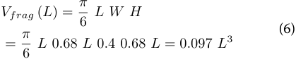

**[Image: Segur_et_al._-_2026_-_Using_the_power_law_size_distribution_to_extrapolate_and_compare_microplastic_number_and_mass_concen.pdf-0008-11.png (419x84, 7.0KB)]**

Where _L_ is the reported length (µm), and _W = 0.68×L_ and _H = 0.40×W_ [16]. 

For fibers, a cylinder volume approximation is computed using the reported diameter, _D_ and a 40% void fraction (Simon18, Barchiesi23). If _D_ is not reported, it is set to the typical value of 15 μm [33], except for rare fibers shorter than 45 μm, where _D = L/3_ , derived from the aspect ratio definition of fibers, _L/W > 3_ , used in several studies [24, 26, 51]: 

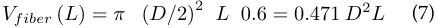

**[Image: Segur_et_al._-_2026_-_Using_the_power_law_size_distribution_to_extrapolate_and_compare_microplastic_number_and_mass_concen.pdf-0008-14.png (436x28, 4.7KB)]**

Page 9 of 19 

Segur _et al. Microplastics and Nanoplastics_ (2026) 6:45 

For films we assume a thickness (height, _H_ ) of 17 μm, corresponding to the typical grocery bag thickness [18], and an ellipse shaped surface: 

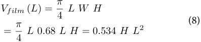

**[Image: Segur_et_al._-_2026_-_Using_the_power_law_size_distribution_to_extrapolate_and_compare_microplastic_number_and_mass_concen.pdf-0009-03.png (397x84, 6.4KB)]**

The mass concentration (µg m[− 3] ) of each shape category can then be estimated using the power law parameters _a_ and _b_ obtained by the C-PSD method described in 3.3: Fragments: 

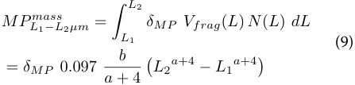

**[Image: Segur_et_al._-_2026_-_Using_the_power_law_size_distribution_to_extrapolate_and_compare_microplastic_number_and_mass_concen.pdf-0009-05.png (447x107, 9.9KB)]**

Films: 

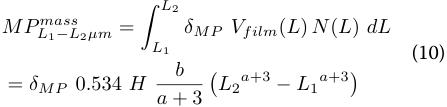

**[Image: Segur_et_al._-_2026_-_Using_the_power_law_size_distribution_to_extrapolate_and_compare_microplastic_number_and_mass_concen.pdf-0009-07.png (447x107, 10.8KB)]**

Fibers: 

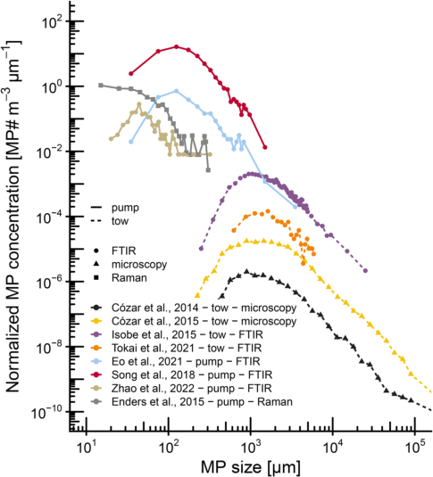

**[Image: Segur_et_al._-_2026_-_Using_the_power_law_size_distribution_to_extrapolate_and_compare_microplastic_number_and_mass_concen.pdf-0009-09.png (485x535, 78.0KB)]**

**Fig. 4** Examples of BN-PSD inflection points for different sampling and analytical techniques (all surface ocean water, BN-PSD visualisation) 

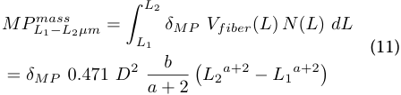

**[Image: Segur_et_al._-_2026_-_Using_the_power_law_size_distribution_to_extrapolate_and_compare_microplastic_number_and_mass_concen.pdf-0009-11.png (448x107, 10.3KB)]**

Where _MP[mass] L_ 1 _− L_ 2 _µ m_[ [µg m][− 3][] is the MP mass concen-] tration within size range _L_ 1 to _L_ 2 [µm]. _a_ and _b_ are the slope and the intercept derived from _a’_ and _b’_ of the C-PSD power law model, respectively. 

## **Properties of environmental MP PSD** 

In this section we examine the properties of binned PSD published in MP studies, with a focus on different sampling and analysis methods, and associated limits of detection. We use environmental MP data from the MPsizeBase compilation [44] that includes 81 binned MP PSDs for fragments and fibers from 44 studies in air (both indoor and outdoor suspended MP), surface ocean and subsurface ocean waters. Unlike the fictional example presented in Sect. "Power law theory", environmental MP data rarely follow the power law perfectly over their whole reported PSD range. Authors generally do not formally define their limit of detection (LOD) and report all MP counts made in a single sample. This often generates lower than expected MP counts for the smaller PSD bins, and zero or single MP counts for upper size bins. Before fitting a MP PSD it is therefore important to consider what the analytical LOD on the lower MP size end (lower LOD), and on the upper MP size end (upper LOD) is. 

## **PSD LOD** 

## _**Lower size LOD**_ 

When lower than expected small MP counts were initially documented and discussed by Cozar et al. [9], it was interpreted as a true decrease in small MP abundance in ocean surface waters. Since then ‘log-normal’ PSD behavior has been observed in many MP datasets, and has been suggested to be related to sampling net mesh size [28, 48, 54], to fragmentation energy barriers [2, 15] or to a low bias in MP counting, which is inherent in all measurement techniques, whether visual, software assisted, or microscope assisted [25, 27, 38]. In Fig. 4 we illustrate the log-normal PSDs of different ocean surface MP datasets obtained by microscopy [9, 10], by µFTIR [14, 20, 42, 48, 55], and by µRaman [13]. The overlap of the observed MP size range between sampling and detection techniques allows us to visualise that the power law inflection point is dependent on the dataset and analytical technique used. Although we cannot exclude that the inflection reflects the true environmental PSD, Fig. 4 supports the common assumption that the log-normal PSD phenomena is likely a low bias in the recovery and counting of small MP that exists for all sampling and detection techniques. Mattsson et al. [31] illustrated how experimental 

Page 10 of 19 

Segur _et al. Microplastics and Nanoplastics_ (2026) 6:45 

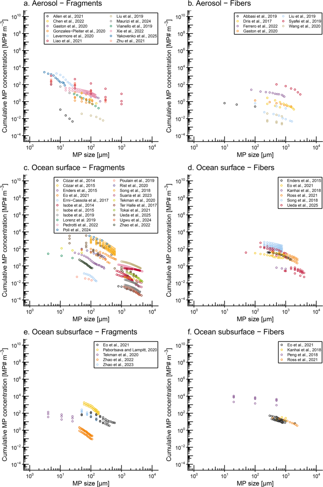

**[Image: Segur_et_al._-_2026_-_Using_the_power_law_size_distribution_to_extrapolate_and_compare_microplastic_number_and_mass_concen.pdf-0010-02.png (840x1264, 284.8KB)]**

**Fig. 5** (See legend on next page.) 

Page 11 of 19 

Segur _et al. Microplastics and Nanoplastics_ (2026) 6:45 

(See figure on previous page.) 

**Fig. 5** Published cumulative MP number particle size distribution (C-PSD) in atmosphere ( **a** ., **b** .), surface ocean ( **c** ., **d** .) and subsurface ocean ( **e** ., **f** .). The MP size (µm, lower bound of each reported bin) is plotted against the cumulative MP number concentration (MP# m[− 3] ), which is the sum of reported MP concentration whose size is greater than x. C-PSD were separated into fragments (left panels, **a** ., **c** ., **e** .) and fibers (right panels, **b** ., **d** ., **f** .). Only data points within the assigned lower and upper LOD are shown (see Lower size LOD and Upper size LOD). All individual C-PSDs are visualised in Supporting Information 3, including slope fitting and all bins (including bins removed before fitting) 

fragmentation produces a power law PSD across the full 0.1–5000 μm range, but that each technique used to study sub-intervals of the PSD (light and electron microscopy, NP tracking analysis) displayed low-counting bias. Underestimated bins on the left end of the PSD (small MP) tend to increase the slope (i.e. less steep slope) and therefore have to be removed from the regression. 

It is important to emphasize that our attribution of lognormal MP PSDs behaviour to method bias is a major assumption of the power law C-PSD size alignment framework. PSDs for natural particles such as coarse mineral dust, seasalt aerosols or marine suspended particulate matter often display log-normal behavior below 10 μm in size [1, 12, 45]. Aerosol size distribution in the 1 –10 μm range is indeed understood as a superposition of multiple log-normal PSDs related to nucleation, accumulation and coarse modes [12]. However, rarely do such PSDs show 10-fold drops in particle abundance as we illustrate for MP in Fig. 4. As we will see later (Fig. 5), only five MP PSDs reported in the MPSizeBase dataset have data < 10 μm, and none of these show pronounced log-normal behavior. We therefore consider our assumption that the power applies over the full 1–5000 μm MP size range justified, but we remind readers that as higher quality data in the 1–20 μm range becomes available, we may need to revisit the possibility of log-normal MP PSD behavior. Future microscopy studies can also explore the potential superposition of individual polymer PSDs. 

## _**Upper size LOD**_ 

Microscopy MP measurements generally detect fewer large particles, and at some point the number of large MP counts are no longer representative of the true large MP concentration. The question is: at what size the upper size LOD is situated. The upper LOD of the BN-PSD and C-PSD is related to the sampling volume and the % of the sample (i.e. filter area) analyzed. In addition, the right hand tail of the C-PSD slumps downward as a function of the sum of all large particles that have not been counted or that are not present. Underestimated bins on the right end of the PSD (large MP) tend to decrease the slope (i.e. steeper slope) and therefore have to be removed from the regression. 

## _**Systematic LOD determination**_ 

A two-step algorithm was developed to identify the bin size range over which the power law holds. The algorithm basically finds the most linear section of the log-log PSD, 

and automatically detects and removes bins outside of the low- and high-LOD described above. In the first step, a preliminary ordinary least-squares (OLS) regression was performed on the full C-PSD. Bins with a positive residual (i.e. bins whose observed cumulative concentration exceeds the fitted regression line) were retained as candidates for the final regression window. Additionally, bins below the peak of the BN-PSD were excluded, as these consistently correspond to low-counting bias. Bins above 5000 μm were also excluded, as they are not formally part of the MP size range. In the second step, all possible contiguous bin sequences ≥ 3 were OLS-fitted and the coefficient of determination R² was computed. Sequences with R² < 0.90, indicating log-normal (curved) bin sequences, were discarded. Among the remaining sequences, the longest one was selected as the final LOD window; ties were broken by R². If no sequence met the conditions (R²> and length > 3), the constraint was relaxed and the widest available candidate range was used as a fallback. 

Supporting Information 3 includes the python code (Pyhton version 3.13) implementing the algorithm presented above. It provides, for each of the 132 PSDs reported in MPsizeBase (81 unique ones), an excel file containing the lower and upper size LOD automatically assigned, the PSD slope and intercept, and the extrapolated number and mass concentration to the 1–5000 μm size range. The code also provides all 132 regression plots with lower and upper LOD visualisation, alongside both BN-PSD and C-PSD. 

## **Environmental PSD slope variability** 

Figure 5 visualises MPsizeBase C-PSDs for each environmental compartment (atmosphere, surface and subsurface ocean) after lower and upper LOD assignment. To identify potential differences in power law slopes between MP shape and compartments, a two way Anova was performed (Fig. 6). No statistical differences in power law slope ( _a_ ) were identified between compartments (within fragment or fiber groups), for both number and mass PSD ( _p_ = 0.98). This means that the current MPsizeBase dataset is not able to distinguish differences in PSD between atmosphere, surface ocean and deep ocean, indicating no detectable MP size sorting during sinking or emission and atmospheric deposition. Conversely, we observe a strong statistical difference between MP fiber and fragment shapes ( _p_ < 0.0001, Fig. 6). For fibers, slope _a_ varies from − 1.27 to -2.46 with a mean value of -1.86 ± 0.36 (1 

Page 12 of 19 

Segur _et al. Microplastics and Nanoplastics_ (2026) 6:45 

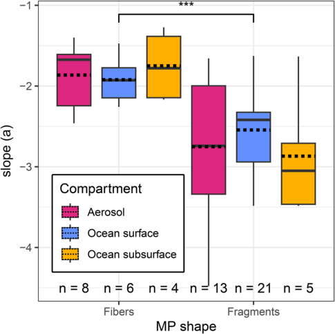

**[Image: Segur_et_al._-_2026_-_Using_the_power_law_size_distribution_to_extrapolate_and_compare_microplastic_number_and_mass_concen.pdf-0012-02.png (485x484, 35.0KB)]**

**Fig. 6** Two-factor Anova comparison of MP number concentration PSD power law slope between MP shape (fibers or fragments) and environmental compartments (atmosphere, ocean surface water or subsurface water). In order to give each study equal weight, the mean of the slope was taken for each study that reported more than one PSD for the same shape-compartment category. Full lines are medians, dotted lines are means. We observe a significant difference ( _p_ < 0.0001) in slope between the two MP shapes: -1.86 ± 0.36 (mean ± 1 sd) for fibers and − 2.66 ± 0.68 (mean ± 1 sd) for fragments. No statistical difference was observed between compartments, within each MP shape 

sd), and for fragments, slope _a_ varies from − 1.63 to -4.48 with a mean value of -2.66 ± 0.68 (1 sd). Compared to the theoretical slopes of the fractal fragmentation model for 1d, 2d and 3d plastic objects presented in Sect. "Power law theory", this suggests that fragments behave close to ideal 3d fragmentation, despite this model being a serious simplification of reality. An explanation could be that the NP or DOC produced during the surface cracking phase are too small (< 1 μm), and not included in the model, leaving only the larger MP particles following an apparent ideal fractal fragmentation. On the other hand, fibers, with slope of -1.86, fragment more like 2d sheets than 1d fibers, which may partly reflect the inclusion of fragmentlike fibers in reported fiber datasets, with aspect ratio only slightly larger than 3. 

Previous studies have examined PSD slope variability in different datasets. Initially, Kooi and Koelmans [25] examined a mix of fiber and fragment PSDs, finding a mean slope _a_ of -1.6 for number PSD. Later, Kooi et al. [26] compiled raw MP data from five studies of marine surface water and sediment, freshwater and sediment, wastewater effluent and benthic freshwater biota. The five studies deployed different sampling methods, but comparable measurement techniques, including FTIR identification of MP using the same spectral reference 

database, > 500 MP counts per sample, and > 60% of filter surface analyzed. After filtering PSDs for lower LOD bias in small MP, the power law slopes, determined by the MLE method, for the predominantly (93%) fragment raw data were found to be very similar across all samples with _a_ = -2.68 and − 2.64 for length and width PSDs respectively. These fragment MLE slopes are, within their approximate uncertainty of ± 0.6, not significantly different from our C-PSD derived fragment slopes of -2.66 ± 0.68 in atmospheric and ocean MP, indicating broad environmental similarity in MP PSDs across Earth surface environments. Kooi et al. [26] observed minor statistically significant slope differences for MP length between surface water ( _a_ > -3) and biota ( _a_ < -3) in both freshwater and marine environments ( _p_ < 0.05). Similarly, slopes were found to be >-3 for PE and PP, and <-3 for denser minority polymers in surface waters, suggesting preferential removal by settling of the larger, denser polymers. Kaandorp et al. [22] highlighted potential differences in PSD shape for marine surface water MP at coastal and offshore locations studied by Isobe et al. [19] and Isobe et al. [20]. 

In summary, we observe different PSD for MP fragments and fibers that are to some extent coherent with the variable dimensionality of plastic fragmentation. It appears that the absence of statistically different PSD slopes between environmental compartments in the MPsizeBase data compilation is likely due to the great variety of sampling, MP counting, and MP reporting (i.e. binning) methods. Working with reported binned data lead to a substantial loss of information compared to raw MP data. The detection of minor, but significant slope differences in high-quality raw data PSDs measured with near-identical methods [19, 26] suggests that standardization of measurement methods, and reporting raw data is key to tap into the full information on MP fragmentation and fractionation that is contained within PSDs. 

## **Extrapolating and intercomparing environmental MP concentrations** 

## **Aligning different sampling and analysis methods** 

In this section we examine how sampling and analysis methods affect the measured MP size range and MP concentration, and how C-PSD size-alignment can help reconcile perceived differences in MP counts. 

## _**Direct comparison of net tow vs. pumped sampling**_ 

Surface water MP sampling is often done by towing a plankton, manta or neuston net with mesh size around 300–330 μm for 20–60 min. The large volume sampled, 200–600 m[3] , is ideal to capture larger, less abundant MP in the 1–5 mm size range. These MP can be handpicked and manually counted and identified by spectroscopy, usually FTIR. More recent exploration of MP 

Page 13 of 19 

Segur _et al. Microplastics and Nanoplastics_ (2026) 6:45 

concentrations in the subsurface ocean relies mostly on discrete volume CTD casts (1–100 L), use of in situ pumps (100–800 L), filtration at a smaller mesh size of 1–20 μm, and automated FTIR or Raman particle finding or whole filter FTIR mapping techniques to identify small MP. In addition, shipboard pumps are now regularly used to sample surface water, again with lower volume (1–100 L) than plankton net tows. It has been recognized in the literature that net tows often report lower MP concentrations than pumped samples [46, 51] and we therefore ask the question whether that discrepancy disappears after MP size-alignment. 

To investigate this we return to the unique Ueda et al. [51] surface seawater study that directly intercompared neuston net tows (350 μm mesh) with discrete pumped (10 μm mesh) samples at four locations in the coastal, urbanized Tokyo Bay. Net tow MP were manually picked and analyzed by FTIR, while pumped MP were quantified by near-whole filter FTIR imaging. The reported mean MP concentrations for all sites were 430 (pump) and 0.59 MP# m[− 3] (net tow) for fibers, and 5989 (pump) and 0.75 MP# m[− 3] (net tow) for fragments. These reported MP# concentrations illustrate well the large apparent difference between pump and net tow methods, by factors of 730 (fibers) and 8000 (fragments). The authors indeed concluded that the pump system collected more small 

and fibrous MP, and that net tows were less effective in capturing MP < 1000 μm. Figure 7 illustrates the pooled (all sites, A, B, C, D) extrapolated MP concentrations (C-PSD, bin size 50 μm for pump and 100 μm for net tow, filtered as described in Sect. "Systematic LOD determination") for the ‘net tow’ and ‘pump’ groups, and for both fragments and fibers. Note that the choice of bin size is arbitrary since this parameter does not affect the slope estimation as demonstrated in Sect. "Cumulative PSD method" and Fig. 3. For fragments (tow, _n_ = 3552; pump, _n_ = 292), the pump C-PSD in Fig. 7b shows closer behavior to a power law than the net tow C-PSD which displays underestimation of small MP (thin black arrow). Nevertheless, it appears that large MP fragments (> 1000 μm) from the net tow align well with the pumped MP size distribution, indicated by the dashed black lines (C-PSD slopes, Fig. 7b) that are similar for both pump and tow C-PSDs. For fibers, both pump and net tow C-PSDs show curvature and underestimation of small MP (thin black arrows, Fig. 7.a). The effect is stronger for tow than pumped samples, and no single power law fit can plausibly align both fiber distributions. Our visualizations confirm the authors’ conclusion that at first sight, net tows appear to underestimate small MP concentrations. Table 3 summarizes slope and intercepts for the merged Ueda et al. [51] dataset, detailed by shape (fragments or 

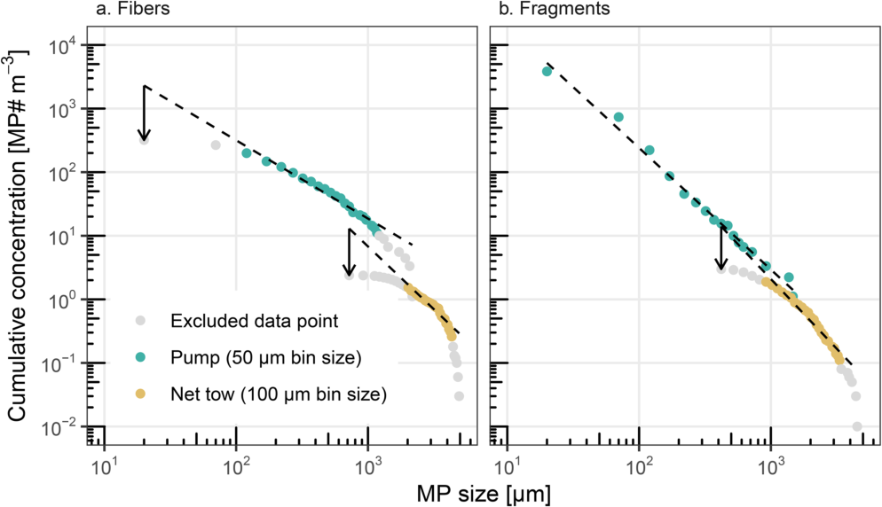

**[Image: Segur_et_al._-_2026_-_Using_the_power_law_size_distribution_to_extrapolate_and_compare_microplastic_number_and_mass_concen.pdf-0013-05.png (994x572, 87.1KB)]**

**Fig. 7** C-PSD comparison between neuston net tow and pumped sampling methods in the Ueda et al. [51] dataset for four Tokyo Bay surface waters. MP counts for all four sites ( **A** - **D** ) have been merged and converted to concentrations; the dashed lines are the C-PSD slope estimates for a bin size of 50 μm for pump samples and 100 μm for tow samples. Data was filtered as described in Sect. "Systematic LOD determination". ( **a** ) For fibers both tow and pump C-PSDs are affected by low bias in small MP (black arrows). ( **b** ) For fragments a low bias in small MP sampled with the net tow is apparent (black arrow) 

Page 14 of 19 

Segur _et al. Microplastics and Nanoplastics_ (2026) 6:45 

fibers) and sampling method (net tow or pump), obtained with the C-PSD method on binned (50–100 μm) data. C-PSD fitting was used to extrapolate MP number (Eq. (5)) and mass (Eqs. (9–11)) concentrations over two default size ranges, MP10−350 μm and MP350−5000 μm (Table 3), in order to examine if extrapolation is reasonable from one method size range to another (10–350 μm and 350–5000 μm). Extrapolated _MP_[#] 10 _−_ 350 _µ m_ fiber concentrations are 5.3 10[3] MP# m[− 3] for pump and 6.0 10[4] MP# m[− 3] for net tow groups, indicating a 1 orders of magnitude mismatch (Fig. 7). The strong log-normal (non-linear) shape of the net tow fiber PSD results in a large uncertainty of the fitted slope, intercept and _MP_[#] 10 _−_ 350 _µ m_[extrapolation. The extrapolated ] _MP_[#] 350 _−_ 5000 _µ m_[ fiber concentrations are 65 MP# m][− 3][ for ] pump and 54 MP# m[− 3] for net tow groups. While this indicates good agreement, the underlying reason for this is that the steeper net tow slope compensates for a pronounced low bias in measured small MP fibers. For fragments (Table 3), the extrapolated _MP_[#] 350 _−_ 5000 _µ m_ concentrations are 22 MP# m[− 3] for pump and 21 MP# m[− 3] for net tow, indicating a good agreement for larger MP fragments. For smaller MP fragments, extrapolated _MP_[#] 10 _−_ 350 _µ m_[ concentrations are 2.0 10][4][ MP# m][− 3][ for ] pump and 5.1 10[4] MP# m[− 3] for net tow groups, indicating agreement to within a factor of 3. MP mass concentration extrapolation generally shows better agreement, because MP mass is dominated by the large MP size range that undergoes less extrapolation. Overall, the apparent 720-fold (fibers) and 8000-fold (fragments) difference in reported MP# concentrations between pump and net tow methods, is reduced to factors of 10 (fibers) and 3 (fragments) after size-alignment. This indicates that the apparent differences in reported MP# concentrations are mostly due to the different MP size ranges that were measured. However, while net tow and pump sampling of fragments permits satisfactory extrapolation, net tow fiber sampling induces strong small-fiber counting bias in the PSD and high uncertainty in the slope and 

extrapolation. We therefore recommend pumped sampling for aquatic MP fiber studies. 

## _**Indirect comparison of ocean surface water net tow vs. pump data**_ 

We further examined PSD variability as a function of sampling techniques for surface ocean MP fragment (but not fiber) datasets in MPsizeBase: high volume net tows and low volume pumped samples (including surface CTD casts, in situ pumps, shipboard pumps and bucket/bottle sampling). Table 4 summarizes key statistics for the ‘pump’ and ‘net tow’ sample groups, with notably statistically different median sample volumes, 0.24 m[3] vs. 422 m[3] respectively (t-test, _p_ = 2 10[− 4] ), and median reported MP size range, 18–371 μm vs. 300–5750 μm respectively. Because the observed MP fragment size ranges are very different, the reported median MP number concentrations are also statistically different, 130 vs. 0.27 MP# m[− 3] (t-test, _p_ = 0.02) for pump vs. net tow groups. The key question is whether these reported MP concentrations align once we fit power laws and extrapolate to a common range, such as 1–5000 μm. After identifying the lower and upper LODs, the fitted C-PSD derived slopes, _a_ , for the pump and net tow groups are − 2.71 ± 0.50 ( _n_ = 9, 1sd) and − 2.46 ± 0.51 ( _n_ = 13, 1sd) respectively, and are not statistically different (t-test, _p_ = 0.27). 

The reported pump and tow MP fragment concentrations of 130 and 0.27 MP m[− 3] are however confounded by coastal and off-shore sampling locations. Separating these two environments leads to reported median fragment concentrations of 728 (pump) and 0.50 MP# m[− 3] (net tow) in coastal waters, and lower 55 (pump) and 0.02 MP# m[− 3] (net tow) fragment concentrations in offshore waters. After C-PSD size alignment the extrapolated _MP_[#] 1 _−_ 5000 _µ m_[ fragment concentrations are 1.6 ] 10[6] and 2.3 10[4] MP# m[− 3] in coastal waters, and 5.5 10[4] and 7.9 10[2] MP# m[− 3] in offshore waters for pump and net tow group respectively. The very large apparent difference in reported marine MP fragment concentrations by pumped and towed sampling method (by factors of 

**Table 3** PSD fitting parameters for the Ueda et al. [51] dataset (sites A, B, C and D are merged together). C-PSD: cumulative particle size distribution with bin size 50 μm for pumped data and 100 μm for net tow data, filtered as described in Sect. "Systematic LOD determination". The extrapolation was performed on two size ranges relevant to the sampling techniques used: 10–350 μm (pump) and 350–5000 μm (net tow) 

|**Sampling** **method**|**Fitting** **method** **Slope (a)** **Intercept (b)** **MP#** **reported** **MP#** **10-350μm** **MP#** **350-5000μm** **MPmass** **10-350μm** **MPmass** **350-5000μm**|
|---|---|
||**MP# m− 3** **MP# m− 3** **MP# m− 3** **µg m− 3** **µg m− 3**|
|**Fibers** Pump Net tow **Fragments** Pump Net tow|C-PSD -2.23 1.1 105 431 5.3 103 65 17 6.2 C-PSD -2.97 1.1 107 0.60 6.0 104 54 126 3.7 C-PSD -2.91 3.1 106 5989 2.0 104 22 157 2723 C-PSD -3.19 1.7 107 0.75 5.1 104 21 222 1779|

Page 15 of 19 

Segur _et al. Microplastics and Nanoplastics_ (2026) 6:45 

**Table 4** Surface sea water MP fragment PSD comparison for pump and net tow sampling methods in coastal and offshore waters. Fiber PSDs are not shown. N is the number of studies, and N PSD is the number of PSDs. In order to give the same weight to each study, studies reporting multiples PSDs were averaged into one value before computing the global average (mean for the normally distributed slope, median for the log-normally distributed intercept and concentrations) 

|distributed|slope,median for the log-normallydistributed intercept and concentrations)|
|---|---|
||**_N_** **_N_** **PSD** **Size range MP#/PSD** **Volume** **sampled** **PSD** **slope (a)** **PSD intercept** **(b)** **MP#** **reported** **MP#** **1-5000μm** **MPmass** **1-5000μm**|
||**µm** **MP#** **m3** **MP# m− 3** **MP# m− 3** **µg m− 3**|
||**reported** **reported** **reported** **estimated estimated** **reported** **estimated** **estimated**|
||**median of** **min - max** **median(IQR)** **median(IQR)** **mean± 1** **sd** **median(IQR)** **median(IQR)** **median(IQR)** **median** **(IQR)**|
|**Coastal** Pump Net tow **Ofshore** Pump Net tow **All data** Pump Net tow|6 17 20–620 460 (342–23075) 0.22 (0.13–0.81) -2.68 ± 0.28 3.6 106 (7.8 104− 1.8 107) 728 (111–2208) 1.6 106 (5.1 104− 9.2 106) 3117 (2275–15225) 6 11 250–4625 320 (199-12902) 341 (110–656) -2.65 ± 0.66 3.2 104 (2.5 103− 3.4 106) 0.50 (0.32–3.24) 2.3 104 (1.4 103− 1.4 106) 535 (247–1008) 3 3 10–310 239 (234–391) 0.39 (0.24–1.49) -2.77 ± 0.89 1.1 105 (5.7 104− 1.3 105) 55 (31–147) 5.5 104 (2.8 104− 5.8 104) 41 (22–2494) 7 12 308–10,250 1100 (620–4070) 422 (231–510) -2.30 ± 0.30 1.1 103 (3.1 102− 1.7 103) 0.02 (0.01–0.05) 7.9 102 (2.0 102− 1.3 103) 10 (6–81) 9 20 18–371 425 (234–519) 0.24 (0.10–1.00) -2.71 ± 0.50 1.5 105 (3.2 104− 7.1 106) 130 (94–1327) 6.0 104 (2.3 104− 3.0 106) 2529 (2173–4947) 13 23 300–5750 1016 (280–6405) 422 (165–543) -2.46 ± 0.51 1.4 103 (5.2 102− 9.8 103) 0.27 (0.02–0.59) 9.6 102 (3.2 102− 4.8 103) 93 (7–582)|

728/0.50 = 1450 for coastal, and by 55/0.02 = 2600 for offshore) is reduced to factors of 68 and 70 following size alignment. This indicates that power law size-alignment improves the pump vs. net tow MP fragment concentration mismatch in coastal and offshore waters. Similar conclusions can be drawn for size-aligned median _MP[mass]_ 1 _−_ 5000 _µ m_[ fragment concentrations that extrapo-] late to 3117 (pump) and 535 µg m[− 3] (net tow) in coastal waters, and 41 (pump) and 10 (net tow) µg m[− 3] in offshore waters, which is below one order of magnitude difference. Note, however, that these size-aligned pump and tow MP fragment concentrations are from different studies and geographical locations, and therefore do not represent the same waters as in the Ueda et al. [51] study illustrated in Sect. "Systematic LOD determination". This likely explains the residual differences. 

It is instructive to use the generic surface ocean fragment PSD slope of -2.63+-0.58 (1 sd, Table 5, pump and net two samples included) to estimate the MP fragment number and mass fractions that net tow and pump methods cover based on their mesh size. One can compute using Eq. (5) that typical plankton/neuston/manta nets (mesh size ~ 300 μm) used to sample surface ocean MP recover less than 1% of the total number of MP fragments in the size range 1–5000 μm. On the other hand, 

the same 300 μm mesh net catches 92% to 100% of the total floating MP fragment mass in the size range 1–5000 μm. Due to the exponential nature of the power law, about 99% of all surface ocean MP fragments are smaller than 10 μm. In the MPsizeBase database, only two studies observed MP fragments smaller than 10 μm at the ocean surface [29, 47]. 

## **Extrapolation of MPsizeBase datasets with C-PSD fitting** 

For each of the 62 PSDs in MPsizeBase, the slope _a_ and intercept _b_ was fitted with the C-PSD method (Sect. "Cumulative PSD method") and used to compute the extrapolated MP1−5000 μm number and mass concentrations using Eq. (5) for number and Eqs. (9–11) for mass. For studies which provided multiple PSDs, we averaged PSD slopes (mean), intercept (median) and extrapolated concentrations (median) so that every study has the same weight in the final average. The extrapolated concentrations are summarized in Table 5. Figure 8 compares reported measured MP concentrations over restricted size ranges to extrapolated _MP_[#] 1 _−_ 5000 _µ m_[ con-] centrations over the formal 1–5000 μm MP size range. It can be observed that extrapolated _MP_[#] 1 _−_ 5000 _µ m_[ number ] concentrations (fragments and fibers) are always higher 

Page 16 of 19 

Segur _et al. Microplastics and Nanoplastics_ (2026) 6:45 

**Table 5** Summary of C-PSD size-aligned literature data by environmental compartment and MP shape. Values are mean ± 1 SD for normally distributed data, and median (IQR) for log-normally distributed data. N*: number of datapoints; N PSD: number of PSDs 

||**_N_* (****_N_ PSD)** **slope (a)** **intercept (b)** **MP#** **reported** **MP#** **1-5000μm** **MPmass** **1-5000μm**|
|---|---|
||**MP# m− 3** **MP# m− 3** **µg m− 3**|
|**Ocean surface** Fibers Fragments **Ocean subsurface** Fibers Fragments **Aerosol** Fibers Fragments|24 (15) -2.09 ± 0.41 2.1 104 (2858 − 5.8 104) 43 (0.8–173) 1.9 104 (3349 − 5.2 104) 15 (4–39) 43 (32) -2.63 ± 0.58 4.3 104 (1273 − 5.1 105) 1.6 (0.2–124.4) 2.8 104 (840 − 2.7 105) 585 (63–2408) 14 (7) -1.92 ± 0.39 2.2 104 (1.2 104− 3.7 104) 42 (34–70) 1.9 104 (1.7 104− 3.1 104) 17 (14–26) 18 (8) -2.81 ± 0.62 3.3 105 (3.8 104− 2.7 106) 116 (74–202) 1.9 105 (2.5 104− 1.2 106) 1281 (808–2390) 11 (9) -1.91 ± 0.41 73 (5–335) 0.9 (0.7–5.4) 58 (9–488) 0.13 (0.03–1.84) 22 (14) -2.70 ± 0.88 4156 (710 − 3.3 104) 37 (11–253) 2854 (416 − 1.8 104) 56 (6–942)|

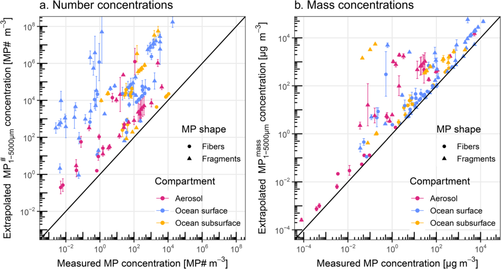

**[Image: Segur_et_al._-_2026_-_Using_the_power_law_size_distribution_to_extrapolate_and_compare_microplastic_number_and_mass_concen.pdf-0016-04.png (994x534, 156.8KB)]**

**Fig. 8** Comparison of measured MP concentrations to extrapolated MP1−5000 μm concentrations in ( **a** ) number (MP# m[− 3] ) and ( **b** ) mass (µg m[− 3] ). Error bars are estimated extrapolation uncertainties (1 standard deviation). Because only a fraction of the MP size spectrum between 1 and 5000 μm is measured, the extrapolated MP number and mass concentrations are generally higher than the corresponding reported concentrations. Data sampling dates cover the period 2011–2023 

than measured MP number concentrations by a median factor of 700x (IQR: 20–8500). The reason for this is that only a sub range of the full MP size spectrum (1 and 5000 μm) is observed, which contains a small fraction of the total MP number. In particular, abundant small MP are not observed by FTIR studies. Fibers have lower extrapolation factors as their slopes tend to be less steep than fragments (Fig. 6). For MP mass concentrations (fragments and fibers), the extrapolated MP[mass] 1−5000 μm 

are higher by a median factor of 3x (IQR: 1.5–12) than the estimated measured concentrations. For many net tow datasets, mass extrapolation leads to only a limited increase in MP mass concentration, because large MP size ranges from 300 to 5000 μm, which dominate mass, are already covered by the original observed data. 

Page 17 of 19 

Segur _et al. Microplastics and Nanoplastics_ (2026) 6:45 

**Extrapolating MP concentration data without C-PSD fitting** 

Depending on research questions and objectives there may be needs for extrapolation of MP# concentration without going through the complexity of fitting individual C-PSD datasets. This can be done by using generic, mean power law slopes, for different environmental compartments. Koelmans and Kooi (2020) developed equations, similar to Eq. (2) above, for a MP concentration correction factor, CF, that allows extrapolation of a reported MP# concentration to any size range, based on the minimum and maximum MP size observed, and a literature-based estimate of the generic PSD slope _a_ : 

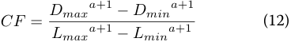

**[Image: Segur_et_al._-_2026_-_Using_the_power_law_size_distribution_to_extrapolate_and_compare_microplastic_number_and_mass_concen.pdf-0017-04.png (368x53, 4.2KB)]**

where _Lminand Lmax_ are the reported minimum and maximum MP length (µm), and _Dminand Dmax_ refer to the default size range of choice (e.g. 1–5000 μm). Corrected, extrapolated _MP_[#] _Dmin−Dmax_[ concentrations are:] 

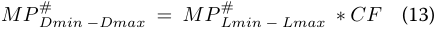

**[Image: Segur_et_al._-_2026_-_Using_the_power_law_size_distribution_to_extrapolate_and_compare_microplastic_number_and_mass_concen.pdf-0017-06.png (437x30, 4.7KB)]**

In Table 5 we summarize our best estimates for generic PSD slopes, _a_ , for fibers and fragments in the atmosphere, surface ocean and subsurface ocean. We note, however, two elements of uncertainty in this CF approach: (i) About half of all reported PSDs show low bias for small MP; consequently the reported measured MP# concentrations are also biased low, which is subsequently propagated to the extrapolated MP number concentration via Eq. (12). (ii) Measured _Lmin_ and _Lmax_ in Eq. (12) are rather uncertain size estimates of observed MP populations, because they represent extreme values. An approximate _Lmax_ introduces little additional uncertainty during MP# extrapolation because extrapolated large MP counts are rare. On the lower _Lmin_ end this is not the case, and we recommend replacing _Lmin_ by the bias-corrected _LlowerLOD_ bound. This, however, demands a corresponding correction of the biased reported MP# concentration that can be calculated in MPsizeBase. Further use of generic PSD slopes to extrapolate MP mass concentrations is best done by first calculating intercept _b_ for each datapoint using Eq. (2), and then apply both generic slope _a_ and datapoint-specific _b_ using Eq’s (9–11). 

## **Conclusions and recommendations** 

We have extended the existing power law PSD framework for microplastic to extrapolate and size-align binned MP size and number concentration data in the literature. The advantage of the framework is that it facilitates data intercomparison of observations and of observation-model output by comparing MP number or mass concentrations over the same MP size range. The main disadvantage is 

that the assumption of MP PSDs to follow a power law precludes detailed investigations of particle size fractionation processes, as current data quality does not result in significant PSD slope variability in atmospheric, surface and subsurface ocean. 

We recommend future environmental MP studies to always provide raw MP particle size data (length, width, area, perimeter, circularity) in numerical format as part of the supporting information or in an online data repository (i.e. submission to MPsizeBase). Raw data, unbinned, provides additional estimates of PSD slope and intercept. Binning MP size data is mostly useful for visualization of PSD histograms in papers. In addition, it would be useful if studies report realistic analysis method LODs to avoid concentrations being under-reported at the smallest particle sizes. 

More studies should intercompare sampling and analytical methods on the same samples, so that we can better understand the strengths and limitations of methods. In the marine environment we show that net tow and discrete, pumped sampling methods provide potentially complementary concentration results for MP fragments. Both methods are important, because large volume net tows recover less abundant large MP that carry most MP mass, while low volume pumped samples allow analysis of small MP that are relevant for biota uptake, health impacts, sea spray emission to the atmosphere and carbon cycling perturbations. Nevertheless, more efforts should be made to observe small MP in the 1–20 μm range by Raman microscopy in all environments. Net tow sampling of MP fibers appears to substantially underestimate small fiber concentrations, and pumped or discrete volume sampling is therefore recommended. Dedicated methodological developments should address both sampling and detection of fibers in environmental media. 

## **Abbreviations** 

MP Microplastic NP Nanoplastic PSD Particles size distribution BN-PSD Bin-normalized particle size distribution C-PSD Cumulative particle size distribution MLE Maximum likelihood estimator LOD Limit of detection FTIR Fourier transform infra-red DOC Dissolved Organic Carbon 

## **Supplementary Information** 

The online version contains supplementary material available at  h t t p s : / / d o i . o r g / 1 0 . 1 1 8 6 / s 4 3 5 9 1 - 0 2 6 - 0 0 2 0 5 - 5 . 

Supporting Information 1: Description oh the three raw datasets used as reference Supporting Information 2: Binned MLE test on MP datasets Additional file: .zip file with the excel file containing all the PSD information used, the python code to reproduce the data, and the visualization of all PSD. 

Page 18 of 19 

Segur _et al. Microplastics and Nanoplastics_ (2026) 6:45 

## **Acknowledgements** 

We thank the anonymous reviewers and editor for their constructive comments, and Frederic Leusch for providing raw MP data. 

## **Author contributions** 

JES and TS designed the study. JES, JLT and HA acquired funding. JES, TS, IH, DV, CR and ND developed the C-PSD size alignment framework. All authors contributed to data interpretation. JES, TS and IH wrote the draft manuscript, which was improved with the help of all authors. 

## **Funding** 

We acknowledge financial support from the CNRS, from the ANR20-CE34-0014 ATMO-PLASTIC and ANR-23-CE34-0012 BUBBLEPLAST grants, from the French ministry of higher education, and from the Horizon-Europe Interreg Poctefa ECOAIR project (309690). 

## **Data availability** 

The authors declare that the data supporting the findings of this study are available within the paper and its supplementary information files, as well as at https:/ /zenodo .org/re cord s/17380284. 

## **Declarations** 

## **Consent for publication** 

The authors provide consent for publication. 

## **Competing interests** 

The authors declare no competing interests. 

## **Author details** 

1Géosciences Environnement Toulouse, CNRS/IRD, Université de Toulouse, Toulouse 31400, France 

2Université Grenoble Alpes, CNRS, IRD, Grenoble INP, IGE, Grenoble, France 3Laboratoire des sciences de l’Environnement Marin, CNRS, IRD, Université de Brest, Ifremer, Plouzané, France 

Received: 5 January 2026 / Accepted: 20 May 2026 

**[Image: Segur_et_al._-_2026_-_Using_the_power_law_size_distribution_to_extrapolate_and_compare_microplastic_number_and_mass_concen.pdf-0018-19.png (276x24, 3.6KB)]**

## **References** 

1. Adebiyi A, Kok JF, Murray BJ, Ryder CL, Stuut J-BW, Kahn RA, Knippertz P, Formenti P, Mahowald NM, García-Pando Pérez, Klose C, Ansmann M, Samset A, Ito BH, Balkanski A, Di Biagio Y, Romanias C, Huang MN, Y., and, Meng J. A review of coarse mineral dust in the Earth system. Aeolian Res. 2023;60:100849. https:/ /doi.or g/10.10 16/j .aeolia.2022.100849. 

2. Aoki K, Furue R. A model for the size distribution of marine microplastics: A statistical mechanics approach. PLoS ONE. 2021;16:e0259781.  h t t p s : / / d o i . o r g / 1 0 . 1 3 7 1 / j o u r n a l . p o n e . 0 2 5 9 7 8 1 . 

3. Barchiesi M, Kooi M, Koelmans AA. Adding Depth to Microplastics. Environ Sci Technol. 2023;57:14015–23. https:/ /doi.or g/10.10 21/a cs.est.3c03620. 

4. Chamas A, Moon H, Zheng J, Qiu Y, Tabassum T, Jang JH, Abu-Omar M, Scott SL, Suh S. Degradation Rates of Plastics in the Environment. ACS Sustainable Chem Eng. 2020;8:3494–511.  h t t p s : / / d o i . o r g / 1 0 . 1 0 2 1 / a c s s u s c h e m e n g . 9 b 0 6 6 3 5 . 

5. Clauset A, Shalizi CR, Newman MEJ. Power-Law Distributions in Empirical Data. SIAM Rev. 2009;51:661–703. 

6. Coffin S, Weisberg SB, Rochman C, Kooi M, Koelmans AA. Risk characterization of microplastics in San Francisco Bay, California. Micropl &Nanopl. 2022;2(19). https:/ /doi.or g/10.11 86/s 43591-022-00037-z. 

7. Coffin S, Bertrand L, Ahmed KT, de Souza Leite L, Cowger W, Siña M, Barrick A, Kukkola A, Carney Almroth B, Miller E, Yeh A, Kennedy S, Mair MM. A probabilistic risk framework for microplastics integrating uncertainty across toxicological and environmental variability: Development and application to marine and freshwater ecosystems. J Hazard Mater. 2026;503:141021.  h t t p s : / / d o i . o r g / 1 0 . 1 0 1 6 / j . j h a z m a t . 2 0 2 5 . 1 4 1 0 2 1 . 

8. Contreras L, Edo C, Rosal R. Mass concentration of plastic particles from twodimensional images. Sci Total Environ. 2024;946:173849.  h t t p s : / / d o i . o r g / 1 0 . 1 0 1 6 / j . s c i t o t e n v . 2 0 2 4 . 1 7 3 8 4 9 . 

9. Cózar A, Echevarría F, González-Gordillo JI, Irigoien X, Úbeda B, HernándezLeón S, Palma ÁT, Navarro S, García-de-Lomas J, Ruiz A, Fernández-de-Puelles ML, Duarte CM. Plastic debris in the open ocean. Proc Natl Acad Sci U S A. 2014;111:10239–44. https:/ /doi.or g/10.10 73/p nas.1314705111. 

10. Cózar A, Sanz-Martín M, Martí E, González-Gordillo JI, Ubeda B, Gálvez JÁ, Irigoien X, Duarte CM. Plastic Accumulation in the Mediterranean Sea. PLoS ONE. 2015;10:e0121762. https:/ /doi.or g/10.13 71/j ournal.pone.0121762. 

11. Cross RK, Roberts SL, Jürgens MD, Johnson AC, Davis CW, Gouin T. Ensuring representative sample volume predictions in microplastic monitoring. Micropl &Nanopl. 2025;5:5. https:/ /doi.or g/10.11 86/s 43591-024-00109-2. 

12. Deike L, Reichl BG, Paulot F. A mechanistic sea spray generation function based on the sea state and the physics of bubble bursting. AGU Adv. 2022;3. https:/ /doi.or g/10.10 29/2 022AV000750. e2022AV000750. 

13. Enders K, Lenz R, Stedmon CA, Nielsen TG. Abundance, size and polymer composition of marine microplastics ≥ 10 µm in the Atlantic Ocean and their modelled vertical distribution. Mar Pollut Bull. 2015;100:70–81.  h t t p s : / / d o i . o r g / 1 0 . 1 0 1 6 / j . m a r p o l b u l . 2 0 1 5 . 0 9 . 0 2 7 . 

14. Eo S, Hong SH, Song YK, Han GM, Seo S, Shim WJ. Prevalence of small highdensity microplastics in the continental shelf and deep sea waters of East Asia. Water Res. 2021;200:117238.  h t t p s : / / d o i . o r g / 1 0 . 1 0 1 6 / j . w a t r e s . 2 0 2 1 . 1 1 7 2 3 8 . 

15. George M, Nallet F, Fabre P. A threshold model of plastic waste fragmentation: New insights into the distribution of microplastics in the ocean and its evolution over time. Mar Pollut Bull. 2024;199:116012.  h t t p s : / / d o i . o r g / 1 0 . 1 0 1 6 / j . m a r p o l b u l . 2 0 2 3 . 1 1 6 0 1 2 . 

16. Hagelskjær O, Margenat H, Yakovenko N, Sonke JE, Le Roux G. Improving environmental microplastic extrapolation: from field of view to full sample, and from microplastic 2D-morphology to mass. 16 July 2025.  h t t p s : / / d o i . o r g / 1 0 . 2 0 9 4 4 / p r e p r i n t s 2 0 2 5 0 7 . 1 3 0 0 . v 1 . 

17. Hidalgo-Ruz V, Gutow L, Thompson RC, Thiel M. Microplastics in the Marine Environment: A Review of the Methods Used for Identification and Quantification. Environ Sci Technol. 2012;46:3060–75.  h t t p s : / / d o i . o r g / 1 0 . 1 0 2 1 / e s 2 0 3 1 5 0 5 . 

18. Imbeault-Tétreault H, Roy P-O, Tromson C, Maxime D, Tirado-Seco P, Dandres T, Margni M, Patreau V, Samson R. ACV des sacs d’emplettes au Québec, RecyQuébec, CIRAIG, Polythechnique Montréal. 2017. 

19. Isobe A, Kubo K, Tamura Y, Kako S, Nakashima E, Fujii N. Selective transport of microplastics and mesoplastics by drifting in coastal waters. Mar Pollut Bull. 2014;89:324–30. https:/ /doi.or g/10.10 16/j .marpolbul.2014.09.041. 

20. Isobe A, Uchida K, Tokai T, Iwasaki S. East Asian seas: A hot spot of pelagic microplastics. Mar Pollut Bull. 2015;101:618–23.  h t t p s : / / d o i . o r g / 1 0 . 1 0 1 6 / j . m a r p o l b u l . 2 0 1 5 . 1 0 . 0 4 2 . 

21. Jenkins T, Persaud BD, Cowger W, Szigeti K, Roche DG, Clary E, Slowinski S, Lei B, Abeynayaka A, Nyadjro ES, Maes T, Hampton T, Bergmann L, Aherne M, Mason J, Honek SA, Rezanezhad JF, Lusher F, Booth AL, Smith AM, R. D. L., and, Van Cappellen P. Current state of microplastic pollution research data: trends in availability and sources of open data. Front Environ Sci. 2022;10.  h t t p s : / / d o i . o r g / 1 0 . 3 3 8 9 / f e n v s . 2 0 2 2 . 9 1 2 1 0 7 . 

22. Kaandorp MLA, Dijkstra HA, van Sebille E. Modelling size distributions of marine plastics under the influence of continuous cascading fragmentation. Environ Res Lett. 2021;16:054075. https:/ /doi.or g/10.10 88/1 748-9326/abe9ea. 

23. Koelmans AA, Redondo-Hasselerharm PE, Nor M, N. H., and, Kooi M. Solving the Nonalignment of Methods and Approaches Used in Microplastic Research to Consistently Characterize Risk. Environ Sci Technol. 2020;54:12307–15. https:/ /doi.or g/10.10 21/a cs.est.0c02982. 

24. Koelmans AA, Redondo-Hasselerharm PE, Nor NHM, De Ruijter VN, Mintenig SM, Kooi M. Risk assessment of microplastic particles. Nat Rev Mater. 2022;7:138–52. https:/ /doi.or g/10.10 38/s 41578-021-00411-y. 

25. Kooi M, Koelmans AA. Simplifying Microplastic via Continuous Probability Distributions for Size, Shape, and Density, Environ. Sci Technol Lett. 2019;6:551–7. https:/ /doi.or g/10.10 21/a cs.estlett.9b00379. 

26. Kooi M, Primpke S, Mintenig SM, Lorenz C, Gerdts G, Koelmans AA. Characterizing the multidimensionality of microplastics across environmental compartments. Water Res. 2021;202:117429.  h t t p s : / / d o i . o r g / 1 0 . 1 0 1 6 / j . w a t r e s . 2 0 2 1 . 1 1 7 4 2 9 . 

27. Leusch FDL, Lu H-C, Perera K, Neale PA, Ziajahromi S. Analysis of the literature shows a remarkably consistent relationship between size and abundance of microplastics across different environmental matrices. Environ Pollut. 2023;319:120984. https:/ /doi.or g/10.10 16/j .envpol.2022.120984. 

28. Lindeque PK, Cole M, Coppock RL, Lewis CN, Miller RZ, Watts AJR, WilsonMcNeal A, Wright SL, Galloway TS. Are we underestimating microplastic abundance in the marine environment? A comparison of microplastic 

Page 19 of 19 

Segur _et al. Microplastics and Nanoplastics_ (2026) 6:45 

capture with nets of different mesh-size. Environ Pollut. 2020;265:114721.  h t t p s : / / d o i . o r g / 1 0 . 1 0 1 6 / j . e n v p o l . 2 0 2 0 . 1 1 4 7 2 1 . 

29. Lorenz C, Roscher L, Meyer MS, Hildebrandt L, Prume J, Löder MGJ, Primpke S, Gerdts G. Spatial distribution of microplastics in sediments and surface waters of the southern North Sea. Environ Pollut. 2019;252:1719–29.  h t t p s : / / d o i . o r g / 1 0 . 1 0 1 6 / j . e n v p o l . 2 0 1 9 . 0 6 . 0 9 3 . 

30. Lu H-C, Ziajahromi S, Locke A, Neale PA, Leusch FDL. Microplastics profile in constructed wetlands: Distribution, retention and implications. Environ Pollut. 2022;313:120079. https:/ /doi.or g/10.10 16/j .envpol.2022.120079. 

31. Mattsson K, Björkroth F, Karlsson T, Hassellöv M. Nanofragmentation of Expanded Polystyrene Under Simulated Environmental Weathering (Thermooxidative Degradation and Hydrodynamic Turbulence). Front Mar Sci. 2021;7:578178. https:/ /doi.or g/10.33 89/f mars.2020.578178. 

32. Meides N, Menzel T, Poetzschner B, Löder MGJ, Mansfeld U, Strohriegl P, Altstaedt V, Senker J. Reconstructing the Environmental Degradation of Polystyrene by Accelerated Weathering. Environ Sci Technol. 2021;55:7930–8. https:/ /doi.or g/10.10 21/a cs.est.0c07718. 

33. Mintenig SM, Kooi M, Erich MW, Primpke S, Redondo- Hasselerharm PE, Dekker SC, Koelmans AA, van Wezel AP. A systems approach to understand microplastic occurrence and variability in Dutch riverine surface waters. Water Res. 2020;176:115723. https:/ /doi.or g/10.10 16/j .watres.2020.115723. 

34. OECD. Global plastics outlook: policy scenarios to 2060. 2022. 

35. Perera K, Ziajahromi S, Bengtson Nash S, Manage PM, Leusch FDL. Airborne Microplastics in Indoor and Outdoor Environments of a Developing Country in South Asia: Abundance, Distribution, Morphology, and Possible Sources. Environ Sci Technol. 2022;56:16676–85.  h t t p s : / / d o i . o r g / 1 0 . 1 0 2 1 / a c s . e s t . 2 c 0 5 8 8 5 . 

36. Pfohl P, Santizo K, Sipe J, Wiesner M, Harrison S, Svendsen C, Wohlleben W. Environmental degradation and fragmentation of microplastics: dependence on polymer type, humidity, UV dose and temperature. Micropl &Nanopl. 2025;5:7. https:/ /doi.or g/10.11 86/s 43591-025-00118-9. 

37. Primpke S, Fischer M, Lorenz C, Gerdts G, Scholz-Böttcher BM. Comparison of pyrolysis gas chromatography/mass spectrometry and hyperspectral FTIR imaging spectroscopy for the analysis of microplastics. Anal Bioanal Chem. 2020a;412:8283–98. https:/ /doi.or g/10.10 07/s 00216-020-02979-w. 

38. Primpke S, Christiansen SH, Cowger W, De Frond H, Deshpande A, Fischer M, Holland EB, Meyns M, O’Donnell BA, Ossmann BE, Pittroff M, Sarau G, Scholz-Böttcher BM, Wiggin KJ. Critical Assessment of Analytical Methods for the Harmonized and Cost-Efficient Analysis of Microplastics. Appl Spectrosc. 2020b;74:1012–47. https:/ /doi.or g/10.11 77/0 003702820921465. 

39. Redondo-Hasselerharm PE, Rico A, Huerta Lwanga E, van Gestel CAM, Koelmans AA. Source-specific probabilistic risk assessment of microplastics in soils applying quality criteria and data alignment methods. J Hazard Mater. 2024;467:133732. https:/ /doi.or g/10.10 16/j .jhazmat.2024.133732. 

40. Sherrod H, Leong N, Hapich H, Gomez F, Moore S, Maurer B, Coffin S, Hampton LT, Hale T, Nelson R, Murphy-Hagan C, Fadare OO, Kukkola A, Lu H-C, Markley L, Cowger W. One4All: An Open Source Portal to Validate and Share Microplastics Data and Beyond. J Open Source Softw. 2024;9:6715.  h t t p s : / / d o i . o r g / 1 0 . 2 1 1 0 5 / j o s s . 0 6 7 1 5 . 

41. Simon M, van Alst N, Vollertsen J. Quantification of microplastic mass and removal rates at wastewater treatment plants applying Focal Plane Array (FPA)-based Fourier Transform Infrared (FT-IR) imaging. Water Res. 2018;142:1– 9. https:/ /doi.or g/10.10 16/j .watres.2018.05.019. 

42. Song YK, Hong SH, Eo S, Jang M, Han GM, Isobe A, Shim WJ. Horizontal and Vertical Distribution of Microplastics in Korean Coastal Waters. Environ Sci Technol. 2018;52:12188–97. https:/ /doi.or g/10.10 21/a cs.est.8b04032. 

43. Sonke JE, Koenig A, Segur T, Yakovenko N. Global environmental plastic dispersal under OECD policy scenarios toward 2060. Sci Adv. 2025a;11:eadu2396. https:/ /doi.or g/10.11 26/s ciadv.adu2396. 

44. Sonke JE, Segur T, Hough I, Nela D, Voisin D, Yakovenko N, Hagelskjaer O, Abbasi S, Bucci S, Richon C, Angot H, Thomas JL, Le Roux G. MPsizeBase: a database for particle size distribution in environmental microplastic data [dataset]. 2025b. https:/ /doi.or g/10.52 81/z enodo.17380284. 

45. Stemmann L, Eloire D, Sciandra A, Jackson GA, Guidi L, Picheral M, Gorsky G. Volume distribution for particles between 3.5 to 2000 µm in the upper 200 m region of the South Pacific Gyre. Biogeosciences. 2008;5:299–310.  h t t p s : / / d o i . o r g / 1 0 . 5 1 9 4 / b g - 5 - 2 9 9 - 2 0 0 8 . 

46. Tamminga M, Stoewer S-C, Fischer EK. On the representativeness of pump water samples versus manta sampling in microplastic analysis. Environ Pollut. 2019;254:112970. https:/ /doi.or g/10.10 16/j .envpol.2019.112970. 

47. Tekman MB, Wekerle C, Lorenz C, Primpke S, Hasemann C, Gerdts G, Bergmann M. Tying up Loose Ends of Microplastic Pollution in the Arctic: Distribution from the Sea Surface through the Water Column to Deep-Sea Sediments at the HAUSGARTEN Observatory. Environ Sci Technol. 2020;54:4079–90. https:/ /doi.or g/10.10 21/a cs.est.9b06981. 

48. Tokai T, Uchida K, Kuroda M, Isobe A. Mesh selectivity of neuston nets for microplastics. Mar Pollut Bull. 2021;165:112111.  h t t p s : / / d o i . o r g / 1 0 . 1 0 1 6 / j . m a r p o l b u l . 2 0 2 1 . 1 1 2 1 1 1 . 

49. Trasande L, Krithivasan R, Park K, Obsekov V, Belliveau M. Chemicals Used in Plastic Materials: An Estimate of the Attributable Disease Burden and Costs in the United States. J Endocr Soc. 2024;8:bvad163.  h t t p s : / / d o i . o r g / 1 0 . 1 2 1 0 / j e n d s o / b v a d 1 6 3 . 

50. Turcotte DL. Fractals and fragmentation. J Geophys Res. 1986;91:1921–1926. https:/ /doi.or g/10.10 29/J B091iB02p01921. 

51. Ueda K, Kameda Y, Fujita E, Rachi S, Iwasaki Y, Tai R, Naito W. Concentrations and characteristics of microplastic particles collected by neuston net or pump system in the surface layer of Tokyo Bay. Reg Stud Mar Sci. 2025;84(104108). https:/ /doi.or g/10.10 16/j .rsma.2025.104108. 

52. Virkar Y, Clauset A. Power-law distributions in binned empirical data, the annals of applied statistics. 2014;8:89–119. 

53. Yakovenko N, Pérez-Serrano L, Segur T, Hagelskjaer O, Margenat H, Roux GL, Sonke JE. Human exposure to PM10 microplastics in indoor air. PLoS ONE. 2025;20:e0328011. https:/ /doi.or g/10.13 71/j ournal.pone.0328011. 

54. Yu M, Herrmann B, Liang H, Sistiaga M, Zhu Z, Brčić J, Tang L, Liu C, Tang Y. Size selection in sampling nets leads to underestimation of microplastic pollution. Environ Pollut. 2025;372:126007.  h t t p s : / / d o i . o r g / 1 0 . 1 0 1 6 / j . e n v p o l . 2 0 2 5 . 1 2 6 0 0 7 . 

55. Zhao S, Zettler ER, Bos RP, Lin P, Amaral-Zettler LA, Mincer TJ. Large quantities of small microplastics permeate the surface ocean to abyssal depths in the South Atlantic Gyre. Glob Change Biol. 2022;28:2991–3006.  h t t p s : / / d o i . o r g / 1 0 . 1 1 1 1 / g c b . 1 6 0 8 9 . 

## **Publisher’s note** 

Springer Nature remains neutral with regard to jurisdictional claims in published maps and institutional affiliations. 

---

## Extracted Images

| # | File | Dimensions | Size |
|---|------|------------|------|
| 1 | Segur_et_al._-_2026_-_Using_the_power_law_size_distribution_to_extrapolate_and_compare_microplastic_number_and_mass_concen.pdf-0001-05.png | 59x60 | 2.6KB |
| 2 | Segur_et_al._-_2026_-_Using_the_power_law_size_distribution_to_extrapolate_and_compare_microplastic_number_and_mass_concen.pdf-0003-05.png | 303x24 | 2.1KB |
| 3 | Segur_et_al._-_2026_-_Using_the_power_law_size_distribution_to_extrapolate_and_compare_microplastic_number_and_mass_concen.pdf-0004-02.png | 994x760 | 193.7KB |
| 4 | Segur_et_al._-_2026_-_Using_the_power_law_size_distribution_to_extrapolate_and_compare_microplastic_number_and_mass_concen.pdf-0004-06.png | 447x117 | 8.7KB |
| 5 | Segur_et_al._-_2026_-_Using_the_power_law_size_distribution_to_extrapolate_and_compare_microplastic_number_and_mass_concen.pdf-0005-02.png | 994x487 | 108.8KB |
| 6 | Segur_et_al._-_2026_-_Using_the_power_law_size_distribution_to_extrapolate_and_compare_microplastic_number_and_mass_concen.pdf-0006-02.png | 952x1270 | 277.1KB |
| 7 | Segur_et_al._-_2026_-_Using_the_power_law_size_distribution_to_extrapolate_and_compare_microplastic_number_and_mass_concen.pdf-0007-07.png | 339x30 | 2.9KB |
| 8 | Segur_et_al._-_2026_-_Using_the_power_law_size_distribution_to_extrapolate_and_compare_microplastic_number_and_mass_concen.pdf-0007-13.png | 448x46 | 4.7KB |
| 9 | Segur_et_al._-_2026_-_Using_the_power_law_size_distribution_to_extrapolate_and_compare_microplastic_number_and_mass_concen.pdf-0007-15.png | 451x78 | 7.3KB |
| 10 | Segur_et_al._-_2026_-_Using_the_power_law_size_distribution_to_extrapolate_and_compare_microplastic_number_and_mass_concen.pdf-0008-11.png | 419x84 | 7.0KB |
| 11 | Segur_et_al._-_2026_-_Using_the_power_law_size_distribution_to_extrapolate_and_compare_microplastic_number_and_mass_concen.pdf-0008-14.png | 436x28 | 4.7KB |
| 12 | Segur_et_al._-_2026_-_Using_the_power_law_size_distribution_to_extrapolate_and_compare_microplastic_number_and_mass_concen.pdf-0009-03.png | 397x84 | 6.4KB |
| 13 | Segur_et_al._-_2026_-_Using_the_power_law_size_distribution_to_extrapolate_and_compare_microplastic_number_and_mass_concen.pdf-0009-05.png | 447x107 | 9.9KB |
| 14 | Segur_et_al._-_2026_-_Using_the_power_law_size_distribution_to_extrapolate_and_compare_microplastic_number_and_mass_concen.pdf-0009-07.png | 447x107 | 10.8KB |
| 15 | Segur_et_al._-_2026_-_Using_the_power_law_size_distribution_to_extrapolate_and_compare_microplastic_number_and_mass_concen.pdf-0009-09.png | 485x535 | 78.0KB |
| 16 | Segur_et_al._-_2026_-_Using_the_power_law_size_distribution_to_extrapolate_and_compare_microplastic_number_and_mass_concen.pdf-0009-11.png | 448x107 | 10.3KB |
| 17 | Segur_et_al._-_2026_-_Using_the_power_law_size_distribution_to_extrapolate_and_compare_microplastic_number_and_mass_concen.pdf-0010-02.png | 840x1264 | 284.8KB |
| 18 | Segur_et_al._-_2026_-_Using_the_power_law_size_distribution_to_extrapolate_and_compare_microplastic_number_and_mass_concen.pdf-0012-02.png | 485x484 | 35.0KB |
| 19 | Segur_et_al._-_2026_-_Using_the_power_law_size_distribution_to_extrapolate_and_compare_microplastic_number_and_mass_concen.pdf-0013-05.png | 994x572 | 87.1KB |
| 20 | Segur_et_al._-_2026_-_Using_the_power_law_size_distribution_to_extrapolate_and_compare_microplastic_number_and_mass_concen.pdf-0016-04.png | 994x534 | 156.8KB |
| 21 | Segur_et_al._-_2026_-_Using_the_power_law_size_distribution_to_extrapolate_and_compare_microplastic_number_and_mass_concen.pdf-0017-04.png | 368x53 | 4.2KB |
| 22 | Segur_et_al._-_2026_-_Using_the_power_law_size_distribution_to_extrapolate_and_compare_microplastic_number_and_mass_concen.pdf-0017-06.png | 437x30 | 4.7KB |
| 23 | Segur_et_al._-_2026_-_Using_the_power_law_size_distribution_to_extrapolate_and_compare_microplastic_number_and_mass_concen.pdf-0018-19.png | 276x24 | 3.6KB |
