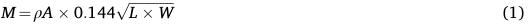
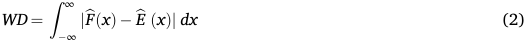
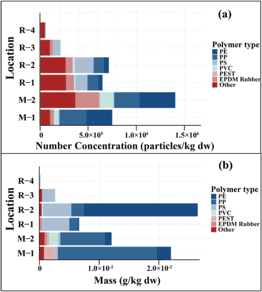
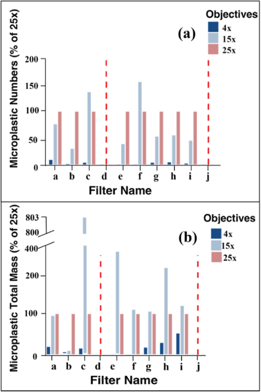
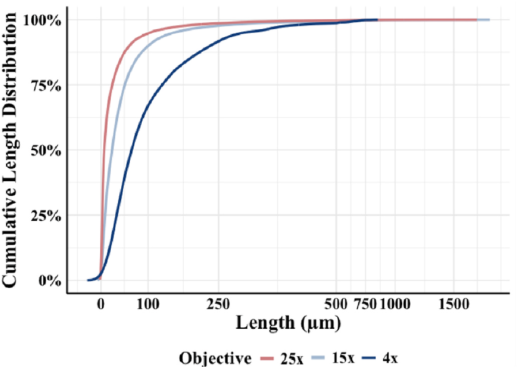
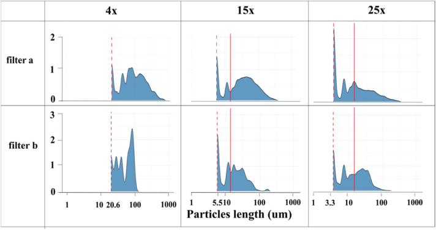
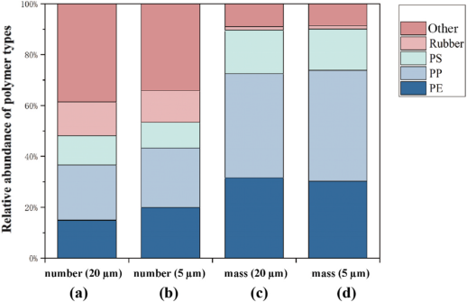
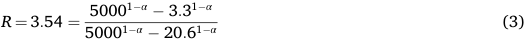

Talanta 296 (2026) 128417 

**[Image: Wang_et_al._-_2026_-_Implications_of_method-_and_instrument-based_size_detection_limits_in_μFTIR-based_microplastic_analy.pdf-0001-01.png (125x136, 22.4KB)]**

Contents lists available at ScienceDirect 

## Talanta 

journal homepage: www.elsevier.com/locate/talanta 

**[Image: Wang_et_al._-_2026_-_Implications_of_method-_and_instrument-based_size_detection_limits_in_μFTIR-based_microplastic_analy.pdf-0001-05.png (119x150, 29.9KB)]**

## Implications of method- and instrument-based size detection limits in μFTIR-based microplastic analysis 

**[Image: Wang_et_al._-_2026_-_Implications_of_method-_and_instrument-based_size_detection_limits_in_μFTIR-based_microplastic_analy.pdf-0001-07.png (60x60, 2.7KB)]**

## Siting Wang[a][,][b][,][c] , Svenja M. Mintenig[a] , Jing Wu[b][,][c] , Albert A. Koelmans[a][,][*] 

a _Aquatic Ecology and Water Quality Management Group, Wageningen University, the Netherlands_ 

b _State Key Laboratory of Regional Environment and Sustainability, Tsinghua University, Beijing, 100084, China_ 

c _Research and Development Center of Advanced Environmental Supervision Technology and Instrument, Research Institute for Environmental Innovation (Suzhou) Tsinghua, Suzhou, 215163, China_ 

## A R T I C L E I N F O A B S T R A C T 

> _Keywords:_ Spectroscopic detection methods are considered the gold standard in microplastic research, but they are not yet 

> Microplastics fully standardized. Results, such as numerical concentrations from different studies, are often reported and 

> Sieve mesh sizeSize distributionμFTIR compared without considering all the relevant factors during the analysis process that may influence these concentrations. For the first time, we quantify the influence of both the sieve mesh sizes used during laboratory Suspended solid matter microplastic extraction and the choice of objective (4×, 15×, or 25× magnification) in μFTIR analysis on microplastics number and mass concentrations in suspended solids samples from two Dutch rivers. A highresolution μFTIR objective and thus lower size detection limit enhances the detection of particles just above this limit, thereby increasing the total number of detected particles. Size distributions captured with a 4× objective (20.6 μm pixel resolution) differed significantly from those with a 15× (5.5 μm) and 25× objective (3.3 μm), while the results for the 15× and 25× objectives were more comparable. Using the 15× objective appears to be a reasonable choice, as lowering the detection limit further would only marginally improve results while significantly increasing workload. 

During extraction, sieves with mesh sizes of 20 μm and 5 μm did not produce sharp size cut-offs. By applying cascade filtration, it was possible to determine whether the actual size boundaries of the retained particles – matched these nominal limits. Our findings indicate that 14 38 % of the particles are nominally either too large or too small to be retained by a given sieve mesh size. Due to negligible differences for polymer type and size distributions found on the 20 and 5 μm sieves, the 20 μm sieve is recommended for an improved time efficiency in microplastic analysis. 

To further improve comparability across studies, we recommend expanding datasets as measured here so that read-across techniques can be developed, allowing conversion between the diverse resolutions and mesh sizes applied. 

## **1. Introduction** 

The abundant presence of microplastics in the biosphere is one of today’s biggest environmental problems, potentially affecting both environmental and human health [1]. Microplastics have been found in air, soil, and water systems, with their number concentrations increasing as microplastic sizes decrease [2–5]. As plastic production continues to rise, and the release of plastic to the environment persists, there is an increasing societal need for monitoring and risk assessments of these hazardous particles [6]. Consequently, there is an urgent need for data 

on microplastic abundances and characteristics, such as size and shape distributions, mass, and polymer identifications, which are essential for ecological and human health risk assessments [7–10]. 

To detect these particle characteristics, spectroscopic methods like μFTIR or Raman are preferred because they measure polymer particles in their native state. For Raman or μFTIR-based particle mass concentrations, which are also needed for monitoring and time trend analysis, improved (e.g., AI-based) models have become available that translate 2D particle size and shape data into accurate estimations of 3D particle volumes and masses [8,11,12]. To enable risk assessments, this particle 

* Corresponding author. Aquatic Ecology and Water Quality Management Group, Wageningen University & Research, P.O. 47, 6700 AA, Wageningen, the Netherlands. 

_E-mail address:_ bart.koelmans@wur.nl (A.A. Koelmans). 

https://doi.org/10.1016/j.talanta.2025.128417 

Received 4 April 2025; Received in revised form 28 May 2025; Accepted 29 May 2025 

Available online 30 May 2025 

0039-9140/© 2025 The Authors. Published by Elsevier B.V. This is an open access article under the CC BY license ( http://creativecommons.org/licenses/by/4.0/ 

_Talanta 296 (2026) 128417_ 

_S. Wang et al.                                                                                                                                                                                                                                   Talanta_ 

data is often presented as probability density functions (PDFs), which constitute an important measurement target alongside basic data such as particle numbers, sizes, and masses [1,13]. 

To date, μFTIR spectroscopy is the most used analytical technique in microplastic research. Significant components such as background contamination, recovery rates, blank correction procedures, polymer identification, subsampling from Anodisc filters, and mass estimation models have received considerable attention in the literature [3,11,12, 14–16]. However, the implications of other analytical choices, such as the selection of microscope objectives or filtration conditions, for targeted particle sizes and characteristics have not been systematically researched. These aspects, however, are crucial as they determine the size detection limit of the instrument and the method, respectively. 

Advanced μFTIR instruments can have different size detection limits, depending on the objective and settings used. For instance, for the Agilent Cary 620 FPA-μFTIR system, one can choose pixel resolutions of 3.3, 5.5, or 20.6 μm, applying a 25×, 15×, or 4× objective, respectively. These are the instrument detection limits. Often, the 4× objective is used as it shortens the measurement time, but the added value of using a higher resolution is unclear because direct comparisons have not yet been made. Knowledge about microplastics _<_ 20 μm is limited in general, and there is a need for quality data in this size range to better understand the occurrences and risks of such small microplastics. So far, presented microplastic size distributions are often extrapolated to below studies’ detection limit [17], an approach that may be validated by measuring particles down to 3.3 μm on the same filter. Until now, it remains unclear to what extent microplastic abundances measured at such fine resolutions can be predicted from measurements taken at a lower resolution. 

Prior to analysis, single or cascade filtration steps are commonly performed to extract microplastics from various sample matrices. These steps can be considered to determine the method particle size detection limits. Until now, method size detection limits are often specified as nominal limits based on the sieving mesh size used. However, it has not yet been evaluated how well the actual size boundaries of the isolated particles align with these nominal limits. 

Given these research gaps, the aim of this method development study is to evaluate the effects of applying different μFTIR objectives ( _instrument size detection limit_ ) and different sieve sizes ( _method size detection limit_ ). The framework for interpretation is the extent to which these choices, in addition to the size detection limit itself (e.g., 3.3; 5.5; 20.6 μm), influence the distributions of particle characteristics such as size, volume, and polymer distribution. The latter was done for particle numbers, but also for their estimated masses [11]. 

These research objectives can be investigated using different types of samples taken from environmental compartments. Here, we chose suspended solids sampled with a sediment box in the Dutch part of the rivers Rhine and Meuse [18,19]. Microplastic abundances and characteristics were determined using μFTIR imaging and automated image analysis [20–22] following previously published QA/QC criteria [3,23]. Samples were analysed using different μFTIR resolutions, i.e., instrument size detection limits of 3.3, 5.5, and 20.6 μm, corresponding to 25×, 15×, and 4× objectives, respectively, and isolated using cascade filtration over 20 and 5 μm mesh sieves. 

## **2. Methods** 

## _2.1. Sampling_ 

Eight suspended matter samples were analysed (Table S1), which were kindly provided by Rijkswaterstaat (The Netherlands). They were collected using a sediment box (Fig. S1). The detailed procedure is outlined elsewhere [19] and is briefly summarized here. A submersible pump was positioned at a depth of 10 cm below the water surface and operated at a controlled flow rate of 4 L per minute. Water was pumped into and through the stainless-steel sediment box (40 × 25 × 30 cm). 

Inside the box, suspended particles, including microplastics, were captured by vertical partitions. Sediment boxes were deployed at two different monitoring stations and remained in place for approximately four weeks allowing 150–167 m[3 ] of surface water to flow through the boxes. Two samples were from the river Meuse, taken in Eijsden (M − 1 and M − 2), and four samples were from the river Rhine, taken in Lobith (R-1, R-2, R-3, R-4). 

Upon retrieval from the field, the sediment boxes were carefully opened in a controlled laboratory environment. The suspended matter from each sediment box was transferred to glass bottles for storage, with total dry weights ranging from 157.1 to 1727.4 g (see Table S1). These bottles were well shaken to homogenize samples after which subsamples of approximately 50 g were taken for further analysis. Additionally, − subsamples from samples M 1 and R-4 were spiked (S-1, and S-2 respectively) with polymer standards made of polyethylene (PE), polypropylene (PP), polyethylene terephthalate (PET) and polystyrene (PS) of varying sizes and concentrations (see Table S2 and S3). 

It should be noted that the sampled microplastics were not intended to be representative of the actual river microplastics load. As buoyant particles at the water surface were not sampled, and the microplastic sampling efficiency of sediment boxes is known to be low [18,19]. 

## _2.2. Sample preparation_ 

The extraction of microplastics from the suspended matter samples followed the protocol by Mintenig et al. [24]. First, the dried suspended matter samples were inspected for larger materials (e.g., visible parts of plant leaves) and then thoroughly shaken. Subsequently, 2.5 g of each sample was taken for microplastic extraction using a metal spoon, while avoiding sampling solely from the top layer. The sample weight was kept relatively low to minimize filter clogging, as we were interested in microplastic sizes down to 5 μm, and because representative sampling of the water systems was not the main objective of this method development study. 

Subsequently, prefiltered SDS (5 %), KOH (12.5 %), and H2O2 (30 %) were added sequentially, followed by a density separation using a prefiltered ZnCl2 solution (1.6 g/cm[3] ). Before the addition of each new chemical, the samples were sequentially filtered through 20 μm and 5 μm mesh metal sieves and rinsed with filtered deionized water. Residues on the two sieves were directly immersed in the subsequent chemical solution in separate beakers. After completion of all digestion and density separation processes, they were filtered separately on aluminium oxide filters (Whatman Anodisc™ 25, pore size 0.2 μm). – Each size fraction per sample was divided across 2 5 Anodisc filters, Table S4 resulting in a total of 50 filters (see ). All filters were fully scanned using the 15× objective of the μFTIR. Additionally, full-surface × and 25× scans were performed for 10 of these filters using the 4 objective as well (Table S5). Results are presented for the 20 and 5 μm sieves individually and in combination. 

## _2.3. Microplastic identification and quantification_ 

The samples were analysed on a μFTIR imaging system with a 128 × 128 FPA detector (Agilent Cary 620, Santa Clara, USA). The 15× objective (pixel resolution of 5.5 μm) was used for all samples, while 10 × and 25× of the 50 filters were analysed additionally with the 4 objective, with a pixel resolution of 20.6 μm and 3.3 μm respectively. Generated μFTIR data were analysed using two software tools, siMPle (v1.0.1) and MPAPP (v1.1.1) [25], in combination with the reference database [22] (https://simple-plastics.eu/). After manual checking identified spectra, polymer-specific thresholds were adapted partially before completing the MPAPP analysis (see Table S6). 

Microplastic abundances are presented as numbers of particles per kilogram dry suspended matter (particles/kg dw). Additionally, microplastic masses (M) were calculated using average polymer densities (Table S6) and the model by Chen et al. [11], which estimates the 

2 

_Talanta 296 (2026) 128417_ 

_S. Wang et al.                                                                                                                                                                                                                                   Talanta_ 

microplastic volumes based on their length (L), width (W), and area (A): 

**[Image: Wang_et_al._-_2026_-_Implications_of_method-_and_instrument-based_size_detection_limits_in_μFTIR-based_microplastic_analy.pdf-0003-03.png (532x24, 2.8KB)]**

Following Kooi et al. [13] we present microplastic size distributions by fitting log-transformed power laws on individual and combined sample data using RStudio (2022.02.01 + 461). We further explored differences in microplastic abundances, sizes and polymer types when applying different μFTIR objectives ( _size detection limit_ ) and different sieve sizes ( _method size detection limit_ ) using Origin 2018. As individual datasets were not normally distributed, we calculated the Wasserstein distance (WD) which is a measure of the distance between two probability distributions [26,27]. 

**[Image: Wang_et_al._-_2026_-_Implications_of_method-_and_instrument-based_size_detection_limits_in_μFTIR-based_microplastic_analy.pdf-0003-05.png (532x41, 3.6KB)]**

where F(x) and E(x) are cumulative distribution functions (CDFs) of two probability distributions being compared. A smaller value indicates that the distributions are more similar, while a larger value suggests greater differences between the distributions. T-tests were performed to test this statistically. 

## _2.4. Quality assurance and quality control_ 

This study followed the QA/QC recommendations provided when extracting microplastics from sediments [23] and freshwaters [3] (see Table S7). In summary, all equipment and containers were cleaned and rinsed with ultrapure water. In the laboratory, cotton clothing and lab coats as well as nitrile gloves were worn, all sample processing steps were performed in a laminar flow cabinet, all chemicals were filtered before usage, and lab surfaces were cleaned with ethanol. A recovery rate of 81.5 ± 0.7 % (n = 3) was determined using polydispersed PE spheres of 10–180 μm (Cospheric, United States), which are similar in size to the targeted microplastics (see Table S8). All reported concentrations were adjusted for this recovery rate. To determine background contamination, three procedural blanks were analysed in parallel with the actual samples. Average blank counts and masses for each polymer type and each 100 μm size bin were subtracted from the corresponding microplastic findings in individual samples (Table S13–16). Additionally, we present the limits of detection (LOD) and limits of quantification (LOQ) values calculated for each polymer based on the microplastics detected in the blank samples. The LOD ranged from 0 to 5.02 × 10[4 ] particles/kg dw and 0 to 4.80 × 10[−][3 ] g/kg dw (see Table S9 and S10), while the LOQ ranged from 0 to 1.67 × 10[5 ] particles/kg dw and 0 to 1.60 × 10[−][2 ] g/kg dw (see Table S11 and S12). Given the analytical nature of this study and the fact that representatively assessing environmental concentrations was not the main aim, we were less strict in adhering to the criteria of sample size and in-site variability. 

## **3. Results and discussion** 

## _3.1. Microplastics in suspended solids_ 

## _3.1.1. Microplastic abundances_ 

Although determining riverine concentrations was not the primary objective of this study, we report microplastic abundances based on measurements conducted using the 15× objective. This enables meaningful comparisons with findings from other studies as well as among our own samples. After subtracting polymer and size specific mean values obtained from the three blanks, microplastic number concentrations in the samples ranged between 5.55 × 10[4 ] and 7.00 × 10[5 ] particles/kg dw in Lobith, and between 7.34 × 10[5 ] and 1.38 × 10[6 ] particles/kg dw in Eijsden (Fig. 1a). Microplastic mass concentrations ranged between 1.95 × 10[−][4 ] to 2.60 × 10[−][2 ] g/kg dw in Lobith, and 1.18 × 10[−][2 ] to 2.16 × 10[−][2 ] g/kg dw in Eijsden (Fig. 1b). The majority of findings are above the polymer specific LOQ, or at least above the LOD. 

**[Image: Wang_et_al._-_2026_-_Implications_of_method-_and_instrument-based_size_detection_limits_in_μFTIR-based_microplastic_analy.pdf-0003-13.png (518x578, 96.9KB)]**

**Fig. 1.** Microplastic concentrations in samples of riverine suspended matter in the Meuse (M) and the Rhine (R), represented as (a) number concentrations and as (b) mass concentrations. Polymers with number shares _>_ 10 % are specified ’ individually, while those with smaller shares are grouped as ‘Other . 

For specific polymers with low and comparable numbers to the blank samples, results fall below the LOD (Table S10 and 12). 

Comparing these concentrations with other studies is challenging for several reasons. First, sample volumes used in this study were likely too small to be fully representative of the actual river microplastic load. Second, typically studies express microplastic concentrations per cubic meter of water. Extrapolating from suspended solid amounts to cubic meters would, however, be highly inaccurate as sampling efficiencies of these sediment boxes is known to be low and variable and has not yet been quantified for different microplastic sizes and densities [18,19]. Only one study on suspended matter exists to date, which sampled at the same location but used even lower sample volumes and a less advanced μFTIR system [28]. This could thus partially explain why their number concentrations were 1–3 orders of magnitude lower. 

## _3.1.2. Microplastic size distributions_ 

All samples exhibited a consistent trend of higher microplastic numbers with decreasing particle sizes. Power laws were fitted to microplastic length data for individual samples measured with the 15× objective, as well as for combined data (Fig. S2). In Lobith, the power law exponents (alpha) ranged from 2.74 (sd 0.43) to 3.47 (sd 0.39), with a mean value of total samples as 3.89 (sd 0.36). In Eijsden, the exponents were 2.40 (sd 0.22) and 3.67 (sd 0.73) with a mean value of total samples as 3.19 (sd 0.58). The minimum sizes for which these power law distributions were applicable ranged from 37.6 (sd 12.9) μm to 92.1 (sd 18.6) μm in Lobith, and from 35.4 (sd 18.0) μm to 90.2 (sd 34.9) μm in Eijsden. Given the uncertainty in the power law slopes, the difference in distributions for the two locations cannot be considered statistically significant (p = 0.99). When combining all data, we found an average alpha value of 3.65 (sd 0.21), applicable down to a minimum size of 118.0 (sd 14.1) μm. This exponent is higher than the previously reported power-law exponent for the particle size distribution in riverine surface water, α = 2.64 ± 0.01 [13]. The power law slope of 2.64 pertained to 

3 

> _S. Wang et al.                                                                                                                                                                                                                                   Talanta 296 (2026) 128417_ 

different water systems, sampling methods, and a distinct matrix (water versus suspended solids), which limits direct comparability. Additionally, one possible explanation is that, given the detection limit of 5.5 μm, smaller particles are being detected than in previous studies. These variations could also be influenced by the sediment box’s varying retention capacity, which depends on particle size [18]. Additionally, larger plastics, which typically float at the water surface, are likely underestimated as they are less commonly found at a depth of 10 cm. Another possibility is that there is indeed a difference in the distributions due to a variation in microplastic sources, polymer composition, or fragmentation mechanisms. 

## _3.1.3. Polymer types_ 

In total, 25 different polymer types were identified. Based on microplastic number concentrations, predominantly PE (19 %), PP (20 %), ethylene propylene diene monomer (EPDM) rubber (13 %) and PS (11 %) were detected (Fig. 1a). Based on mass, the shares of PP (39 %), PE (32 %), and PS (18 %) were even higher, whereas the share of EPDM was only 1 % indicating that identified particles were typically rather small (Fig. 1b). Finding predominantly PE and PP in aquatic environments is common for studies and is associated with their high production volumes and widespread daily use [24,29,30]. Our results further confirm that polymer diversity is high when examining microplastics smaller than 300 μm [24,31]. 

## _3.2. Implications of method- and instrument-based size detection limits_ 

## _3.2.1. Instrument-based size detection limit_ 

## a. Microplastic abundances 

The effects of using different μFTIR objectives, and thus different size detection limits were investigated by repeating the analysis of ten filters using the 4×, 15×, and 25× objectives respectively (Table S5). We chose seven filters from environmental samples with varying microplastic concentrations, and three filters (filter a, g, h) stemming from spiked samples to ensure the inclusion of filters with very high microplastic loads and the presence of differently sized particles. Data from two filters (filters d and j) measured with the 25× objective had to be excluded. One dataset was compromised due to insufficient cooling of the FPA detector during measurement, while the other encountered an error during data export, rendering it unusable. 

It was expected that measurements with the 25× objective would result in the highest microplastic abundances because it has the lowest size detection limit and thus, the highest likelihood of ‘hitting’ the smaller microplastic particles due to a higher density of measuring points. This expectation was confirmed for most of the filters, whereas the highest microplastic numbers on two filters (c and f) were determined during the analysis with the 15× objective. It must be considered that on filter f, particle counts were very low (21 with the 15×, and 16 with the 25× objective respectively), meaning that any slight variability in findings appears more pronounced on a relative abundance scale. In addition to discrepancies in particle numbers, mass results also deviated strongly for filter c. This is likely an effect of sample handling, specifically the process of removing this filter from the μFTIR instrument and subsequently reintroducing it for analysis on another day. This handling may have caused the loss of numerous large polypropylene (PP) particles before analysis with the 25× objective, as well as potential effects on smaller particles, which were also affected and lost during the process. 

Overall, the 15× objective identified 74 ± 47 % of the abundances detected with the 25× objective. As expected, the 4× objective always found the lowest abundances of microplastic. Even more, on three out of the ten filters examined with the 4× objective no microplastics were found at all (filters e, f and j). Comparing microplastic numbers to the findings of the 25× objectives, the 4× objective identified only 3 ± 3 % 

of the abundances (Fig. 2a). It is unsurprising that results from the 4× objective deviate the most, and that the 15× and 25× objectives are more similar to each other given that the densities of measurement points are more comparable (with resolutions of 5.5 μm and 3.3 μm, respectively), whereas the 4× objective has a much coarser resolution of 20.6 μm. Microplastic abundances are expected to increase as particle size decreases, but due to analytical limitations of the 4× objective, little is known about this trend below 20.6 μm. It is evident, however, that comparing results from the 4× and 25× objectives without accounting for microplastic size differences is inaccurate and requires adjustment. In the next step, we therefore excluded all microplastics smaller than 20.6 μm (the 4× objective’s detection limit), from the data obtained with the 15× and 25× objectives (see Fig. S3). After this correction, the 15× objective identified 111 ± 51 % of the particle numbers detected by the 25× objective (99 ± 42 % if excluding filter c with its particle loss from improper handling), while the 4× objective now identified a higher share of 10 ± 9 %. Overlooking so many particles with the 4× objective indicates that the actual detection limit is higher than the nominal instrument detection limit of 20.6 μm. With the majority of microplastics remaining undetected, the 4× objective seems too unreliable for 

**[Image: Wang_et_al._-_2026_-_Implications_of_method-_and_instrument-based_size_detection_limits_in_μFTIR-based_microplastic_analy.pdf-0004-11.png (517x777, 99.4KB)]**

**Fig. 2.** Comparison of the relative number of microplastic particles detected on Anodisc filters, using the 4×, 15× and 25× objectives, respectively. The number of particles detected with the high-resolution 25× objective was set at 100 %. Microplastics numbers (a) and masses (b) of the 2 other objectives are shown relative to what was found with the 25× objective (due to a measurement error, 25× data for filters d and j were not available, red dashed line). Fig. S3 displays a similar plot after excluding all microplastics _<_ 20.6 μm, thus focusing only on the overlapping size range. 

4 

_Talanta 296 (2026) 128417_ 

_S. Wang et al.                                                                                                                                                                                                                                   Talanta_ 

quantitative analysis. The 15× objective, however, appears to be a reasonable alternative, as it offers significantly faster measurement times and smaller file sizes compared to the 25× objective, facilitating more efficient data handling and processing. 

In addition to particle counts, mass estimates are also important. We found that mass estimates based on the 15× objective data generally were very similar to the ones from the 25× objective (a, f, g, i) or clearly ± exceeded these estimates (filter c, e, h) with an overall average of 229 254 % (Fig. 2b). This, however, would be 147 ± 112 % when excluding filter c. The loss of big PP particles (200–425 μm), as previously mentioned, caused the highest deviation of mass estimates. Any mistake in sample handling makes direct comparisons less ideal, because this could cause microplastics to shift or even dislodge from filters, potentially contributing to some of the observed discrepancies. When × excluding PP from the mass analysis of filter c, we found that the 15 objective measured 187 % (instead of 802 %) of the mass detected by the 25× objective. This deviation might still be attributable to improper handling, which could have altered microplastic abundances on the filter. 

Only for one filter, the mass estimates from the 15× objective were a fraction (8 %) only of what was determined with the 25× (filter b). Though this deviation remains unexplained, it could be related again to limited instrument availability causing measurements to be conducted on different days (25× first, then 15×), requiring additional handling and replacing of the filter. 

For the 4× objective, we found 17 ± 18 % of the mass concentration measured with the 25× objective, which is higher than the estimation in terms of number calculations, but still shows considerable deviation. After excluding microplastics smaller than 20.6 μm, mass estimates obtained with the 4× objective were still 17 ± 18 % of those obtained with the 25× objective. In comparison, the 15× objective identified masses at 231 ± 256 % of the 25× objective estimates, which reduced to 149 ± 116 % when the filter c was excluded. 

## b. Size distribution 

Comparing the microplastics’ cumulative length distributions on all filters measured with the three objectives confirms an increased proportion of small particles detected at higher pixel resolutions (Fig. 3). 

During analysis, the smallest detectable particle sizes are constrained by the size of a single pixel. After all, size estimates for these particles become binary, with dimensions restricted to integer multiples of the pixel resolution. This resolution-dependent artefact is particularly evident when size distributions are plotted on a logarithmic scale or represented as smooth lines. These findings underscore the necessity of 

**[Image: Wang_et_al._-_2026_-_Implications_of_method-_and_instrument-based_size_detection_limits_in_μFTIR-based_microplastic_analy.pdf-0005-09.png (517x368, 56.3KB)]**

**Fig. 3.** Cumulative length distributions for all microplastics detected on different Anodisc filters using the 25×, 15× and 4× objectives, respectively. 

careful interpretation of size data in μFTIR-based microplastic analyses. They further highlight the critical importance of addressing resolutioninduced biases to ensure accurate characterization of particle size distributions. 

As mentioned earlier, including the entire size range of microplastics in such a comparison will thus inevitably lead to variations, especially for the smallest particle sizes. This issue can be partially mitigated by only considering a restricted, constant size range across all objectives. However, differences within this adjusted size range could still arise, for example, if a cluster of particles is separated into individual particles by the 25× objective, whereas the 4× objective might detect them as a single particle. To evaluate differences in size distributions across different objectives from the perspective of the same size range, we examined density plots for the full-size range of microplastics length that were found by the objectives (Fig. 4 & S4). 

We determined the WD as a measure of the difference between all pairs of these probability distributions when measured with different objectives and ran t-tests to test if the differences were statistically significant. A smaller WD value indicates that the distributions are more similar, while a larger value suggests greater differences between the distributions. For more samples, statistically significant differences were observed between the 4× and the other objectives, suggesting that the particle distributions captured at the lowest magnification differ substantially from those obtained at higher magnifications (Table S17). 

We calculated the WD for the full-size range of plastics and a corrected range that excludes all particles smaller than 20.6 μm. For the full-size range, WD for 15× vs. 25× objectives ranged from 4.6 (p = 0.99) to 25.4 (p = 3.2 × 10[−][71] ). In contrast, the WD were considerably higher when involving the 4× and ranged from 21.6 (p = 0.008) to 65.6 (p = 4.0 × 10[−][44] ) for the 4× vs. 15× comparison, and from 33.7 (p = 0.003) to 84.8 (p = 4.2 × 10[−][28] ) for the 4× vs. 25× comparison (Table S17). This demonstrates that the length distributions measured with the 4× objective consistently differ from those measured with the 15× and 25× objectives. After excluding again all microplastics smaller than 20.6 μm, the WD values became smaller and ranged from 1.8 (p = 0.78) to 27.3 (p = 0.26) for the 15× vs. 25× comparison, from 7.2 (p = 0.98) to 39.4 (p = 6.2 × 10[−][10] ) for the 4× vs. 15× comparison, and from 6.2 (p = 0.64) to 30.3 (p = 2.8 × 10[−][4] ) for the 4× vs. 25× comparison, respectively. This indicates greater similarity in the aligned microplastic size range and supports the hypothesis that higher magnification increases the number of detected particles by lowering the particle size detection limit, as greater variability was observed specifically in the regions between different size detection limits. Moreover, it is unsurprising that the largest detected particle sizes deviate the most for the 4× objective (801 μm), whereas the 15× (1793 μm) and 25× (1691 μm) objectives yield more comparable results. This similarity arises because the 15× and 25× objectives have closer magnifications, resulting in similar fields of view and spatial resolutions (5.5 μm and 3.3 μm, respectively). Consequently, these higher-magnification objectives can detect smaller details with greater precision, reducing discrepancies between their measurements. In contrast, the lower magnification of the 4× objective results in a larger field of view and poorer spatial resolution, making it less sensitive to smaller particles and causing greater deviations in maximum detected particle size compared with the higher magnifications. 

## c. Polymer type 

Regarding the types of polymers identified, PP and PE were predominant in both number concentration and mass concentration (Fig. S6). The 25× objective detected the highest polymer diversity, with notably increased ‘Other’ and ‘Rubber’ categories, suggesting these polymers may comprise smaller particles that are more effectively detected under higher magnification. Examining a spiked sample (filter a), which clearly contained a high proportion of relatively large PP particles, revealed that the size distributions for PP were substantially 

5 

> _S. Wang et al.                                                                                                                                                                                                                                   Talanta 296 (2026) 128417_ 

**[Image: Wang_et_al._-_2026_-_Implications_of_method-_and_instrument-based_size_detection_limits_in_μFTIR-based_microplastic_analy.pdf-0006-01.png (712x377, 61.7KB)]**

**Fig. 4.** Microplastics’ length distributions from the analysis of filter a and b using different μFTIR objectives (4×, 15× and 25×). Length distributions of the remaining filters can be found in the SI (Fig. S4). Each curve is limited on the left by the nominal detection limit of the instrument: 20.6 μm, 5.5 μm and 3.3 μm respectively (vertical red dashed line). The 20.6 μm threshold (vertical red line) is also marked in each plot to estimate the overlapping size ranges. The y-axis represents a kernel density estimate of particle sizes. The density is relative to the total number of particles detected, and the area under the curve sums to 1. 

different (WD for the 25× vs. 15× comparison was 31.4 (p _<_ 2.2 × 10[−][16] )). However, the WD for the full and aligned size range improved only slightly (WD for the 25× vs. 15× comparison was 6.4 (p = 0.50)). Meanwhile, EPDM particles, being much smaller, were largely overlooked by the 4× objective (Fig. S5). With increased magnification, considerably more EPDM particles were detected. As magnification increased with the 15× and 25× objectives, smaller ‘Rubber’ particles, such as EPDM, became increasingly visible, resulting in a less uniform particle size distribution (WD for the 25× vs. 15× comparison after excluding all microplastics smaller than 20.6 μm was 10.5 (p = 0.48)). This suggests that the overall particle composition includes a significant proportion of smaller fragments, which are identified more effectively at higher magnifications. 

In mass-based concentrations (Fig. S6), PP dominates considerably due to the spiking with polymer standard of up to 300 μm. However, when spiked filters are excluded, PP is less dominant (e.g., numberbased for 25× decreases from 40 % to 19 %) while the mass-based distribution aligns more closely with the number-based data (e.g., mass-based for 25× decreases from 96 % to 73 %). 

## b. Size distribution 

Microplastic lengths determined on the 20 μm sieves ranged between 5.5 (instrument detection limit) and 1793 μm, with an average size of 29.9 μm. Microplastics on the 5 μm filters, after passing through the 20 μm filter, had a length between 5.5 and 445 μm, with an average length of 15.3 μm. To evaluate the size distribution in relation to the method detection limit, we compared data from the 20 μm sieve with the combined data of the 5 and 20 μm sieves. Per sample, the WD ranged from 0.23 (p = 0.96) to 7.79 (p = 3.6 × 10[−][7] ). Further, five of the six samples had a p value above 0.05, indicating that the identified distributions were similar and not significantly different. This observation can be attributed to the fact that the 20 μm sieve retained a higher abundance of small particles, which dominated the size distribution at both detection limits. This suggests that using a 20 μm sieve is a reasonable choice. While some smaller particles may be excluded, the resulting size distributions remain highly comparable to those obtained with a lower method detection limit. Lowering the detection limit would only marginally improve the results but would significantly increase the workload during particle extraction. 

## _3.2.2. Method-based size detection limit_ 

## c. Polymer type 

## a. Microplastic abundances 

By applying cascade filtration through 20 μm and 5 μm filters and subsequently analyzing both fractions individually, we explored two key aspects. Firstly, the extent to which microplastic abundances can be extrapolated from larger to smaller nominal size limits, and secondly, the proportion of microplastic particles that are nominally either too large or too small for the filter sizes on which they were detected. Overall, microplastic abundances were higher in the fraction retained on the 20 μm filter. However, the observed particle sizes did not align with expectations. Looking at microplastic characteristics on the 5 μm sieve, we found between 14 and 39 % of the plastics’ lengths being longer than 20 μm, which nominally should have been retained on the prior 20 μm filter. Conversely, we found between 38 and 75 % of the microplastics on the 20 μm filters being smaller than the nominal 20 μm size limit so they should have passed through (Fig. S7). The retention of nominally too small particles on a filter has been found earlier, and often is attributed to sieve clogging, while nominally too large microplastic might have passed the filter via their shorter dimension, or because the applied vacuum pressure allowed them to pass through more easily [32]. 

Regarding the types of polymers identified, PP and PE were predominant in both number-based and mass-based concentrations in the environmental, and unspiked, samples (Fig. 5). The order of prevalence was similar, with only marginal differences observed between polymers retained on 20 μm filters and those on 5 μm filters. The total number of polymers identified also differed only slightly, with 24 polymers found using the 20 μm sieve, and 18 using the 5 μm sieve. Consequently, using the 20 μm sieve instead of the 5 μm sieve can be justified from the perspective of representing polymer types accurately. 

## **4. General discussion** 

In this study, we investigated several options within the spectroscopic analysis of microplastic particles that have not been previously investigated: the choice of the objective of the μFTIR microscope and the choice of sieve mesh sizes used during the extraction of particles prior to detection. While both aspects affect results, the choice of the μFTIR objective appears to have a considerably higher impact on results obtained. This is especially relevant because spectroscopic techniques play 

6 

_Talanta 296 (2026) 128417_ 

_S. Wang et al.                                                                                                                                                                                                                                   Talanta_ 

**[Image: Wang_et_al._-_2026_-_Implications_of_method-_and_instrument-based_size_detection_limits_in_μFTIR-based_microplastic_analy.pdf-0007-02.png (518x335, 55.5KB)]**

**Fig. 5.** Relative polymer abundances determined for the two method-based detection limits, considering both number concentrations (a, b) and mass concentrations (c, d). Bars representing a detection limit of 5 μm contain the sum of particles retained on the 5 μm and 20 μm sieves. 

a central role in measuring microplastics for water quality policy and management. Although every combination of choices can yield valid results with high QA/QC scores, each combination of choices results in outcomes that are highly conditional. The results are operationally defined and specific to the combination of μFTIR objective and sieve mesh size used. This is in addition to other choices, which were not specifically investigated here, such as sample volume, sampling method, or the blank correction method [3,14]. 

In earlier research, realignment methods were proposed to bridge the gap between the particle size detection limit and the microplastic lower boundary of 1 μm [13,17]. These methods assume that measurements above that detection size limit are accurate in principle. Here, we show that this assumption remains a relative truth. After all, if you perform realignments for measurements taken with a 4×, 15×, or 25× objective lens, all adjusted to 1 μm, you still may obtain different number concentrations because differences in resolution above the particle size detection limit cause differences in the detected particle counts as well. The two phenomena, lower size detection and higher resolution in the same size range of the 25× objective compared to the 4× objective, may be distinguished as follows. For the full-size range of 3.3–5000 μm, the 25× objective detected 100/2.80 = 35.71 times higher number concentration. This factor is partly explained by the 100/9.90 = 10.10 times higher number concentration detected with the 25× objective in the shared size range of 20.6–5000 μm. This means that the remaining factor of 35.71/10.10 = 3.54 may be explained by the lower sizes detected by the 25× objective, e.g., sizes below 20.6 μm. The latter difference (ratio R) can be compared with the theoretical difference based on the theoretical detection limits of the objectives, which are 3.3 μm and 20.6 μm, respectively [17]: 

**[Image: Wang_et_al._-_2026_-_Implications_of_method-_and_instrument-based_size_detection_limits_in_μFTIR-based_microplastic_analy.pdf-0007-06.png (532x41, 4.6KB)]**

> which results in a value for _α_ of 1.68. Due to error propagation, this estimate remains uncertain, and it is somewhat lower than values reported for some natural waters [13], although it is close to the value of 1.6 reported by Kooi and Koelmans [17]. 

Choices for the filters or sieves used cause similar differences. We show that filtration does not produce a sharp boundary in the size of the filtered material. On the one hand, this is due to variation in the mesh of the sieves, both native variation and variation caused by filter clogging. On the other hand, it is due to the highly polydisperse nature of microplastic mixtures [33]. As a result, the reproducibility of filtrations is reduced, making the outcomes conditional as well. 

## **5. Conclusions** 

In this study, microplastics from suspended solid samples collected with sediment boxes in the rivers Rhine and Meuse were extracted using cascade filtration over 20 and 5 μm sieves, followed by μFTIR analysis at different resolutions. Microplastics were detected in all samples, with PP, PE, and PS being the predominant polymers, consistent with previous findings. 

Characterizing microplastics in environmental samples is influenced by both the μFTIR objective (instrument size detection limit) and the sieve size used during extraction (method size detection limit). In riverine suspended solids, a coarse pixel resolution (20.6 μm, 4× objective) detected only 3 ± 3 % of the abundances observed at the highest resolution (3.3 μm, 25× objective). Additionally, size distributions from the 4× objective differed significantly from those obtained with the 15× and 25× objectives, which had more comparable resolutions. This suggests that the 15× objective offers a reasonable balance between analysis time and accuracy. 

The sieve size is often used as a detection limit to extrapolate findings to smaller plastics, but this may not accurately reflect particle sizes. We found that 14–39 % of microplastics were too large and 38–75 % were nominally too small to be retained on a filter. Sequential filtration with 20 μm and 5 μm filters showed minimal differences in microplastic abundance, size distribution, and polymer composition. Hence, the 20 μm sieve is a practical choice, as further lowering the detection limit would offer limited advantages while significantly increasing the workload. 

Our findings highlight the need for standardized methodologies that account for both analytical and methodological detection limits in microplastic assessments. Expanding datasets such as this one will help develop read-across techniques for converting between different resolutions and mesh sizes. 

## **CRediT authorship contribution statement** 

**Siting Wang:** Writing – original draft, Methodology, Investigation, Formal analysis. **Svenja M. Mintenig:** Writing – review & editing, Methodology, Investigation, Formal analysis. **Jing Wu:** Writing – review & editing, Supervision, Funding acquisition, Conceptualization. **Albert A. Koelmans:** Writing – review & editing, Supervision, Methodology, Funding acquisition. 

## **Declaration of competing interest** 

The authors declare that they have no known competing financial interests or personal relationships that could have appeared to influence the work reported in this paper. 

## **Acknowledgements** 

We sincerely thank the financial support provided by the National High-Level Talents Special Support Program (Leading Talent of Technological Innovation of Ten-Thousands Talents Program (20231700024). We also thank Rijkswaterstaat (The Netherlands) for providing the samples. 

## **Appendix A. Supplementary data** 

Supplementary data to this article can be found online at https://doi. org/10.1016/j.talanta.2025.128417. 

## **Data availability** 

Data will be made available on request. 

7 

_Talanta 296 (2026) 128417_ 

_S. Wang et al.                                                                                                                                                                                                                                   Talanta_ 

## **References** 

- [1] A.A. Koelmans, B.M. Gebreyohanes Belay, S.M. Mintenig, N.H. Mohamed Nor, P. E. Redondo-Hasselerharm, V.N. de Ruijter, Towards a rational and efficient risk assessment for microplastics, TrAC, Trends Anal. Chem. 165 (2023). 

- [2] S. Zhang, X. Yang, H. Gertsen, P. Peters, T. Salanki, V. Geissen, A simple method for the extraction and identification of light density microplastics from soil, Sci. Total Environ. 616–617 (2018) 1056–1065. 

- [3] A.A. Koelmans, N.H. Mohamed Nor, E. Hermsen, M. Kooi, S.M. Mintenig, J. De France, Microplastics in freshwaters and drinking water: critical review and assessment of data quality, Water Res. 155 (2019) 410–422. 

- [4] I. Schrank, M.G.J. Loder, H.K. Imhof, S.R. Moses, M. He¨ ß, J. Schwaiger, C. Laforsch, Riverine microplastic contamination in southwest Germany: a large-scale survey, Front. Earth Sci. 10 (2022). 

- [5] X. Zhao, Y. Zhou, C. Liang, J. Song, S. Yu, G. Liao, P. Zou, K.H.D. Tang, C. Wu, Airborne microplastics: occurrence, sources, fate, risks and mitigation, Sci. Total Environ. 858 (Pt 2) (2023) 159943. 

- [6] R.C. Thompson, W. Courtene-Jones, J. Boucher, S. Pahl, K. Raubenheimer, A. A. Koelmans, Twenty years of microplastic pollution research-what have we learned? Sci. Technol. Humanit. 386 (6720) (2024) eadl2746. 

- [7] A.A. Koelmans, P.E. Redondo-Hasselerharm, N.H.M. Nor, V.N. de Ruijter, S. 

   - M. Mintenig, M. Kooi, Risk assessment of microplastic particles, Nat. Rev. Mater. 7 (2) (2022) 138–152. 

- [8] M. Barchiesi, M. Kooi, A.A. Koelmans, Adding depth to microplastics, Environ. Sci. Technol. 57 (37) (2023) 14015–14023. 

- [9] I. Wardani, N. Hazimah Mohamed Nor, S.L. Wright, I.M. Kooter, A.A. Koelmans, Nano- and microplastic PBK modeling in the context of human exposure and risk assessment, Environ. Int. 186 (2024) 108504. 

- [10] E.A. Christopher, Y. Christopher-de Vries, A. Devadoss, L.D.B. Mandemaker, J. van Boxel, H.M. Copsey, H.M. Dusza, J. Legler, F. Meirer, J. Muncke, T.S. Nawrot, N. 

   - D. Saenen, B.M. Scholz-Bottcher, L. Tran, B.M. Weckhuysen, R. Zou, ¨ 

   - L. Zimmermann, K.S. Galea, R. Vermeulen, M.S.P. Boyles, Impacts of micro- and nanoplastics on early-life health: a roadmap towards risk assessment, Microplast. Nanoplast. 4 (1) (2024) 13. 

- [11] Q. Chen, Y. Yang, H. Qi, L. Su, C. Zuo, X. Shen, W. Chu, F. Li, H. Shi, Rapid mass conversion for environmental microplastics of diverse shapes, Environ. Sci. Technol. 58 (24) (2024) 10776–10785. 

- [12] L. Contreras, C. Edo, R. Rosal, Mass concentration of plastic particles from twodimensional images, Sci. Total Environ. 946 (2024) 173849. 

- [13] M. Kooi, S. Primpke, S.M. Mintenig, C. Lorenz, G. Gerdts, A.A. Koelmans, Characterizing the multidimensionality of microplastics across environmental compartments, Water Res. 202 (2021) 117429. 

- [14] A.L. Dawson, M.F.M. Santana, J.L.D. Nelis, C.A. Motti, Taking control of microplastics data: a comparison of control and blank data correction methods, 

   - J. Hazard Mater. 443 (2023). 

- [15] B. Hufnagl, M. Stibi, H. Martirosyan, U. Wilczek, J.N. Moller, M.G.J. Loder, C. Laforsch, H. Lohninger, Computer-assisted analysis of microplastics in environmental samples based on muFTIR imaging in combination with machine learning, Environ. Sci. Technol. Lett. 9 (1) (2022) 90–95. 

- [16] W. Cowger, L.A.T. Markley, S. Moore, A.B. Gray, K. Upadhyay, A.A. Koelmans, How many microplastics do you need to (sub)sample? Ecotoxicol. Environ. Saf. 275 (2024) 116243. 

- [18] M. Harhash, H. Schroeder, A. Zavarsky, J. Kamp, A. Linkhorst, T. Lauschke, G. Dierkes, T.A. Ternes, L. Duester, Efficiency of five samplers to trap suspended particulate matter and microplastic particles of different sizes, Chemosphere 338 (2023) 139479. 

- [19] Rijkswaterstaat, Op weg naar microplastics monitoring in rivieren - deel 1: bemonstering (authored by I. Freriks, C. van Oversteeg, & H. Zemmelink). RWS CIV, Commissioned by the Ministry of Infrastructure and Water Management, 2023. 

- [20] C.G. Pan, S.M. Mintenig, P.E. Redondo-Hasselerharm, P. Neijenhuis, K.F. Yu, Y. H. Wang, A.A. Koelmans, Automated muFTIR imaging demonstrates taxon-specific and selective uptake of microplastic by freshwater invertebrates, Environ. Sci. Technol. 55 (14) (2021) 9916–9925. 

- [21] S. Primpke, S.H. Christiansen, W. Cowger, H. De Frond, A. Deshpande, M. Fischer, E.B. Holland, M. Meyns, B.A. O’Donnell, B.E. Ossmann, M. Pittroff, G. Sarau, B. M. Scholz-Bottcher, K.J. Wiggin, Critical assessment of analytical methods for the harmonized and cost-efficient analysis of microplastics, Appl. Spectrosc. 74 (9) (2020) 1012–1047. 

- [22] S. Primpke, M. Wirth, C. Lorenz, G. Gerdts, Reference database design for the automated analysis of microplastic samples based on Fourier transform infrared (FTIR) spectroscopy, Anal. Bioanal. Chem. 410 (21) (2018) 5131–5141. 

- [23] P.E. Redondo-Hasselerharm, A. Rico, A.A. Koelmans, Risk assessment of microplastics in freshwater sediments guided by strict quality criteria and data alignment methods, J. Hazard Mater. (2023). 

- [24] S.M. Mintenig, M. Kooi, M.W. Erich, S. Primpke, P.E. Redondo-Hasselerharm, S. C. Dekker, A.A. Koelmans, A.P. van Wezel, A systems approach to understand microplastic occurrence and variability in Dutch riverine surface waters, Water Res. 176 (2020) 115723. 

- [25] S. Primpke, P.A. Dias, G. Gerdts, Automated identification and quantification of microfibres and microplastics, Anal. Methods 11 (16) (2019) 2138–2147. 

- [26] L.N. Vaserstein, Markov processes over denumerable products of spaces, describing large systems of automata, Probl. Peredachi Inf. 5 (1969). 

- [27] A. Ramdas, N. Garcia, M. Cuturi, On wasserstein two sample testing and related families of nonparametric tests, Entropy 19 (2) (2017) 47. 

- [28] H.A. Leslie, S.H. Brandsma, M.J. van Velzen, A.D. Vethaak, Microplastics en route: field measurements in the Dutch river delta and Amsterdam canals, wastewater treatment plants, North Sea sediments and biota, Environ. Int. 101 (2017) 133–142. 

- [29] Y. Wang, X. Zou, C. Peng, S. Qiao, T. Wang, W. Yu, S. Khokiattiwong, N. Kornkanitnan, Occurrence and distribution of microplastics in surface sediments from the Gulf of Thailand, Mar. Pollut. Bull. 152 (2020) 110916. 

- [30] Q. Fang, S.P. Niu, J.H. Yu, Characterising microplastic pollution in sediments from urban water systems using the diversity index, J. Clean. Prod. 318 (2021). 

- [31] M. Haave, C. Lorenz, S. Primpke, G. Gerdts, Different stories told by small and large microplastics in sediment - first report of microplastic concentrations in an urban recipient in Norway, Mar. Pollut. Bull. 141 (2019) 501–513. 

[32] R. Nakajima, D.J. Lindsay, M. Tsuchiya, R. Matsui, T. Kitahashi, K. Fujikura, T. Fukushima, A. small, stainless-steel sieve optimized for laboratory beaker-based extraction of microplastics from environmental samples, MethodsX 6 (2019) 1677–1682. 

[33] H. Dong, X. Wang, X. Niu, J. Zeng, Y. Zhou, Z. Suona, Y. Yuan, X. Chen, Overview of analytical methods for the determination of microplastics: current status and trends, TrAC, Trends Anal. Chem. 167 (2023). 

- [17] A.A. Koelmans, P.E. Redondo-Hasselerharm, N.H. Mohamed Nor, M. Kooi, Solving the nonalignment of methods and approaches used in microplastic research to consistently characterize risk, Environ. Sci. Technol. 54 (19) (2020) 12307–12315. 

8 

---

## Extracted Images

| # | File | Dimensions | Size |
|---|------|------------|------|
| 1 | Wang_et_al._-_2026_-_Implications_of_method-_and_instrument-based_size_detection_limits_in_μFTIR-based_microplastic_analy.pdf-0001-01.png | 125x136 | 22.4KB |
| 2 | Wang_et_al._-_2026_-_Implications_of_method-_and_instrument-based_size_detection_limits_in_μFTIR-based_microplastic_analy.pdf-0001-05.png | 119x150 | 29.9KB |
| 3 | Wang_et_al._-_2026_-_Implications_of_method-_and_instrument-based_size_detection_limits_in_μFTIR-based_microplastic_analy.pdf-0001-07.png | 60x60 | 2.7KB |
| 4 | Wang_et_al._-_2026_-_Implications_of_method-_and_instrument-based_size_detection_limits_in_μFTIR-based_microplastic_analy.pdf-0003-03.png | 532x24 | 2.8KB |
| 5 | Wang_et_al._-_2026_-_Implications_of_method-_and_instrument-based_size_detection_limits_in_μFTIR-based_microplastic_analy.pdf-0003-05.png | 532x41 | 3.6KB |
| 6 | Wang_et_al._-_2026_-_Implications_of_method-_and_instrument-based_size_detection_limits_in_μFTIR-based_microplastic_analy.pdf-0003-13.png | 518x578 | 96.9KB |
| 7 | Wang_et_al._-_2026_-_Implications_of_method-_and_instrument-based_size_detection_limits_in_μFTIR-based_microplastic_analy.pdf-0004-11.png | 517x777 | 99.4KB |
| 8 | Wang_et_al._-_2026_-_Implications_of_method-_and_instrument-based_size_detection_limits_in_μFTIR-based_microplastic_analy.pdf-0005-09.png | 517x368 | 56.3KB |
| 9 | Wang_et_al._-_2026_-_Implications_of_method-_and_instrument-based_size_detection_limits_in_μFTIR-based_microplastic_analy.pdf-0006-01.png | 712x377 | 61.7KB |
| 10 | Wang_et_al._-_2026_-_Implications_of_method-_and_instrument-based_size_detection_limits_in_μFTIR-based_microplastic_analy.pdf-0007-02.png | 518x335 | 55.5KB |
| 11 | Wang_et_al._-_2026_-_Implications_of_method-_and_instrument-based_size_detection_limits_in_μFTIR-based_microplastic_analy.pdf-0007-06.png | 532x41 | 4.6KB |
