Water Research 299 (2026) 125833 

**[Image: Zhao_et_al._-_2026_-_Physically-based_mesh_selectivity_correction_model_for_standardized_microplastic_abundance_estimates.pdf-0001-01.png (125x136, 22.4KB)]**

Contents lists available at ScienceDirect 

## Water Research 

journal homepage: www.elsevier.com/locate/watres 

**[Image: Zhao_et_al._-_2026_-_Physically-based_mesh_selectivity_correction_model_for_standardized_microplastic_abundance_estimates.pdf-0001-05.png (119x150, 31.7KB)]**

## Physically-based mesh selectivity correction model for standardized microplastic abundance estimates in aquatic environment 

**[Image: Zhao_et_al._-_2026_-_Physically-based_mesh_selectivity_correction_model_for_standardized_microplastic_abundance_estimates.pdf-0001-07.png (60x60, 2.7KB)]**

Bu Zhao[a][,][*] , Ruth E. Richardson[b][,][c] , Yilin Huang[a] , Fengqi You[c][,][d][,][e][,][*] 

**[Image: Zhao_et_al._-_2026_-_Physically-based_mesh_selectivity_correction_model_for_standardized_microplastic_abundance_estimates.pdf-0001-09.png (18x18, 1.0KB)]**

a _Department of Environmental and Sustainable Engineering, University at Albany, State University of New York, NY 12222, USA_ 

b _School of Civil and Environmental Engineering, Cornell University, Ithaca, NY, 14853, USA_ 

c _Atkinson Center for a Sustainable Future, Cornell University, Ithaca, NY 14853, USA_ 

d _Robert Frederick Smith School of Chemical and Biomolecular Engineering, Cornell University, Ithaca, NY 14853, USA_ 

e _Systems Engineering, Cornell University, Ithaca, NY 14853, USA_ 

## H I G H L I G H T S 

## G R A P H I C A L A B S T R A C T 

- Propose a physically-based mesh selectivity correction model for MP quantification. 

- Model accounts for mesh aperture, particle size, shape, and deformability. 

- The model outperforms empirical and power-law corrections models. 

- Model reduces underestimation and improves data harmonization. 

- Future work should address biases inherent in different MP sampling protocols. 

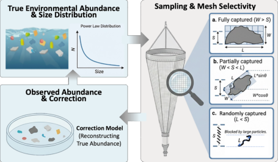

**[Image: Zhao_et_al._-_2026_-_Physically-based_mesh_selectivity_correction_model_for_standardized_microplastic_abundance_estimates.pdf-0001-22.png (455x266, 113.4KB)]**

## A R T I C L E I N F O 

_Keywords:_ Microplastics Abundance correction Mesh selectivity Standardization Probability distribution 

## A B S T R A C T 

Accurate quantification of microplastic (MP) abundance in aquatic environments is critical for understanding their ecological and health impacts. However, the reliability and comparability of reported MP concentrations are frequently undermined by methodological inconsistencies between studies, particularly differences in sampling mesh size and protocols. Conventional correction approaches, such as empirical or power-law based models, often fail to adequately capture the complex effects of mesh aperture, particle size, shape variability, and deformability on sampling outcomes, leading to persistent systematic underestimation and limiting cross-study integration. In this work, we develop a physically-based mesh selectivity correction model that mechanistically accounts for the probabilistic retention of MPs as a function of sampling setting, particle size, morphological heterogeneity, and deformation behavior in the effective size range of 10–5000 μm. By simulating the detailed capture process across a range of mesh sizes and particle properties, our model establishes a direct, physically interpretable link between environmental MP characteristics and their observed field abundances, thereby enabling reliable adjustment and standardization of MP abundance data obtained from diverse sampling protocols. Model validation against multiple published datasets demonstrates that our approach can increase the mean estimation accuracy by up to 70.6% and decrease the mean logarithmic error by 83.7%, which 

- Corresponding authors. 

- _E-mail addresses:_ bzhao@albany.edu (B. Zhao), fengqi.you@cornell.edu (F. You). 

https://doi.org/10.1016/j.watres.2026.125833 

Received 21 August 2025; Received in revised form 23 February 2026; Accepted 25 March 2026 Available online 26 March 2026 

0043-1354/© 2026 Elsevier Ltd. All rights are reserved, including those for text and data mining, AI training, and similar technologies. 

> _B. Zhao et al.                                                                                                                                                                                                                                    Water Research 299 (2026) 125833_ 

substantially reduces systematic underestimation compared to existing empirical and power-law corrections. By enabling rigorous correction and unification of MP data across studies, this framework advances the standardization and comparability of global MP monitoring efforts, supporting more accurate quantitative assessments and risk evaluations across diverse aquatic systems. 

## **1. Introduction** 

Microplastics (MPs) are small plastic particles with a diameter ranging from 1 μm to 5 mm (Arthur et al., 2009; Law and Thompson, 2014). Their ubiquitous presence in aquatic environments has raised significant environmental and health concerns, underpinning an urgent need for accurate quantification of MP abundance in global water bodies (Vethaak and Legler, 2021; Koelmans et al., 2022; Zhao et al., 2024). Over the past decade, intensive research efforts have been dedicated to global MP monitoring in aquatic environments, yielding a vast accumulation of field datasets and pivotal insights into their environmental distribution. Nevertheless, the reliability and comparability of these reported MP abundances remain severely hampered by substantial inconsistencies in sampling and analytical methods, leading to discrepancies of several orders of magnitude even within identical or co-located sampling sites (Fig. 1) (Zhao et al., 2024; Li et al., 2018; Stanton et al., 2020; Li et al., 2020; Rochman et al., 2017; Michida et al., 2019). 

Among these, a core source of uncertainty arises from the issue of mesh selectivity, which results from the use of varying sieve, net, or filter mesh sizes in widely adopted sampling techniques such as net trawling, pump filtration, and grab sampling (Tokai et al., 2021; Yu et al., 2025). These diverse mesh sizes introduce a pronounced selectivity bias: particles smaller than the nominal mesh aperture escape collection, and the retention of particles close to or above the cutoff depends not only on their sizes but also on their shapes, deformability, positions, and orientations during sampling. This selective loss is especially prominent for thin or deformable MPs, such as fibers, films, and foams, which may align with fluid flow or bend to pass through mesh openings considerably smaller than their longest dimensions (Zheng et al., 2021). Such systematic underestimation leads to severe inconsistencies in the reported abundances (Cai et al., 2020), which further hampers the inter-comparison of MP pollution levels across different studies and regions (Hidalgo-Ruz et al., 2012; Besley et al., 2017). 

To address these pervasive inconsistencies and reconcile disparate datasets, researchers have increasingly sought robust methodologies to 

correct reported abundances in existing studies. Current correction methodologies are predominantly empirical, relying on statistical or theoretical size distribution models to mathematically extrapolate observed data to account for missing fractions in undersampled size ranges (Kooi and Koelmans, 2019; Metz et al., 2020; Koelmans et al., 2020; Leusch et al., 2023; Xu and Gao, 2025). However, these empirical methods are fundamentally limited in several key respects. First, most existing frameworks focus primarily on the influence of the reported size range, typically assuming that particle size alone determines recovery efficiency. These approaches generally neglect the explicit physical mechanisms governing MP capture or loss at the mesh interface, particularly the critical roles played by particle shape and deformability. As a result, the effects of heterogeneous particle morphology and mechanical behavior are systematically overlooked during both sampling design and abundance correction, leading to persistent underestimation of, and bias against, certain MP types in abundance estimates. Additionally, most proposed correction models are often derived from specific sampling protocols or regional datasets, which lack rigorous validation using independent or in situ field data over broad spatial scales. As such, they lack the generality and extendibility needed for application to new sampling contexts, mesh sizes, or regions. 

In light of these critical limitations, and with the aim of maximizing the scientific utility of the vast monitoring data already generated, in this study, we developed and validated a physically-based mesh selectivity model for correcting MP abundance estimates in aquatic envi‑ ronments. Rather than proposing yet another site specific prediction formula for capture probability, our goal is to establish a mechanistic framework that explains why different sampling protocols can yield systematically different MP abundances, and to quantify to what extent these differences can be reconciled by explicitly accounting for mesh aperture, particle size, shape distribution, and deformation. Distinct from empirical or power-law correction approaches, this model embeds these controls in a unified probabilistic description of mesh selectivity, enabling both the quantification of the MP retention probability and the “back-calculation” of the true environmental abundance from observed field measurements. In this way, the framework serves primarily as a 

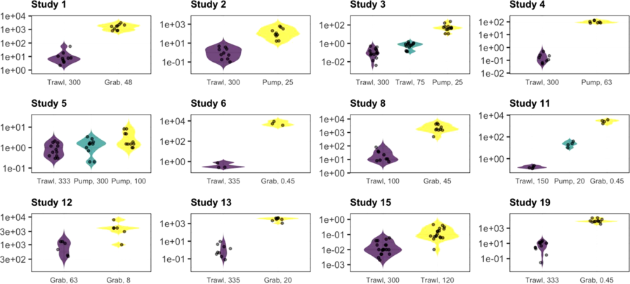

**[Image: Zhao_et_al._-_2026_-_Physically-based_mesh_selectivity_correction_model_for_standardized_microplastic_abundance_estimates.pdf-0002-08.png (897x404, 135.6KB)]**

**Fig. 1.** Distributions of MP abundance measured within identical or co-located sampling sites using different sampling methods and mesh sizes across selected studies. Each panel represents data from a single study and the sampling method and mesh size (μm) are indicated below each violin. The y-axis shows measured abundances on a log10 scale. More results can be found in the supporting information (SI), Fig. S1. 

2 

> _B. Zhao et al.                                                                                                                                                                                                                                    Water Research 299 (2026) 125833_ 

‑ tool for understanding and correcting protocol induced biases. By providing a physically interpretable bridge between environmental MP properties and sampling outcomes, the model helps reconcile methodology-induced discrepancies and unlock the full potential of existing global monitoring data, thereby ensuring that extensive research efforts translate into more reliable, high-fidelity scientific knowledge. 

The main contributions and novelties of this work are summarized as follows: 

- (1) We develop a physically-based mesh selectivity model that, for the first time, mechanistically quantifies the probabilistic retention of MP particles as a function of particle size, shape, and sampling device properties. By explicitly representing particlemesh geometry and orientation statistics, the framework provides a fundamental understanding of the MP capture process during sampling and explains why different sampling protocols can yield systematically different abundance estimates. 

- (2) Our framework establishes a transparent and mechanistic connection between observed field measurements and actual environmental MP abundance, enabling post‑hoc correction of mesh‑induced underestimation and harmonization of heterogeneous historical datasets. Within its calibrated domain, i.e., surface‑water MPs in the 10–5000 μm size range and sampling protocols that differ primarily in mesh/pore size, the model ‑ 

- provides a practical tool for reconciling method dependent biases ‑ 

- and for exploring trade offs in prospective sampling design. 

- (3) Through validation against multiple published field datasets with wide spatial coverage, we show that, in cases where sampling methods are comparable and differ mainly in mesh size, the proposed model generally outperforms existing empirical and power‑law‑based approaches, substantially reducing systematic ‑ 

- underestimation and improving cross method consistency. 

The remainder of the paper is organized as follows. Section 2 details the experimental datasets and the proposed modeling framework. Section 3 presents the results and performance evaluation of the correction model. Section 4 discusses the broader implications, limitations, and potential extensions of this work. Finally, Section 5 concludes the paper with a summary of key findings. 

## **2. Methods** 

## _2.1. Particle size distribution_ 

In general, the particle size distributions in aquatic environments are expected to show a power law distribution over the observed size range. This can be explained by the physical mechanism of fragmentation processes: as larger plastic debris is repeatedly broken down by physical, chemical, and biological forces, a cascade of breakage events ensues, resulting in a scale-invariant abundance of particles where smaller sizes vastly outnumber larger ones. This hierarchical process is well described by a power-law decay and has been repeatedly observed in empirical MP datasets, as evidenced by extensive previous studies (Kooi and Koelmans, 2019; Koelmans et al., 2020; Leusch et al., 2023; Song et al., 2014; Enders et al., 2015; Erni-Cassola et al., 2017; Cai et al., 2018). Although alternative distributions such as log-normal have been considered in some cases, these models mainly provide convenient statistical fits to datasets that are already affected by mesh-related truncation; they do not explicitly represent the physical fragmentation mechanisms that are thought to govern MP generation in the environment (Iwasaki et al., 2023; Aoki and Furue, 2021; Feng et al., 2025). 

Our methodology builds upon the foundational work of Kooi and Koelmans (Kooi and Koelmans, 2019; Koelmans et al., 2020), with key modifications to enhance applicability across heterogeneous datasets. Particle abundance data were extracted from published studies 

reporting counts or proportions of particles in surface water across defined size bins. For a study to be included, results had to be presented in ≥5 size bins in the MP size range ( _<_ 5 mm) to allow for enough data points and meaningful data fitting. In our study, a total of 1507 data points for 219 distinct water bodies/sampling periods were collected from 56 papers. After data preprocessing with the same pipeline used in Kooi and Koelmans, (Kooi and Koelmans, 2019; Koelmans et al., 2020) 852 effective data points for 137 distinct water bodies/sampling periods collected from 45 papers were used for the following data fitting. 

Following Kooi and Koelmans’ approach, we assumed MP fragmentation follows a power law distribution _fL_ ( _L_ ) expressed as: 

## _fL_ ( _L_ ) = _b_ ⋅ _L_[−] _[α] , Lmin_ ≤ _L_ ≤ 5000 

where _L_ is the particle size (μm) in its longest dimension and _fL_ ( _L_ ) is the probability density, _α_ as the scaling exponent, and _b_ is the normalization constant, _Lmin_ represents the effective lower bound for the size range. In this study, given that the common detection limit _L_ min of typical spectroscopic methods (e.g., Raman and FTIR) is on the order of 10 μm (Chen et al., 2020; Song et al., 2015; Anger et al., 2018; Cabernard et al., 2018), _Lmin_ is set as 10 μm to define the reliable application domain of the model. Our approach incorporated five critical improvements compared with Kooi and Koelmans’ approach: (1) First, we exclusively used data collected from surface water samples. This restriction is designed to minimize biases that may arise from pooling together samples across different environmental compartments (e.g., sediments, biota, or suspended particles in the water column), which are subject to distinct fragmentation mechanisms and transport dynamics. Integrating data from multiple matrices risks confounding the analysis due to matrix-specific processes such as density-driven settling or biological ingestion, which can alter the apparent size distribution and obscure the underlying fragmentation signature relevant to aquatic environments. (2) Second, we included only studies with mesh or pore sizes _<_ 50 μm. This explicit constraint addresses a major methodological bias, i.e., mesh selectivity, that is known to artificially truncate size distributions by systematically excluding small particles and most fibers from samples collected with coarser meshes. By focusing on data generated using finer mesh sizes, we reduce the likelihood of underestimating the abundance of small and deformable particles, and thus provide a more accurate reflection of the true environmental size spectrum. (3) Third, we adopted the geometric mean as a point estimate for bin width, in place of the arithmetic mean, to better capture the characteristics of polydisperse particle size distributions and reduce bias introduced by varying bin intervals across studies. (4) Fourth, abundances were normalized by bin width to correct for unequal interval effects, ensuring that the fitted size distribution is not distorted by inconsistent data reporting practices (Table S1) (Leusch et al., 2023). (5) Finally, we explicitly restricted the fitted power law to the empirically supported size domain. Given that the common detection limit _L_ min of typical spectroscopic methods (e.g., Raman and FTIR) is on the order of 10 μm (Chen et al., 2020; Song et al., 2015; Anger et al., 2018; Cabernard et al., 2018), we only apply the fitted size distribution over the range 10–5000 μm, and all subsequent use of this distribution in our correction model is confined to this interval. This restriction ensures that our conclusions on size distributions and abundance corrections are grounded solely in the size range that can be validated with current measurement techniques. This modified protocol maintained the theoretical foundation of Kooi and Koelmans’ power law framework while overcoming some potential limitations. More details for the justification and verification of the above model are listed in the supporting text S1. 

## _2.2. Particle shape distribution_ 

In this study, the shapes of MP particles are simplified as idealized three-dimensional regular shapes (e.g., ellipsoids, cylinders, or cuboids) and their distributions were characterized using continuous probability 

3 

> _B. Zhao et al.                                                                                                                                                                                                                                    Water Research 299 (2026) 125833_ 

distributions based on length-to-width-to-height ratios ( _L:W:H_ , where _L, W,_ and _H_ represent the longest, second longest and shortest dimensions of the particle), following the foundational framework of Kooi and Koelmans (Kooi and Koelmans, 2019; Koelmans et al., 2020) This approach circumvents the arbitrary boundaries of discrete shape classifications (i.e., fibers, fragments, pellets, films, foams (GESAMP, 2019)) by treating shape as a continuous variable. The adoption of idealized geometric shapes is primarily motivated by the need for computational tractability and consistency in probabilistic modeling, enabling a systematic integration of particle morphology into the mesh selectivity framework. 

In contrast to earlier approaches which relied on composite shape factors (i.e., the Corey Shape Factor), our method explicitly simulates each particle’s geometry as random variates based on its shape category. Specifically, for each simulated particle in each shape category, we assumed the longest dimension _L_ follows the power law distribution _fL_ ( _L_ ) identified in Section 2.1 for all shape categories from the effective size range of 10–5000 μm. Conditional on _L_ , we then draw an aspect ratio _R_ = _L_ : _W_ from a triangular distribution _fR_ ( _R_ ). For each shape category (fragments, films, foams, fibers, pellets), the minimum, maximum, and mode of this triangular distribution are taken directly from the continuous _L:W:H_ parametrization of Kooi and Koelmans (Kooi and Koelmans, 2019; Koelmans et al., 2020) (see Table S2 for more details), which synthesizes empirical data on environmental MP shapes. Under the assumption that _L_ and _R_ are independent within each shape class, this construction defines a joint probability density for ( _L,R_ ) as: 

## _fL,R_ ( _L, R_ ) = _fL_ ( _L_ ) _fR_ ( _R_ ) 

Width is then obtained as _W_ = _L/R_ , which implicitly defines a joint size-shape density _f_ ( _L, W_ ) via a standard change of variables. In practice, as most of the studies will only measure the longest dimension _L_ or Feret diameter, there is no need to estimate _W_ directly. Instead, _W_ is generated stochastically from these empirically constrained aspect‑ratio distributions, so that only _L_ and shape‑type abundances are required from existing datasets. 

In addition to the primary size-shape distributions, flexible particles such as fibers, films, and foams exhibit significant variability in their effective length due to bending and deformation during sampling, especially for fibers with high aspect ratios (i.e., slender and flexible particles). To realistically reflect this phenomenon, we introduce a probabilistic deformation model designed as a monotonic function of _L: W_ , where greater elongation increases the probability of deformation (Guo et al., 2011; Xiang and Kuznetsov, 2008). The deformation probability ( _Pdeform_ ) is described by an exponential function: 

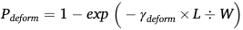

**[Image: Zhao_et_al._-_2026_-_Physically-based_mesh_selectivity_correction_model_for_standardized_microplastic_abundance_estimates.pdf-0004-06.png (267x34, 3.2KB)]**

where _γdeform_ is a parameter that tunes the sensitivity of deformation probability to the _L:W_ ratio. This expression ensures that longer, thinner fibers bend more frequently. This functional form is frequently used to describe the nonlinear and probabilistic buckling and stretching properties of fibers under turbulent flow conditions (Allende et al., 2018). If deformation occurs, the effective length is resampled as: 

## _Leff_ = _L_ × (1 − _β_ ) 

where _β_ is the deformation ratio sampled from a triangular distribution (see supporting text S2 for more details). By this mechanism, the model dynamically integrates shape variability and random deformation into the effective particle shape distribution during the sampling used for the mesh selectivity analysis. 

## _2.3. Mesh selectivity model for microplastic sampling_ 

To mechanistically represent the selective retention of MP particles by mesh-based samplers, a mesh selectivity model was developed. The 

model formalizes how the size and shape of an individual particle interact with a given mesh to determine capture probability during sampling. Specifically, as described in Section 2.2, each MP particle is characterized by its _L, W_ , and _H_ . Fragments and pellets are assumed to be rigid, non-deformable solids. Fibers, films, and foams are treated as deformable, flexible particles whose capturing length may be reduced by bending. In analyzing the mesh selectivity, the essential geometric factor governing whether a particle passes through or is captured by a mesh opening is its maximum projection normal to the mesh opening (Ludwick and Henderson, 1968). Owing to the principle of rotational invariance, any particle-mesh configuration can always be rotated together so that its projection through the mesh aligns with _L_ and _W_ dimensions. As such, the passage or capture outcome is determined not by the full three-dimensional shape of the particle, but by the maximum projection it can present in any orientation. This projection envelope is fully characterized by two characteristic dimensions, the particle length _L_ and width _W_ . Therefore, capturing the essential characteristics of particle-mesh interactions requires consideration of only these two dimensions. This projection-based description is consistent with classical studies of particle passage through mesh openings (Ludwick and Henderson, 1968). 

Conceptually, the capture or passage of an individual particle can be understood through the interaction process illustrated in Fig. 2. As a particle is transported by the surrounding flow toward a mesh opening of width _S_ , it eventually makes first contact with the mesh at a point along the edge (indicated by the red dots in Fig. 2). At this moment, the particle’s long axis _L_ forms an angle _θ_ with respect to the mesh normal, and the particle is free to rotate about the contact point under the action of the flow, tending toward the orientation that produces the larger hydrodynamic torque. For a given _θ_ and impact position, the critical quantity is the projection of the particle’s _L_ − _W_ envelope onto the direction perpendicular to the mesh opening. If this projected dimension exceeds the opening width _S_ , this means the particle necessarily extends beyond the mesh aperture and presses against the edge, leading to capture, as shown in Fig. 2a. In contrast, when the projected envelope remains smaller than _S_ , the particle can remain entirely within the opening over a range of orientations and contact positions, corresponding to successful passage through the mesh (Fig. 2b). Thus, the complex particle-mesh interaction reduces to a simple geometric comparison between the orientation-dependent projection of the _L_ − _W_ envelope and the mesh opening size _S_ . 

Based on this conceptual picture, the particle capture process is categorized into three scenarios (Fig. 3). For clarity, we define the geometric quantities used in the following expressions. _L_ denotes the longest dimension of the particle in its projected plane (i.e., the long axis), and _W_ denotes the second-longest projected dimension (i.e., the short axis). The particle centroid ( _O_ ) is located at the shortest normal distance _X_ from the nearest mesh edge, which defines the relative position of the particle with respect to the mesh. The angle _θ_ is defined as the angle between the particle’s long axis and the mesh normal in the projection plane ( _θ_ = 0[∘ ] means the long axis is perpendicular to the mesh edge and incident straight into the opening, whereas _θ_ = 90[∘ ] means the long axis is parallel to the mesh edge): 

- Fully captured: If _W_ exceeds the mesh size _S_ ( _W > S_ ), the particle’s projected short axis is already larger than the opening, and there is no possible orientation in which the particle can fit entirely within the aperture. In this case, the particle is physically unable to pass through the mesh and is always retained ( _Pc_ = 1). 

- Partially captured: If _W_ is less than _S_ , but _L_ is greater than _S_ ( _W_ 〈 _S and L_ 〉 _S_ ), the particle is, in principle, narrow enough to enter the opening along its short axis, but too long to always pass freely along its long axis. Whether it is captured or passes through, depending on its orientation ( _θ_ ) and the shortest distance from its centroid to the mesh edge ( _X_ ) upon contacting the mesh. Geometrically, we are interested in the maximum extent of the particle’s 

4 

> _B. Zhao et al.                                                                                                                                                                                                                                    Water Research 299 (2026) 125833_ 

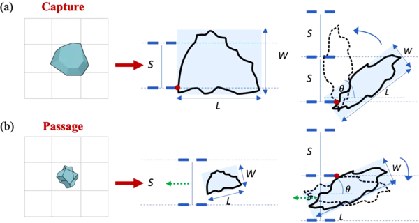

**[Image: Zhao_et_al._-_2026_-_Physically-based_mesh_selectivity_correction_model_for_standardized_microplastic_abundance_estimates.pdf-0005-01.png (600x320, 74.2KB)]**

‑ ‑ **Fig. 2.** Schematic of flow driven particle-mesh interactions and orientation dependent (a) capture versus (b) passage of particles. 

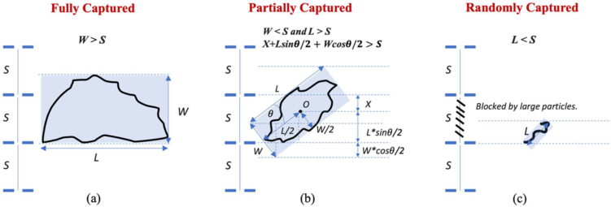

**[Image: Zhao_et_al._-_2026_-_Physically-based_mesh_selectivity_correction_model_for_standardized_microplastic_abundance_estimates.pdf-0005-03.png (751x255, 88.4KB)]**

**Fig. 3.** The mesh selectivity model under three scenarios (a) fully captured; (b) partially captured; (c) randomly captured. 

projection onto the direction normal to the mesh edge above its centroid ( _O_ ) on the corresponding mesh opening. Thus, for a given orientation _θ_ , the maximum distance from the centroid to the outermost point of the particle in the normal direction is 2 _L[sin][θ ]_[+] _W_ 2 _[cos][θ]_[, where ] _[L][/]_[2 and ] _[W][/]_[2 denote the distances from the centroid to ] the particle ends along the long and short axes, respectively. Adding the centroid-to-edge distance _X_ gives the total distance from the mesh edge to the furthest point of the particle along the normal, i.e., _X_ + 2 _L[sin][θ]_[ +] _W_ 2 _[cos][θ]_[. If this total distance is less than or equal to the ] mesh opening _S_ , the entire projected particle can be accommodated within the aperture and can pass through. If it exceeds _S_ , some part of the particle necessarily overlaps the mesh edge and the particle is captured. Therefore, the geometric condition for retention in the partially captured regime is: 

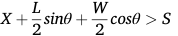

**[Image: Zhao_et_al._-_2026_-_Physically-based_mesh_selectivity_correction_model_for_standardized_microplastic_abundance_estimates.pdf-0005-06.png (178x36, 2.7KB)]**

Then, the capture probability can be further estimated by integrating this geometric condition over the joint distributions of _X_ and _θ_ , effectively averaging over possible impact positions within the opening and orientation states at contact. In this model, _X_ is assumed to follow a uniform distribution in the interval [0 _,S /_ 2], reflecting that, upon impact, the particle centroid is equally likely to lie anywhere within half of the opening width measured from the nearest edge. The distribution of _θ_ is determined by the sampling techniques which are characterized by the mesh size. For net trawling and pump sampling with a relatively larger mesh size ( _S >_ 10 _μ_ m), elongated particles are expected to experience a statistical bias toward alignment with the mean flow. This assumption is supported by a substantial body of experimental, numerical, and theoretical work on particles in shear and turbulent flows, which consistently 

reports preferential alignment of rod‑ and fiber‑like particles with the ‑ local flow or vorticity direction and with dominant strain rate eigenvectors (Calzavarini et al., 2020; Voth and Soldati, 2017; Nagy et al., 2023). These studies show that highly elongated particles spend a disproportionate amount of time with their long axis close to the ‑ streamline direction, especially in shear dominated regions. In our framework, we abstract this behavior into a compact statistical model by sampling _θ_ from a von Mises distribution described as below: 

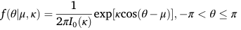

**[Image: Zhao_et_al._-_2026_-_Physically-based_mesh_selectivity_correction_model_for_standardized_microplastic_abundance_estimates.pdf-0005-09.png (343x43, 4.2KB)]**

where _μ_ is the mean direction which is set as zero in this study, _κ_ is the _κ_ concentration parameter reflecting the degree of alignment (higher corresponds to more pronounced alignment of particle orientations with the flow). In practice, higher _κ_ values are most relevant for net‑towing ‑ and pump sampling configurations with relatively large meshes, where clogging is less likely and, consequently, higher towing or pumping ‑ velocities are typically employed, enhancing flow induced alignment. _I_ 0( _κ_ ) is the modified Bessel function of the first kind of order zero, acting as the normalization constant. This reflects the physical reality that fluid flow can induce alignment of elongated particles with the streamlines, thereby increasing the likelihood that the longest dimension of the particle encounters the mesh at small inclination angles. For grab sampling which typically separates the MP particles through in-lab filtration through filters with smaller mesh/pore sizes ( _S_ ≤ 10 _μ_ m), orientations are considered isotropic and sampled uniformly over all possible angles. This construction follows directly from rigid-body projection geometry and is conceptually consistent with classical sieving models for nonspherical particles, where passage and retention probabilities are expressed as functions of particle shape, aperture size, and random impact position and orientation. The probability of capture in this scenario is then obtained by integrating the above geometric condition over 

5 

> _B. Zhao et al.                                                                                                                                                                                                                                    Water Research 299 (2026) 125833_ 

the joint distributions of _L, W, X_ , _θ_ , and _S_ , which is conceptually consistent with classical sieving models for non-spherical particles (Ludwick and Henderson, 1968). 

- Randomly captured: If _L_ is smaller than _S_ , the particle is smaller than the mesh opening in its longest dimension and would, under purely geometric considerations, be expected to pass through the mesh in almost all encounters. However, in practice, a small but nonzero probability of capture may be observed due to factors such as turbulent flow, particle aggregation, surface interactions, or blockage by larger particles (Cai et al., 2018; Gonzalez-Saldias et al., 2024). To account for this stochasticity, we propose two alternative probabilistic models based on different mechanistic assumptions: 

(1) Exponential Stochastic Model. This model is grounded in collision theory, assuming that the capture of small particles is a result of independent, random encounter events. The number of potential interception events follows a stochastic process where the expected number of contacts is proportional to the relative particle size _L /S_ . Here, _L /S_ is used as the governing variable because it is the simplest dimensionless measure of how “large” a particle appears relative to the aperture, and ‑ follows the classical geometrical similarity assumption used in mesh‑selectivity analysis (i.e., that retention depends primarily on the ratio between characteristic body size and mesh opening rather than on their absolute values) (Tokai et al., 2021): For particles much smaller than the opening ( _L_ **≪** _S_ ), the collision cross‑section and the probability of interacting with the mesh or with transient blockages increase approximately in proportion to _L_ , while the effective collision area of the aperture scales with _S_ . According to Poisson statistics, the probability of “not being captured” (zero interception events) decays exponentially (Yao et al., 1971) as the particle's relative dimensions increase: _Pescape_ ∝ exp( − _k_ ⋅ _L /S_ ). Consequently, the capture probability _Pc_ , representing the likelihood of at least one successful interception, is formulated as: 

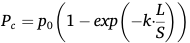

**[Image: Zhao_et_al._-_2026_-_Physically-based_mesh_selectivity_correction_model_for_standardized_microplastic_abundance_estimates.pdf-0006-04.png (190x43, 3.2KB)]**

Where _p_ 0 is the maximum random capture probability and _k_ is a rate parameter. 

(2) Logistic Retention Model. Alternatively, the capture process can be modeled using a Logistic function, a standard approach in fisheries science now widely adapted for assessing mesh selectivity in MP sampling (Tokai et al., 2021; Yu et al., 2025). This model describes the empirical retention probability _Pc_ as a function of particle length _l_ and mesh size _S_ : 

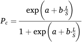

**[Image: Zhao_et_al._-_2026_-_Physically-based_mesh_selectivity_correction_model_for_standardized_microplastic_abundance_estimates.pdf-0006-07.png (167x86, 4.1KB)]**

where _a_ and _b_ are intercept and slope parameters determined from parallel‑towing experiments. This formulation follows Tokai et al․ (Tokai et al., 2021), who estimated _a_ = − 7 _._ 72 and _b_ = 3 _._ 67 from parallel-towing experiments with 1.00‑ and 0.333‑mm neuston nets and then applied Baranov’s geometrical similarity assumption to other mesh sizes. We use these published parameter values as an empirical alternative within our framework. While this model provides an excellent ‑ ‑ empirical fit for rigid, non string like plastic fragments in the size range of _L_ ≥ _S_ , Tokai et al. also emphasize, this empirical relationship is not ‑ valid for small and string like fragments, because their length-diameter relation and deformation behavior violate the underlying assumptions. ‑ In our framework, we therefore use this Tokai type logistic model only as a benchmark to demonstrate the effectiveness of the Exponential Stochastic Model. The comparison between these two models and the unsuitability of the Logistic Retention Model can be found in the SI (Fig. S2). 

In simple words, the three capture regimes can be interpreted as follows: 

- When _W > S_ : the particle is wider than the opening in its short dimension, so there is no orientation in which it can fit entirely within a single mesh aperture; such particles are always retained by the mesh. 

- When _W < S < L_ : the particle is narrow enough to enter the opening, but its long dimension exceeds the mesh size. Whether it is captured or passes depends on the instantaneous impact position of the centroid and the particle orientation at contact, so retention in this regime is intrinsically probabilistic and obtained by averaging the geometric condition over position and angle. 

- When _L < S_ : the particle is smaller than the opening even along its longest axis and would be expected to pass in almost all purely geometric encounters; any retention is attributed to stochastic processes such as transient blockage, aggregation, or turbulent interception and is therefore described by a separate random‑capture term. 

The overall capture probability for a particle with dimensions of _L_ and _W_ , and mesh size _S,_ can thus be expressed as: 

## _Pc_ ( _L,W,S_ ) 

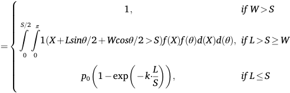

**[Image: Zhao_et_al._-_2026_-_Physically-based_mesh_selectivity_correction_model_for_standardized_microplastic_abundance_estimates.pdf-0006-15.png (492x159, 12.4KB)]**

For simplicity, the mesh is assumed to be regular and either circular or square, with the effective diameter ( _S_ ) taken as equivalent for both shapes and thus ignoring any minor differences between diagonal and side length in the case of square meshes. In our study, the effective mesh size ( _Seff_ ) is adjusted by a factor (i.e., 5% increase) to account for potential mesh widening or manufacturing tolerances. Hydrodynamic factors, particle aggregation, and physicochemical interactions with the mesh surface are not explicitly considered. This framework allows for a probabilistic estimation of the mesh selectivity curve as a function of both particle morphology and mesh aperture, and forms the mechanistic basis for subsequent integration of particle size and shape distributions into overall sampling efficiency calculations. The above assumptions enable a tractable yet physically meaningful estimation of mesh selectivity, facilitating the correction of sampling biases in field studies. 

## _2.4. Abundance correction model_ 

To quantitatively correct for the selective retention bias inherent in mesh-based sampling of MP particles, we implemented an abundance correction model that combines the mesh selectivity framework (Section 2.3) with the empirically or theoretically determined size and shape distributions of environmental MPs (Sections 2.1 and 2.2). 

In this approach, the observed abundance ( _Cobs_ ) is related to the true environmental abundance ( _Ctrue_ ) according to: _Cobs_ = _Ctrue_ × _E_ 

where _E_ is the overall sampling efficiency in the targeted size range, i.e., the expected probability that a particle from the environment will be captured and detected, given its size and shape: _E_ = _Pc_ ( _L, W_ ( _L, R_ ) _, S_ ) _fL_ ( _L_ ) _fR_ ( _R_ ) _dLdR_ ∫∫ 

where _Pc_ ( _L, W_ ( _L, R_ ) _, S_ ) is the mesh selectivity function as defined in 

6 

> _B. Zhao et al.                                                                                                                                                                                                                                    Water Research 299 (2026) 125833_ 

Section 2.3, _W_ ( _L, R_ ) = _L/R_ , _fL_ ( _L_ ) is the environmental size distribution, and _fR_ ( _R_ ) is the aspect‑ratio distribution per shape class as established in Sections 2.1 and 2.2. The integration is performed over the full environmental range of size and shape variables. 

To estimate the true environmental abundance, the observed value is 

rescaled by the reciprocal of the sampling efficiency: 

## _Cobs Ctrue_ = 

## _E_ 

In practice, this calculation was performed using Monte Carlo sampling from the empirically derived distributions of particle size and shape. The detailed abundance correction procedure is described in Table 1. 

All the non-fixed parameters in the framework, namely those con‑ trolling particle deformation and random capture processes, are calibrated against observational datasets. Specifically, we apply a ‑ grid search procedure over a physically plausible range. For each ‑ candidate parameter set, the Monte Carlo mesh selectivity model is run, and the resulting correction factors are evaluated in terms of how much they reduce discrepancies between sampling protocols. The selected parameter combinations are those that minimize loss functions between corrected and reference abundances. Conceptually, this procedure is analogous to supervised parameter tuning in machine learning, with the ‑ objective of minimizing residual inter protocol differences after correction rather than fitting a single experiment. In addition, a sensitivity analysis (see Fig. S3) shows that reasonable variations in the alignment and deformation parameters do not alter the main qualitative conclusions of the study, nor the relative performance of the proposed correction framework compared with existing empirical models. More details regarding the values and the source of all parameters in the mesh selectivity model can be found in Table S3. 

For each simulated particle, the final capture probability was determined according to the mesh selectivity model using the optimal 

**Table 1** 

Abundance correction procedure. 

|No.|Step Name|Description and Output|
|---|---|---|
|1|Observed Data|• Record total observed MP abundance|
||Collection|(particles/m³) • Record the observed fraction of each shape type (%) • Record the mesh size used during sampling (μm)|
|2|Monte Carlo|For each simulated particle in each particle type|
||Simulation|(in total 106times):|
|||• Simulate particle size (e.g., power law distribution with exponent_α_)|
|||• Simulate particle shape (aspect ratio), position,|
|||and orientation|
|||• Monte Carlo simulations for mesh selectivity|
|||effects|
|3|Estimate True Fractions|For each particle type:|
|||• Calculate the mean capture probability for each|
|||particle type based on the Monte Carlo|
|||Simulation|
|||• Use observed fraction and mean capture|
|||probability for each type to estimate true|
|||environmental fraction as:|
|||• True fraction=(Observed fraction) / (Mean|
|||capture probability) • Normalize to sum to 1|
|4|Correct Abundance|• Compute true abundance in the 10–5000μm|
||(10–5000μm)|range|
|||True abundance= sum(Observed abundance for|
|||each particle type / mean capture probability each|
|||particle type)|
|5|Sub-range Adjustment|• Using simulated particles and estimated true|
||(20–5000μm)|fractions, calculate fraction that fall in the|
|||20–5000μm range|
|||True abundance (20–5000μm)=True abundance|
|||(10–5000μm)× (proportion in 20–5000μm)|

parameters. The resulting efficiency factor was then calculated as the mean capture probability across all simulated particles. This framework corrects for both systematic underestimation due to mesh-size limitations and shape-related selectivity, providing a robust link between observed and true MP concentrations in the environment. 

## _2.5. Performance evaluation_ 

To assess the performance of our correction model, we adopted a standardized and robust evaluation procedure based on published MP datasets. Specifically, we required that, for any given sampling location, abundance measurements were available from at least two different sampling methods, with at least one employing a fine mesh size (≤20 μm). The measurements obtained using the smallest mesh size served as the “ground-truth” reference for each site. Model-corrected abundances derived from the coarser mesh methods were then quantitatively compared to these reference values. By selecting only data that met these criteria, we ensured that performance evaluation was based on realistic scenarios where direct cross-validation with high-resolution reference abundances was possible. 

To comprehensively evaluate the accuracy and robustness of the correction models, we selected a set of widely used statistical metrics, each offering unique insights into model performance. These metrics include Root Mean Square Error (RMSE), Mean Absolute Percentage Error (MAPE), Mean Logarithmic Error (MLE), mean Accuracy, and Jensen-Shannon (JS) divergence. RMSE measures the square root of the average squared prediction errors, serving as a strict indicator of overall deviation magnitude and being particularly sensitive to large discrepancies between estimated and reference values. MAPE, as the mean of absolute percentage errors, facilitates intuitive interpretation of the error relative to reference measurements, allowing direct comparison across datasets with differing abundance levels. MLE quantifies the mean logarithmic divergence between predicted and observed abundances, offering robustness against skewed distributions and emphasizing multiplicative rather than absolute differences, which is especially relevant when abundances span several orders of magnitude. Mean Accuracy reflects the overall bias tendency (under- or overestimation) by averaging the ratio of estimated to reference abundances, and serves as a simple yet informative metric for the practical effectiveness of correction approaches. In addition, to quantify how well the simulated size distributions reproduce the observed spectra, we use the ‑ JS divergence as a complementary distribution level metric, after normalizing the binned counts to obtain probability distributions over the common size bins. Collectively, these metrics provide a balanced and multi-dimensional assessment of both the precision and reliability of our model under realistic field sampling scenarios. 

RMSE: 

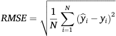

**[Image: Zhao_et_al._-_2026_-_Physically-based_mesh_selectivity_correction_model_for_standardized_microplastic_abundance_estimates.pdf-0007-17.png (195x61, 3.4KB)]**

MAPE: 

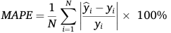

**[Image: Zhao_et_al._-_2026_-_Physically-based_mesh_selectivity_correction_model_for_standardized_microplastic_abundance_estimates.pdf-0007-19.png (243x47, 3.6KB)]**

MLE, applied after adding a small constant (1e-6 in our study) to avoid log(0): 

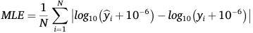

**[Image: Zhao_et_al._-_2026_-_Physically-based_mesh_selectivity_correction_model_for_standardized_microplastic_abundance_estimates.pdf-0007-21.png (359x47, 4.6KB)]**

Mean Accuracy (%): 

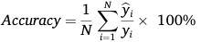

**[Image: Zhao_et_al._-_2026_-_Physically-based_mesh_selectivity_correction_model_for_standardized_microplastic_abundance_estimates.pdf-0007-23.png (220x47, 3.6KB)]**

7 

_Water Research 299 (2026) 125833_ 

> _B. Zhao et al.                                                                                                                                                                                                                                    Water Research_ 

JS divergence: 

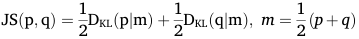

**[Image: Zhao_et_al._-_2026_-_Physically-based_mesh_selectivity_correction_model_for_standardized_microplastic_abundance_estimates.pdf-0008-03.png (359x39, 4.1KB)]**

where DKL is the Kullback-Leibler divergence. With this convention, JS(p _,_ q) ranges from 0 (identical distributions) to 1 (maximally different), and provides a compact quantitative measure of how closely the simulated and observed size spectra agree in overall shape. 

from Xu and Gao (Xu and Gao, 2025)). This discrepancy likely reflects methodological improvements in our protocol, such as restricting analysis to single environmental matrices (i.e., surface water) with fine mesh sizes ( _<_ 50 μm) and normalizing abundance by bin width to reduce biases due to heterogeneous size binning. These refinements highlight the necessity of standardized data treatment for meaningful cross-study synthesis of MP size distributions. 

## _3.2. Mesh selectivity curve and capture probability_ 

## **3. Results** 

## _3.1. Power-law exponent estimation of microplastic size distributions_ 

In this study, a total of 852 effective MP size data points from 45 distinct publications were analyzed, corresponding to 137 different water bodies or time periods. Each individual water body or time period was fitted with a power-law distribution, yielding its respective exponent ( _α_ ). To minimize the impact of any single publication on the overall analysis, given the variability in sampling strategies and size distributions across studies, we calculated the average _α_ value for each publication based on the different water bodies associated with it. 

> As shown in Fig. 4, the overall mean of the estimated _α_ values from the 45 studies is 1.50 with a standard deviation of 0.53 and a mean goodness of fit (R[2] ) of 0.87. After adjusting for the mesh selectivity, the 

> adjusted _αadjusted_ = 1 _._ 53. The normalized probability density function for the fitted power law distribution is shown as below: 

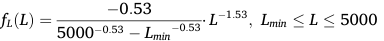

**[Image: Zhao_et_al._-_2026_-_Physically-based_mesh_selectivity_correction_model_for_standardized_microplastic_abundance_estimates.pdf-0008-11.png (384x41, 4.5KB)]**

Where _Lmin_ represents the effective lower bound for the size range. In this study, given that the common detection limit _L_ min of typical spectroscopic methods (e.g., Raman and FTIR) is on the order of 10 μm (Chen et al., 2020; Song et al., 2015; Anger et al., 2018; Cabernard et al., 2018), _Lmin_ is set as 10 μm to define the reliable application domain of the model. This result suggests that the MP distributions in surface water follow a general scaling law, with a higher relative abundance of smaller particles, a pattern consistent with theoretical expectations of fragKooi and mentation and reported findings in similar ecological contexts ( Koelmans, 2019; Koelmans et al., 2020; Leusch et al., 2023). Notably, the average exponent value obtained in this study ( _αadjusted_ = 1 _._ 53) is somewhat lower than those reported in previous research (i.e., _α_ = 1 _._ 6 from Kooi and Koelmans (Kooi and Koelmans, 2019; Koelmans et al., 2020), _α_ = 1 _._ 68 from Leusch et al. (Leusch et al., 2023), and _α_ = 2 _._ 33 

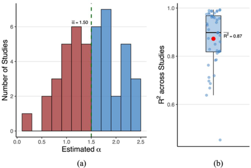

**[Image: Zhao_et_al._-_2026_-_Physically-based_mesh_selectivity_correction_model_for_standardized_microplastic_abundance_estimates.pdf-0008-13.png (501x336, 47.0KB)]**

**Fig. 4.** (a) Histogram of estimated power-law exponents (α) for MP size distributions from 45 published studies. The vertical dashed line indicates the overall mean α (1.50) across studies. (b) Boxplot of the R[2 ] values for the powerlaw fits, with the red dot marking the mean R² (0.87) from the 45 published studies. 

To quantify particle retention biases introduced by mesh-based sampling, we evaluated the mesh selectivity curves and capture probabilities for different MP particle types using a group of mesh sizes of typical sampling techniques. For each particle type, i.e., fragment, film/ foam, pellet, and fiber, the capture probability was calculated through the Monte Carlo simulation as a function of the particle’s longest dimension ( _L_ ), incorporating the modeled effects of particle shape and deformation (as described in Section 2.2). 

The results show significant differences in capture efficiency depending on both particle morphology and size. To clearly illustrate this, we present the selectivity curves for the 330 μm mesh (Fig. 5), a mesh size commonly used in surface water sampling through manta trawls. For compact particles such as fragments and pellets, especially pellets, which have a relatively small aspect ratio ( _L:W_ ) and limited deformability, the capture probability rises sharply as the longest dimension exceeds the mesh size. Specifically, for pellets (Fig. 5(e)), the capture efficiency increases rapidly after surpassing the mesh threshold, with over 50% of particles retained when their longest dimension reaches approximately 418 μm, and above 90% retained for sizes around 491 μm. The capture probability at the mesh size itself (330 μm) is very low (0.3%), underscoring the inefficiency of the mesh for sub-threshold particles. The selectivity curves for fragments and film/foam are broadly similar, yet films and foams, due to a moderate capacity for bending, tend to have a slightly broader transitional window and marginally lower capture probabilities in the size range just above the mesh size. For fragments (Fig. 5(a)), the median (50%) capture probability is reached at 608 μm, and at 90% efficiency levels, the required particle size is about 1057 μm. A greater proportion of fragment, film/foam particles are missed compared to pellets in the transitional size zone, with only gradual increases in the capture rate compared to the more abrupt rise observed for pellets. 

Fibers, due to their slender and flexible nature, demonstrate substantially lower capture efficiencies and a much more gradual increase in capture probability with length. Even at lengths substantially greater than the mesh size, some fibers are still able to pass through the mesh due to their high aspect ratio (resulting in relatively small diameters which smaller than the mesh aperture) and ability to bend and strong responsiveness to hydrodynamic forces. For fibers (Fig. 5(g)), the 10% and 50% capture probabilities are only reached at lengths of 1735 μm and 3870 μm, respectively, and the modeled maximum capture probability for the largest simulated fibers is still below 60%. This strikingly low collection efficiency for fibers highlights that conventional meshbased methods are particularly inadequate for quantifying elongated, flexible MPs. Such inefficiency means that environmental fiber concentrations are likely to be underestimated by orders of magnitude, leading to significant bias in MP pollution assessments. 

The area plots (Fig. 5(b), 5(d), 5(f), and 5(h)) of capture mode proportions show that, for all particle types, particles with lengths below the mesh size are “randomly captured”, with capture probabilities universally around 0.3%. As particle size exceeds the mesh threshold, pellets exhibit an abrupt transition: the proportion of particles that are “fully captured” rises steeply. In contrast, for fragments and films/ foams, this transition is more gradual, with a slightly broader window where “partially captured” outcomes are common. Fibers show the most distinctive pattern, with the “randomly captured” and “partially captured” modes dominating across a much wider size range due to 

8 

> _B. Zhao et al.                                                                                                                                                                                                                                    Water Research 299 (2026) 125833_ 

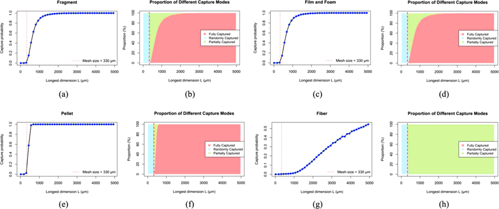

**[Image: Zhao_et_al._-_2026_-_Physically-based_mesh_selectivity_correction_model_for_standardized_microplastic_abundance_estimates.pdf-0009-01.png (972x408, 127.3KB)]**

**Fig. 5.** Mesh selectivity curve and proportion of different capture modes under the mesh size of 330 μm for fragment (a, b), film/foam (c, d), pellet (e, f), and fiber (g, h) through Monte Carlo simulation for 10[6 ] times. 

significant deformability, even at original lengths several times greater than the mesh size. 

Across all particle types, it is evident that particles with the longest dimensions below the mesh size are rarely captured. Those that are detected represent rare, stochastic events, with capture probabilities around 0.3%. This means that MP abundance and size distributions inferred from mesh-based samples are severely biased against smaller particles, especially when using larger mesh sizes. The mean capture probabilities for fragment, film/foam, pellet, and fiber at 330 μm mesh size are 7.93%, 7.89%, 10.55%, and 0.70% for the size range of 10 μm to 5000 μm and 11.59%, 11.52%, 15.44%, and 0.97% for the size range of 20 μm to 5000 μm, implying that field samples capture only a small fraction of the true particle population. To further elucidate the influence of mesh size on sampling bias, we extended the analysis to two finer mesh sizes commonly used in MP sampling for surface water: 20 μm (typical for pump sampling) and 0.45 μm (typical for grab sampling). As shown in Fig. S4 and Fig. S5, reducing the mesh size dramatically increases the overall capture probability for all particle types, significantly minimizing the probability of missing smaller MPs. For the 20 μm mesh, the selectivity curves for fragments, films/foams, and pellets rise steeply around the mesh threshold, with over 90% of these particles fully retained once their longest dimension slightly exceeds the mesh size. However, for fibers, even such a fine mesh still allows considerable passage of particles below ~100 μm in length. The mean capture probabilities for fragment, film/foam, pellet, and fiber at 20 μm mesh size are 53.00%, 52.21%, 60.54%, and 37.58% for the size range of 10 μm to 5000 μm and 77.56%, 76.43%, 88.66%, and 59.52% for the size range of 20 μm to 5000 μm, which are about 6 times higher than the capture efficiency with the 330 μm mesh size. With the 0.45 μm mesh, near-complete capture ( _>_ 98%) is achieved for all particle types except fiber (86.99%), effectively eliminating mesh-related sampling bias. The combined analysis underscores the necessity for both morphological and size-specific correction factors to enable accurate estimation of true environmental MP loads from field data, and illustrates the potential sampling loss at both the type and size spectrum that may otherwise go unnoticed. 

## _3.3. Mesh-captured size distributions_ 

To further characterize the effect of mesh selectivity on observed MP size distributions, we conducted a simulation combining all major particle types to reflect a typical environmental mixture. Specifically, capture probability curves for fragment, film/foam, pellet, and fiber were 

first established at a mesh size of 330 μm (i.e., Fig. 5). Using typical postcapture particle type proportions for 330 μm mesh size from our previous studies (fragments: 47.2%, films: 12.6%, foams: 6.0%, pellets: 11.5%, and fibers: 22.5%) (Zhao et al., 2024) and correcting these with our modeled selectivity functions, we inferred the actual environmental composition for each shape class (fragments: 12.5%, films: 3.4%, foams: 1.6%, pellets: 2.3%, and fibers: 80.2%). By applying the corresponding capture probabilities to this reconstructed mixture, we generated the overall capture probability curve and the resulting observed size distribution for the MP mixture. 

As illustrated in Fig. 6(a), the composite mesh selectivity curve closely resembles that of fibers (Fig. 5(g)), reflecting their dominant proportion in the environmental mixture. The overall capture efficiency is 2.1% for the size range of 10–5000 μm and 3.1% for the size range of 20–5000 μm. Notably, a substantial fraction of small MPs ( _<_ 1 mm) is missed during sampling, especially those at or below the mesh size threshold. The resulting size distribution of mesh-captured particles (Fig. 6(b)) exhibits a single pronounced peak, a pattern commonly observed in field studies, (Jiao et al., 2022; Li et al., 2021; Zhao et al., 2014; Wang et al., 2017; Dai et al., 2018; Xia et al., 2020) but which differs markedly from the underlying power-law distribution of true environmental MPs. This is primarily due to that, particles smaller than the mesh aperture are almost entirely absent from the collected dataset, with their occasional detection resulting primarily from rare, random capture events rather than systematic retention. This causes a pronounced deficit of small particles in observed data and often results in an artificial peak just above the mesh threshold, in contrast to the continuous decay of a true power-law. In contrast, the large-size tail of the observed distribution is dominated by particle types with higher retention efficiency, such as rigid fragments and pellets. While the contribution from fibers remains suppressed even at larger sizes, an outcome of their persistent escape from retention via bending and alignment mechanisms. This result explains why some studies have utilized log-normal rather than power-law functions to fit observed size distributions of MPs (Iwasaki et al., 2023; Aoki and Furue, 2021; Feng et al., 2025). While for the mesh size of 20 μm (Fig. 6(c) and (d)), the capture –5000 efficiency increases to 42.43% and 62.62% for the size range of 10 μm and 20–5000 μm. The overall selectivity curve becomes much steeper, with a rapid transition to high capture probabilities for particles just above the mesh threshold. This results in a size distribution of captured MPs that more closer to the power-law distribution. Compared to the 330 μm mesh, a significantly greater proportion of small MPs (including those tens to hundreds of micrometers in length) can be 

9 

> _B. Zhao et al.                                                                                                                                                                                                                                    Water Research 299 (2026) 125833_ 

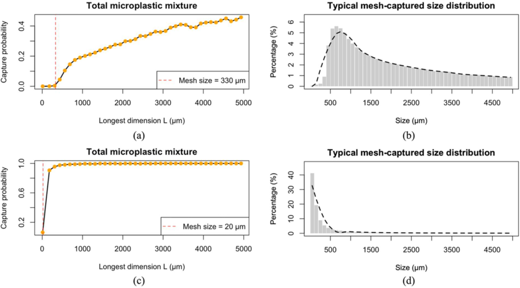

**[Image: Zhao_et_al._-_2026_-_Physically-based_mesh_selectivity_correction_model_for_standardized_microplastic_abundance_estimates.pdf-0010-01.png (876x485, 124.8KB)]**

**Fig. 6.** Mesh selectivity curve (a) (c) and mesh-captured size distribution (b) (d) for MP mixture under the mesh size of 330 and 20 μm. 

recovered. Overall, these findings highlight the significant bias introduced by mesh-based sampling, particularly when using large mesh sizes. The observed distributions are strongly shifted toward larger particles and display altered proportions of different particle shapes, with the underrepresentation of small, flexible, and elongated MPs being particularly pronounced. Such selective sampling not only distorts estimates of total abundance, but also misrepresents the true nature of MP pollution in the environment. Correcting for mesh selectivity is therefore essential for accurate assessment, especially for quantifying the prevalence of smaller and more deformable MPs. 

To evaluate the performance and validity of the proposed mesh selectivity model, we compared the modeled mesh-captured size distributions to measured field observations from two independent studies (Fig. 7). Through this comparison, we intend to test whether the model 

could reproduce the key structural features of mesh selectivity. In the first example from Tokai et al. (Tokai et al., 2021) with only a single shape category (i.e., fragment), both simulated Fig. 7(a) and observed Fig. 7(b) fragment size distributions are shown for samples collected with 0.333 mm and 1.00 mm mesh sizes. The simulated distribution accurately replicates the main features of the measured data: both show a left-skewed distribution with a peak abundance of fragments just above the respective mesh cutoff, and a rapid decline toward smaller sizes, in both simulation and empirical results, fragments below the mesh size are largely absent. Although there were still certain differences at the level of individual size bins (in practice, perfect agreement at the level of individual size bins is not achievable for any realistic ‑ simulation model, given event specific stochastic factors and measurement uncertainties), those key structural features, including the 

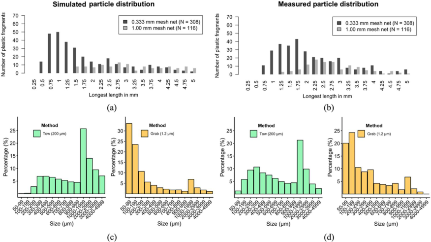

**[Image: Zhao_et_al._-_2026_-_Physically-based_mesh_selectivity_correction_model_for_standardized_microplastic_abundance_estimates.pdf-0010-06.png (876x491, 168.5KB)]**

**Fig. 7.** Simulated particle distribution (a) (c) and measured particle distribution (b) (d). (b) is reproduced from Tokai et al. (Tokai et al., 2021) and (d) is reproduced from Deakin et al. (Deakin et al., 2024). 

10 

> _B. Zhao et al.                                                                                                                                                                                                                                    Water Research 299 (2026) 125833_ 

difference in total counts between the two mesh sizes, as well as the overall shape of the distribution, are well captured by the model. This agreement indicates that the model effectively captures the essential effects of mesh size on retention probability and apparent size distributions for rigid fragments. 

simulation and observation suggests that mesh selectivity is the predominant driver of size distribution distortion in net-based MP surveys. 

## _3.4. Abundance correction and accuracy assessment_ 

In the second case from Deakin et al. (Deakin et al., 2024), our simulation approach was applied to two sampling strategies, net tow (200 μm) and grab sampling (1.2 μm), in a typical surface water environment for a mixture of all five MP categories. Fig. 7(c) displays the simulated mesh-captured size distributions for net tow and grab methods, respectively, while Fig. 7(d) shows the actual measured size distributions from the corresponding studies. Both the simulated and observed size distributions clearly illustrate the strong influence of sampling method and mesh size on the apparent MP spectrum. For the tow samples with a 200 μm mesh, both the simulation and field measurements show a pronounced absence of particles below the mesh size, with the distribution peaking just above the mesh threshold and displaying a secondary mode at larger particle sizes (this “fake” peak is due to the change of bin width). In contrast, grab samples with a much finer 1.2 μm pore are able to retain small particles, and both simulated and observed distributions in this category display a classic descending pattern typical of natural power-law-like fragmentation, with the majority of particles found in the smallest size bins. 

To validate the effectiveness and generalizability of our model, we compared our physically-based mesh selectivity model against two established correction methodologies from Kooi and Koelmans (Kooi and Koelmans, 2019; Koelmans et al., 2020) and Xu and Gao (Xu and Gao, 2025). All three methods were evaluated using the published data from existing studies. Dataset 1 is from Xu and Gao (Xu and Gao, 2025), Dataset 2 is from Covernton et al. (Covernton et al., 2019), and Dataset 3 is from Chae et al․ (Chae et al., 2015). For Dataset 1, we replaced the reference all-sized abundance (size range of 10–5000 μm) to the abundance in the size range of 50–5000 μm (was defined as the data with the 50 μm initial size) to reflect the practical detection threshold of common MP identification techniques (e.g., Raman and FTIR spectroscopy), whose reliable size cut-off is typically 20–50 μm, thereby minimizing impacts from the undercounting of the very smallest size classes (evidenced by the relative small number in the 10–50 μm size group). For Dataset 2 and 3, all sampling locations were sampled using two different sampling methods with different mesh sizes. We used the abundance collected from the methods with smaller mesh sizes (≤20 μm) as the reference, and applied our correction model to rescale the abundances measured with coarser meshes to the corresponding 20–5000 μm size range for comparison. It is important to note that these reference data should not be interpreted as the exact true abundances. The finer‑pore methods are themselves subject to measurement error and sampling variability, and the paired samples are not always perfectly co‑located in time and space; they are expected only to exhibit smaller systematic bias than the coarser methods. Consequently, our objective is not to achieve perfect agreement with each individual reference value, but to assess whether the correction systematically narrows the discrepancy between the two methods on average. 

To quantitatively measure the similarity between simulated and observed size spectra in Fig. 7, we computed the JS divergence between the corresponding binned probability distributions (Table 2). For the Tokai neuston‑net experiments, JS values of 0.0943 and 0.1029 for the 0.333‑ and 1.00‑mm nets indicate moderate differences at the bin level. For the Deakin et al. data, the grab samples (1.2 μm pore) exhibit a very small divergence (0.0385), consistent with the close visual agreement, whereas the tow samples (200 μm mesh) show a relatively larger but still reasonable divergence (0.2664), reflecting the more pronounced ‑ mismatch at small sizes which may be attributed to site specific heterogeneity. These results indicate that the simulated size spectra are reasonably close in overall shape to the measured distributions, with residual discrepancies concentrated in a few bins. 

As detailed in Table 3 and Table S4-S6, across all field sampling locations and initial sizes, our physically-based correction model outperformed both reference methods, achieving the lowest RMSE, MAPE (except on Dataset 2), MLE, and the highest mean Accuracy. For Dataset 1, correction factors were computed for each initial size (100, 200, and 300 μm) and applied to the observed abundances to yield corrected estimates within the 50–5000 μm size range. The mean accuracy achieved by our model is 82.1%, which is much higher than that from Kooi and Koelmans (62.8%, increased 19.3%) and Xu and Gao (11.4%, increased 70.6%) and the MLE is about 38.5% and 83.7% lower than that for the reference models. For different initial sizes, a smaller initial size will lead to a higher correction accuracy among all models. While, the differences among methods are largest for abundance estimates from 

In general, the simulation captures the overall trends and replicates key features such as the size-dependent left truncation in the tow samples and the more comprehensive recovery of small particles in grab ‑ sampling. In certain size bins, especially the smaller size range, the simulation tends to overestimate the abundance of particles compared to the measured field data. These differences can arise from several factors. First, natural environmental heterogeneity, including site-specific fragmentation patterns, polymer types, and local sources, may not be fully reflected in the generalized input distributions used for simulation. Second, the model assumes idealized particle shapes and does not account for irregular morphologies, aggregation, or the presence of biofilms that could affect particle retention by the mesh. Third, field sampling is subject to additional biases such as operator technique, losses during sample processing, and analytical limitations, all of which can influence the reported size spectrum independently of mesh selec‑ tivity, especially for the smaller size range. Finally, the model relies on previously reported particle proportions and parameter assumptions, which may not exactly match the true environmental conditions at the sites studied. Nevertheless, the similarity in the main features between 

**Table 3** 

Abundance correction performance from multiple models. 

| sampling is subject to additional biases such as operator technique, losses during sample processing, and analytical limitations, all of which can infuence the reported size spectrum independently of mesh selec- |**Table 3** Abundance correction performance from multiple models.|
|---|---|
|tivity, especially for the smaller‑size range. Finally, the model relies on previously reported particle proportions and parameter assumptions, which may not exactly match the true environmental conditions at the sites studied. Nevertheless, the similarity in the main features between **Table 2** Jensen-Shannon divergence (log2) between simulated and observed size distributions. Dataset Sampling method Mesh / pore size (μm) JS divergence Tokai et al. (Tokai et al., 2021) net tow 333 0.0943 net tow 1000 0.1029 Deakin et al. (Deakin et al., 2024) net tow 200 0.2664 grab sampling 1.2 0.0385|Dataset Models Accuracy (mean±SD) RMSE MAPE MLE|
||Dataset 1 (Xu and Gao, 2025) Kooi and Koelmans 62.77± 26.48 9918.36 37.23 0.26 Xu and Gao 11.41± 4.08 14,353.34 88.59 0.98 Our model **82.05± ** **29.15** **8616.53** **26.00** **0.16** Dataset 2 ( Covernton et al., 2019) Kooi and Koelmans 48.01± 49.20 3813.36 **64.21** 0.55 Xu and Gao 5.62± 5.76 4491.03 94.38 1.44 Our model **168.02± ** **174.90** **3228.25** 110.45 **0.37** Dataset 3 (Chae et al., 2015) Kooi and Koelmans 0.05± 0.05 2085.80 99.95 2.93 Xu and Gao 0.01± 0.01 2086.30 99.99 3.07 Our model **0.23± 0.22** **2083.52** **99.77** **2.59**|

11 

> _B. Zhao et al.                                                                                                                                                                                                                                    Water Research 299 (2026) 125833_ 

larger initial sizes. Different from the simplified power-law adjustments, which only consider the impacts from the different reported size ranges, the improved performance of our model can be attributed to its explicit handling of particle heterogeneity and mesh selectivity at the level of physical mechanism. Such a framework is better equipped to address biases introduced by the underrepresentation of small and deformable particles, particularly fibers, than models relying solely on abundance scaling via a global _α_ exponent. In addition, it needs to be noted that the accuracy of the model from Xu and Gao is much worse than that reported in their paper. This difference is mainly due to the change of the target size range, indicating the need for a more generalized and extendable modeling framework. 

For Dataset 2, the abundance correction results are generally consistent with the overall trend observed in Dataset 1. Our model delivers a mean accuracy of 168.0%, the lowest RMSE and MLE, and achieves comparable MAPE to the other methods. Notably, both the Koelmans and Xu and Gao methods tend to systematically underestimate the “true” abundance, as reflected by their mean accuracies of 48.0% and 5.6%, respectively. For Dataset 3, although our model still outperforms other models, none of these models provides reasonable correction results as indicated by the very low mean accuracy and persistently high relative error values. The primary reason for this discrepancy lies in the sampling methods selection. For Dataset 1 and 2, both the baseline and comparative abundances are derived from samples collected using the same field sampling method, differing only in mesh size. This methodological consistency minimizes extraneous variability, thereby allowing the correction models, particularly our physicallyinformed approach, to more effectively recover the true abundance across different mesh sizes. While for Dataset 3, there are significant differences between the baseline and comparative sampling methods (e. g., zooplankton trawl net towed by a vessel around the sampling station vs. plastic bucket and filtered through a hand net on-board). Such differences introduce substantial biases and additional uncertainty that cannot be fully addressed by abundance correction alone, regardless of the correction model employed. For instance, differences in sampled water volume, sampling depth, location of sample collection, and the degree of disturbance introduced during sampling (which may resuspend or selectively exclude certain particles) can all contribute to significant methodological and sampling biases. Thus, the dramatic discrepancies in Dataset 3 highlight that, in cases where sampling protocols differ fundamentally, methodological differences extend well beyond mesh selectivity. In such situations, other systematic biases dominate and cannot be remedied by mesh‑based corrections alone. 

## **4. Discussions** 

Despite these advancements, several limitations should be acknowledged. (1) First, the study relies on the data reported from published papers, which vary widely in methodological details, quality control, and reporting standards. Although efforts were made to standardize and guarantee the quality of the data, internal heterogeneity may still affect the accuracy of power-law exponent estimates and abundance correction. (2) Second, the size-distribution component of the framework is calibrated only over the empirically supported size domain (10–5000 μm) and should not be interpreted as a validated description of the abundance of sub‑10 μm particles. Field data at smaller size classes are currently insufficient to constrain the true sizeabundance relationship below the detection limits of common spectroscopic methods, so the present model does not provide quantitative estimates for 1–10 μm MPs. All correction factors and performance assessments reported in this study are therefore explicitly tied to the _>_ 10 μm range, and extrapolation beyond this domain should be regarded as exploratory rather than definitive. Future work will require targeted measurements at finer size resolutions to extend and rigorously validate the framework toward smaller particle sizes. (3) Third, MP particles are simplified as idealized three-dimensional regular shapes in this study. 

However, it should be acknowledged that real MP particles often exhibit irregular and complex shapes due to environmental weathering, aggregation, or non-uniform fragmentation processes. By excluding these morphological intricacies, our model may introduce some uncertainties in simulating mesh capture probabilities, particularly for highly nonconvex or distorted particles whose retention behavior could deviate from that predicted by regular shapes. Similarly, we also simplified the mesh structure itself, assuming regular and idealized mesh openings without explicitly considering mesh edge thickness or variations in pore geometry. This further abstraction may not capture the effects of edge width, irregularities, or manufacturing tolerances that influence the actual passage and retention of particles at the mesh interface. Nevertheless, these idealizations represent necessary trade-offs to enhance model generalizability and reproducibility. (4) Fourth, our mesh selectivity model focuses primarily on geometric and probabilistic mechanisms of particle retention, while neglecting potential influences from complex hydrodynamic interactions, particle aggregation, or physicochemical attractions to the mesh, especially under field conditions. In reality, turbulent flows or highly variable sampling velocities could induce alignment, reorientation, or forced passage of MP particles differing from the statistically sampled orientation distributions used in our model. Likewise, aggregation or entanglement of MPs may alter their effective size, flexibility, and likelihood of capture, leading to deviations from the retention probabilities predicted by models that assume independent, isolated particles. Neglecting these processes may limit the model’s applicability under conditions of high particle concentration, complex flow regimes, or environments with pronounced bio- or organic-fouling of the mesh. (5) Fifth, due to the limited availability of experimental data, certain parameters used in the probability distributions, such as those describing particle deformation or random capture, were specified based on subjective assumptions or indirect inference, which may introduce additional uncertainty into the model predictions. (6) Additionally, the model parameters governing particle deformation and mesh efficiency were based on current literature and typical observations, but may not fully represent the variation seen in different environmental matrices or MP types. (7) Finally, the lack of direct experimental validation limits the ability to quantitatively assess the absolute accuracy of the proposed correction factor in real-world settings. 

Meanwhile, although the present framework is formulated in probabilistic terms, it is grounded in explicit geometric and mechanical mechanisms: retention is determined by the projection of a particle’s long and short axes relative to the mesh aperture, by the distribution of impact positions and orientations, and by the propensity of different shape classes to deform under flow. In combination with continuous size-shape distributions, this structure clarifies why, for instance, compact pellets transition rapidly from almost complete passage to almost complete retention once their length exceeds the mesh size, ‑ whereas slender, flexible fibers remain strongly under sampled over a much broader size range. These mechanistic insights help explain why different sampling protocols, targeting different size ranges and mesh geometries, can yield markedly different pictures of the same underlying microplastic population. However, experimental selectivity models, such as those of Tokai et al., remain indispensable whenever system‑ specific calibration data are available, and they often provide the most precise estimates of capture probability for a given gear and particle category. Our contribution is complementary: the proposed framework generalizes the underlying physical logic of mesh selectivity across particle shapes, sizes, and mesh apertures, and translates this into abundance‑correction factors that can be applied to heterogeneous historical datasets. In this sense, the model is not primarily intended to replace dedicated experimental calibrations, but to provide a unified, mechanistically informed basis for comparing and correcting MP monitoring data across diverse sampling protocols and regions. 

Furthermore, it is important to emphasize that the abundance correction framework developed here is specifically designed to address 

12 

> _B. Zhao et al.                                                                                                                                                                                                                                    Water Research 299 (2026) 125833_ 

mesh selectivity effects, but does not account for the broader suite of potential biases introduced by the sampling methods themselves. Variations in sampling techniques, including the depth and duration of sampling, the volume and area sampled, the potential introduction of turbulence or disturbance during sample collection, and the specific operational procedures of various trawling or grab-sampling methods, can all impact the composition, concentration, and representativeness of the collected MP samples. These methodological differences between sampling protocols are not explicitly addressed by the present correction model, and thus, the corrections applied here should be interpreted as adjustments for selectivity bias based on particles that actually enter and interact with the mesh, rather than fully comprehensive corrections for all aspects of sampling variability. As a result, the estimated “true” abundances should be regarded as the most accurate possible reflection of the sampled population given mesh-based retention selectivity, but not necessarily the absolute environmental concentrations in all contexts. 

It is also important to note that the present study focuses exclusively on surface water environments. However, MPs are ubiquitous across a range of environmental matrices, including sediments, biota, soil, atmospheric deposition, and wastewater, each of which exhibits distinct sampling biases. While the current modeling framework was developed for surface water sampling, it has the potential to be extended or adapted to these other media. To do so effectively, certain matrixspecific adjustments and extensions would be required. For instance, the sampling procedures and pre-analytical processing steps (e.g., density separation for sediments, digestion for biota, air filtration methods) differ substantially between matrices and will affect both selectivity and analytical recoveries. Therefore, adapting the geometric-probabilistic framework proposed here would require the integration of matrixspecific physical models, adjustment of mesh or filter selectivity curves, and the incorporation of process-specific capture efficiencies. Such methodological extensions would support a more comprehensive and systematic evaluation of MP contamination across all relevant environmental compartments, ultimately improving the reliability of abundance estimates and allowing robust cross-media comparisons and integrated ecological risk assessments. Future work should focus on parameterizing and validating these extensions through targeted experimental studies in sediments, biota, and atmosphere, thereby enabling the wider applicability of the correction framework for global MP monitoring. 

Taken together, the proposed framework mechanistically links ‑ environmental MP properties to mesh based sampling outcomes, thereby providing a practical tool for correcting mesh‑induced underestimation and harmonizing abundance estimates across studies that use different sampling protocols. The model represents MPs using a power‑law size distribution and idealized, empirically constrained particle shapes, and describes particle-mesh interactions through a probabilistic, geometry‑based selectivity function. By explicitly accounting for particle size, shape, mesh size, and particle-mesh encounter in this way, the model helps reconcile heterogeneous monitoring datasets and supports more consistent quantitative assessments of MP pollution. The framework is most robust when applied to surface‑water MPs with sizes between 10 and 5000 μm. In practice, these elements make the approach particularly useful for harmonizing historical datasets collected with different mesh sizes and for exploring how alternative sampling designs affect the fraction of particles that can be recovered. 

Based on the current results, future work should seek to further implement more robust experimental validation and direct measurements. Laboratory and field experiments should be specifically designed to quantify mesh selectivity across diverse MP types and environmental conditions, under controlled variations of flow regime, mesh geometry, and particle composition. Such targeted measurements will enable more accurate determination and adjustment of key model parameters, reducing reliance on subjective or literature-derived assumptions, and substantially improving overall model robustness. In addition, 

extending the current framework to incorporate particle aggregation dynamics, biofouling effects, and interactions with organic/inorganic matter could further enhance the physical realism of abundance correction. The integration of high-throughput image analysis, machine learning for particle classification, and three-dimensional numerical simulation of particle-mesh interactions also represents a promising direction. Ultimately, these efforts will contribute to the establishment of standardized, globally applicable protocols for microplastic monitoring and quantitative ecological risk assessment. 

## **5. Conclusions** 

This study presents a mechanistically informed correction model for MP abundance correction that addresses the methodological inconsistencies caused by mesh selectivity and particle heterogeneity in environmental monitoring. By explicitly incorporating the size, shape, and deformability of MPs into a probabilistic framework of mesh selectivity, our model provides a robust and physically transparent foundation for harmonizing MP datasets collected using diverse sampling protocols and mesh sizes. Comprehensive comparisons using multiple published field datasets demonstrate that the proposed model consistently outperforms existing empirical and power-law-based correction approaches, with an increase of mean estimation accuracy by up to 70.6% and a decrease of mean logarithmic error by 83.7%. The results substantially reduced systematic underestimation and increased quantitative accuracy across a variety of environmental contexts. Our findings highlight both the necessity and practical feasibility of improving the comparability of MP monitoring data through physically based correction. Nevertheless, we also show that the ultimate effectiveness of any correction method is inherently limited by the standardization of sampling protocols. As such, standardized field protocols remain essential for global assessments, but our model offers a transparent and generalizable solution for retrospective data harmonization and cross-study integration where such consistency cannot be achieved. By bridging the gap between environmental MP properties and sampling outcomes, this framework advances the reliability of environmental risk assessment, supports regulatory harmonization, and encourages the adoption of physically grounded quantitative methods in the field of MP research. 

## **CRediT authorship contribution statement** 

**Bu Zhao:** Writing – review & editing, Writing – original draft, Visualization, Validation, Methodology, Investigation, Formal analysis, Data curation, Conceptualization. **Ruth E. Richardson:** Validation, Supervision, Project administration. **Yilin Huang:** Data curation. **Fengqi You:** Writing – review & editing, Supervision, Project administration, Conceptualization. 

## **Declaration of competing interest** 

The authors declare no conflict of interest. 

## **Acknowledgments** 

This project is partially supported by the Eric and Wendy Schmidt AI in Science Postdoctoral Fellowship to Cornell University, a Schmidt Sciences program. 

## **Supplementary materials** 

Supplementary material associated with this article can be found, in the online version, at doi:10.1016/j.watres.2026.125833. 

13 

_Water Research 299 (2026) 125833_ 

> _B. Zhao et al.                                                                                                                                                                                                                                    Water Research_ 

## **Data availability** 

The data presented in this study are available on request from the corresponding author. 

## **References** 

Allende, S., Henry, C., Bec, J., 2018. Stretching and buckling of small elastic fibers in turbulence. Phys. Rev. Lett. 121 (15), 154501. 

Anger, P.M., et al., 2018. Raman microspectroscopy as a tool for microplastic particle analysis. TrAC Trends Anal. Chem. 109, 214–226. 

Aoki, K., Furue, R., 2021. A model for the size distribution of marine microplastics: a statistical mechanics approach. PLoS One 16 (11), e0259781. Arthur, C., Baker, J.E., Bamford, H.A., 2009. In: Proceedings of the International Research Workshop on the Occurrence, Effects, and Fate of Microplastic Marine Debris, September 9-11, 2008. University of Washington Tacoma, Tacoma, WA, USA. 

Besley, A., et al., 2017. A standardized method for sampling and extraction methods for quantifying microplastics in beach sand. Mar. Pollut. Bull. 114 (1), 77–83. Cabernard, L., et al., 2018. Comparison of Raman and Fourier transform infrared spectroscopy for the quantification of microplastics in the aquatic environment. Env Sci Technol. 52 (22), 13279–13288. Cai, H., et al., 2020. Microplastic quantification affected by structure and pore size of filters. Chemosphere 257, 127198. 

Cai, M., et al., 2018. Lost but can't be neglected: huge quantities of small microplastics hide in the South China Sea. Sci. Total. Environ. 633, 1206–1216. Calzavarini, E., Jiang, L., Sun, C., 2020. Anisotropic particles in two-dimensional convective turbulence. Phys. Fluids 32 (2). 

Chae, D.-H., et al., 2015. Abundance and distribution characteristics of microplastics in surface seawaters of the Incheon/Kyeonggi coastal region. Arch. Environ. Contam. Toxicol. 69, 269–278. 

Chen, Y., et al., 2020. Identification and quantification of microplastics using fouriertransform infrared spectroscopy: current status and future prospects. Curr. Opin. Environ. Sci. Health 18, 14–19. 

Covernton, G.A., et al., 2019. Size and shape matter: a preliminary analysis of microplastic sampling technique in seawater studies with implications for ecological risk assessment. Sci. Total. Environ. 667, 124–132. 

Dai, Z., et al., 2018. Occurrence of microplastics in the water column and sediment in an inland sea affected by intensive anthropogenic activities. Environ. Pollut. 242, 1557–1565. 

Deakin, K., et al., 2024. Sea surface microplastics in the Galapagos: grab samples reveal high concentrations of particles _<_ 200 μm in size. Sci. Total. Environ. 923, 171428. Enders, K., et al., 2015. Abundance, size and polymer composition of marine microplastics≥ 10 μm in the Atlantic Ocean and their modelled vertical distribution. Mar. Pollut. Bull. 100 (1), 70–81. 

Erni-Cassola, G., et al., 2017. Lost, but found with Nile red: a novel method for detecting and quantifying small microplastics (1 mm to 20 μm) in environmental samples. Environ. Sci. Technol. 51 (23), 13641–13648. 

Feng, X., et al., 2025. Sub-sampling strategies for analysis of small ( _<_ 20 µm) microplastics in water. Water. Res., 123846 

GESAMP, G., 2019. Guidelines for the monitoring and assessment of plastic litter in the Gonzalez-Saldias, F., Sabater, F., Gomocean. GESAMP Rep. Stud. 99, 130`a, J., 2024. Microplastic distribution and their . abundance along rivers are determined by land uses and sediment granulometry. Sci. Total. Environ. 933, 173165. Guo, H.-F., et al., 2011. Effect of the geometric parameters on a flexible fiber motion in a tangentially injected divergent swirling tube flow. Int. J. Eng. Sci. 49 (10), 1033–1046. Hidalgo-Ruz, V., et al., 2012. Microplastics in the marine environment: a review of the methods used for identification and quantification. Environ. Sci. Technol. 46 (6), 3060–3075. 

Iwasaki, Y., et al., 2023. Estimating species sensitivity distributions for microplastics by quantitatively considering particle characteristics using a recently created ecotoxicity database. Microplastics Nanoplastics 3 (1), 21. 

Jiao, J., et al., 2022. Microplastics in surface waters and floodplain sediments of the Dagu River in the Jiaodong Peninsula. China J. Ocean Univ. China 21 (6), 1538–1548. Koelmans, A.A., et al., 2020. Solving the nonalignment of methods and approaches used in microplastic research to consistently characterize risk. Environ. Sci. Technol. 54 (19), 12307–12315. 

Koelmans, A.A., et al., 2022. Risk assessment of microplastic particles. Nat. Rev. Mater. 7 (2), 138–152. 

Kooi, M., Koelmans, A.A., 2019. Simplifying microplastic via continuous probability distributions for size, shape, and density. Environ. Sci. Technol. Lett. 6 (9), 551–557. Law, K.L., Thompson, R.C., 2014. Microplastics in the seas. Science 345 (6193), 144–145. 

Leusch, F.D., et al., 2023. Analysis of the literature shows a remarkably consistent relationship between size and abundance of microplastics across different environmental matrices. Environ. Pollut. 319, 120984. 

Li, C., Busquets, R., Campos, L.C., 2020. Assessment of microplastics in freshwater systems: a review. Sci. Total. Environ. 707, 135578. 

Li, J., et al., 2021. Distribution and characteristics of microplastics in the basin of Chishui River in Renhuai, China. Sci. Total. Environ. 773, 145591. 

Li, J., Liu, H., Chen, J.P., 2018. Microplastics in freshwater systems: a review on occurrence, environmental effects, and methods for microplastics detection. Water. Res. 137, 362–374. 

Ludwick, J.C., Henderson, P.L., 1968. Particle shape and inference of size from sieving. Sedimentology 11 (3–4), 197–235. 

Metz, T., Koch, M., Lenz, P., 2020. Quantification of microplastics: which parameters are essential for a reliable inter-study comparison? Mar. Pollut. Bull. 157, 111330. Michida, Y., et al., 2019. Guidelines for harmonizing ocean surface microplastic monitoring methods. Version 1 1. 

Nagy, V., et al., 2023. Flow of asymmetric elongated particles. J. Stat. Mech. Theory Exp. 2023 (11), 113201. 

Rochman, C.M., Regan, F., Thompson, R.C., 2017. On the harmonization of methods for measuring the occurrence, fate and effects of microplastics. Anal. Methods 9 (9), 1324–1325. 

Song, Y.K., et al., 2014. Large accumulation of micro-sized synthetic polymer particles in the sea surface microlayer. Environ. Sci. Technol. 48 (16), 9014–9021. Song, Y.K., et al., 2015. A comparison of microscopic and spectroscopic identification methods for analysis of microplastics in environmental samples. Mar. Pollut. Bull. 93 (1–2), 202–209. 

Stanton, T., et al., 2020. Freshwater microplastic concentrations vary through both space and time. Environ. Pollut. 263, 114481. 

Tokai, T., et al., 2021. Mesh selectivity of neuston nets for microplastics. Mar. Pollut. Bull. 165, 112111. 

Vethaak, A.D., Legler, J., 2021. Microplastics and human health. Science 371 (6530), 672–674. 

Voth, G.A., Soldati, A., 2017. Anisotropic particles in turbulence. Annu Rev. Fluid. Mech. 49 (1), 249–276. 

Wang, W., et al., 2017. Microplastics pollution in inland freshwaters of China: a case study in urban surface waters of Wuhan, China. Sci. Total. Environ. 575, 1369–1374. Xia, W., et al., 2020. Rainfall is a significant environmental factor of microplastic pollution in inland waters. Sci. Total. Environ. 732, 139065. Xiang, P., Kuznetsov, A., 2008. Simulation of shape dynamics of a long flexible fiber in a turbulent flow in the hydroentanglement process. Int Commun. Heat Mass Transf. 35 (5), 529–534. 

Xu, D., Gao, B., 2025. Recalculating national occurrence of microplastics in China’s freshwater. Cell Rep. Sustain. 2 (1). 

Yao, K.-M., Habibian, M.T., O'Melia, C.R., 1971. Water and waste water filtration. 

Concepts and applications. Environ. Sci. Technol. 5 (11), 1105–1112. 

Yu, M., et al., 2025. Size selection in sampling nets leads to underestimation of microplastic pollution. Environ. Pollut. 372, 126007. 

Zhao, B., Richardson, R.E., You, F., 2024. Microplastics monitoring in freshwater systems: a review of global efforts, knowledge gaps, and research priorities. J. Hazard. Mater., 135329 

Zhao, S., et al., 2014. Suspended microplastics in the surface water of the Yangtze Estuary System, China: first observations on occurrence, distribution. Mar. Pollut. Bull. 86 (1–2), 562–568. 

Zheng, Y., et al., 2021. Comparative study of three sampling methods for microplastics analysis in seawater. Sci. Total. Environ. 765, 144495. 

14 

---

## Extracted Images

| # | File | Dimensions | Size |
|---|------|------------|------|
| 1 | Zhao_et_al._-_2026_-_Physically-based_mesh_selectivity_correction_model_for_standardized_microplastic_abundance_estimates.pdf-0001-01.png | 125x136 | 22.4KB |
| 2 | Zhao_et_al._-_2026_-_Physically-based_mesh_selectivity_correction_model_for_standardized_microplastic_abundance_estimates.pdf-0001-05.png | 119x150 | 31.7KB |
| 3 | Zhao_et_al._-_2026_-_Physically-based_mesh_selectivity_correction_model_for_standardized_microplastic_abundance_estimates.pdf-0001-07.png | 60x60 | 2.7KB |
| 4 | Zhao_et_al._-_2026_-_Physically-based_mesh_selectivity_correction_model_for_standardized_microplastic_abundance_estimates.pdf-0001-09.png | 18x18 | 1.0KB |
| 5 | Zhao_et_al._-_2026_-_Physically-based_mesh_selectivity_correction_model_for_standardized_microplastic_abundance_estimates.pdf-0001-22.png | 455x266 | 113.4KB |
| 6 | Zhao_et_al._-_2026_-_Physically-based_mesh_selectivity_correction_model_for_standardized_microplastic_abundance_estimates.pdf-0002-08.png | 897x404 | 135.6KB |
| 7 | Zhao_et_al._-_2026_-_Physically-based_mesh_selectivity_correction_model_for_standardized_microplastic_abundance_estimates.pdf-0004-06.png | 267x34 | 3.2KB |
| 8 | Zhao_et_al._-_2026_-_Physically-based_mesh_selectivity_correction_model_for_standardized_microplastic_abundance_estimates.pdf-0005-01.png | 600x320 | 74.2KB |
| 9 | Zhao_et_al._-_2026_-_Physically-based_mesh_selectivity_correction_model_for_standardized_microplastic_abundance_estimates.pdf-0005-03.png | 751x255 | 88.4KB |
| 10 | Zhao_et_al._-_2026_-_Physically-based_mesh_selectivity_correction_model_for_standardized_microplastic_abundance_estimates.pdf-0005-06.png | 178x36 | 2.7KB |
| 11 | Zhao_et_al._-_2026_-_Physically-based_mesh_selectivity_correction_model_for_standardized_microplastic_abundance_estimates.pdf-0005-09.png | 343x43 | 4.2KB |
| 12 | Zhao_et_al._-_2026_-_Physically-based_mesh_selectivity_correction_model_for_standardized_microplastic_abundance_estimates.pdf-0006-04.png | 190x43 | 3.2KB |
| 13 | Zhao_et_al._-_2026_-_Physically-based_mesh_selectivity_correction_model_for_standardized_microplastic_abundance_estimates.pdf-0006-07.png | 167x86 | 4.1KB |
| 14 | Zhao_et_al._-_2026_-_Physically-based_mesh_selectivity_correction_model_for_standardized_microplastic_abundance_estimates.pdf-0006-15.png | 492x159 | 12.4KB |
| 15 | Zhao_et_al._-_2026_-_Physically-based_mesh_selectivity_correction_model_for_standardized_microplastic_abundance_estimates.pdf-0007-17.png | 195x61 | 3.4KB |
| 16 | Zhao_et_al._-_2026_-_Physically-based_mesh_selectivity_correction_model_for_standardized_microplastic_abundance_estimates.pdf-0007-19.png | 243x47 | 3.6KB |
| 17 | Zhao_et_al._-_2026_-_Physically-based_mesh_selectivity_correction_model_for_standardized_microplastic_abundance_estimates.pdf-0007-21.png | 359x47 | 4.6KB |
| 18 | Zhao_et_al._-_2026_-_Physically-based_mesh_selectivity_correction_model_for_standardized_microplastic_abundance_estimates.pdf-0007-23.png | 220x47 | 3.6KB |
| 19 | Zhao_et_al._-_2026_-_Physically-based_mesh_selectivity_correction_model_for_standardized_microplastic_abundance_estimates.pdf-0008-03.png | 359x39 | 4.1KB |
| 20 | Zhao_et_al._-_2026_-_Physically-based_mesh_selectivity_correction_model_for_standardized_microplastic_abundance_estimates.pdf-0008-11.png | 384x41 | 4.5KB |
| 21 | Zhao_et_al._-_2026_-_Physically-based_mesh_selectivity_correction_model_for_standardized_microplastic_abundance_estimates.pdf-0008-13.png | 501x336 | 47.0KB |
| 22 | Zhao_et_al._-_2026_-_Physically-based_mesh_selectivity_correction_model_for_standardized_microplastic_abundance_estimates.pdf-0009-01.png | 972x408 | 127.3KB |
| 23 | Zhao_et_al._-_2026_-_Physically-based_mesh_selectivity_correction_model_for_standardized_microplastic_abundance_estimates.pdf-0010-01.png | 876x485 | 124.8KB |
| 24 | Zhao_et_al._-_2026_-_Physically-based_mesh_selectivity_correction_model_for_standardized_microplastic_abundance_estimates.pdf-0010-06.png | 876x491 | 168.5KB |
