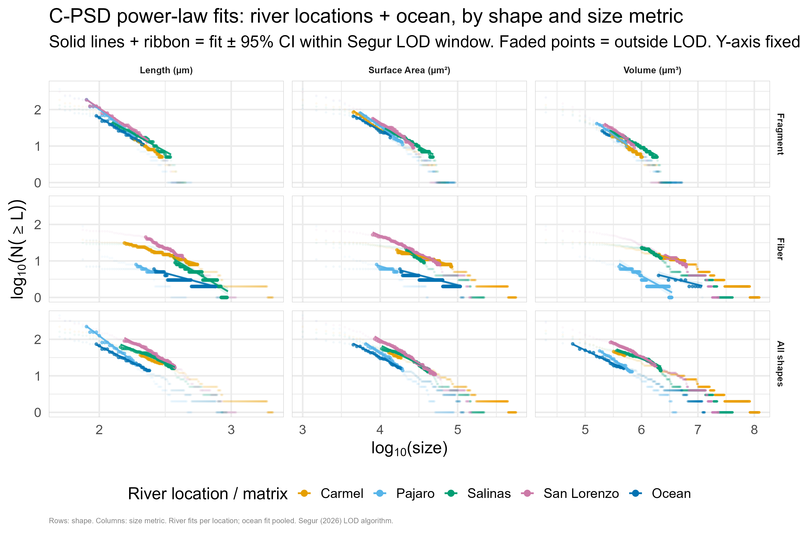
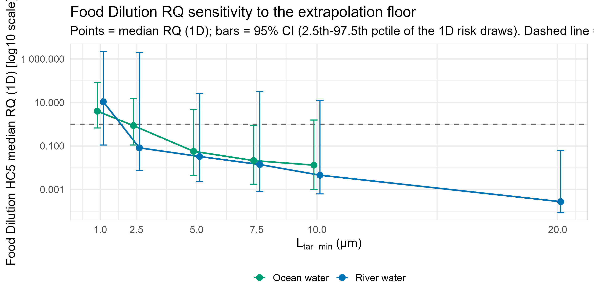

**Authors:** Scott Coffin¹\* \[co-authors to complete\]¹ Office of Environmental Health Hazard Assessment (OEHHA), California Environmental Protection Agency, Sacramento, CA, USA\* Corresponding author: <scott.coffin@oehha.ca.gov>

_Intended for_ Environmental Science & Technology _(Article / Policy Analysis)._

## Abstract

Probabilistic ecological risk assessment (ERA) of microplastics rescales size-limited monitoring data to a common 1-5000 µm range and compares it against species sensitivity distribution (SSD)-derived thresholds. We conducted a fully two-dimensional (2D) probabilistic ERA for four central California rivers (Carmel, Pajaro, Salinas, San Lorenzo) and adjacent coastal water. Cumulative particle size distributions (C-PSD) were fitted with the method of Segur et al. (2026) [1](file:11948#chars=529-736) - an implementation validated bit-identical to the authors' own reference code across all nine matrix × shape distributions (max |Δα| = 8.4×10⁻¹⁵) [1](file:11948#chars=529-736) - and exposure and hazard uncertainty were propagated through a Monte Carlo framework separating variability from uncertainty, with hazard thresholds derived from a probabilistic SSD (pSSD++) built on the ToMEx 2.0 database. At the field-standard 1 µm lower size floor, the food-dilution risk quotient (RQ) exceeds unity in both matrices (river median 2D RQ = 7.88, P(RQ>1) = 100%; ocean = 3.28, P(RQ>1) = 73.8%) [1](file:11948#chars=529-736), whereas tissue translocation remains below threshold (river RQ = 0.194; ocean RQ = 0.037) [1](file:11948#chars=529-736). This exceedance is **not robust**. It collapses below unity when the lower size floor is raised from 1 to 2.5 µm, and a formal decomposition shows it is generated by _which_ toxicity studies enter the SSD rather than by the extrapolation of exposure to unmeasured small particles: holding the study set fixed while rescaling exposure and hazard coherently leaves the river RQ at 0.636, and admitting sub-10 µm-tested studies collapses the food-dilution HC5 from ~1200 to ~68 particles/L to produce the exceedance. Because this ~68 particles/L HC5 reproduces the published field-standard value (Koelmans freshwater HC5 = 75.6 particles/L) [2](https://ftp.sccwrp.org/pub/download/DOCUMENTS/JournalArticles/1271_MicroplasticsRiskManagementFramework.pdf), the fragility is a property of the standard method, not of these sites. An independent two-segment (piecewise) exposure model, strongly favored by the data for river water, brings the river food-dilution RQ down to ~0.99 (ocean, where the two-segment preference is much weaker, falls only to ~1.39). We conclude that food-dilution threshold exceedance **cannot be excluded** but should not be reported as a robust finding of likely harm, and we offer the floor-sensitivity decomposition as a transferable diagnostic for microplastic ERA.

**Keywords:** microplastics; ecological risk assessment; species sensitivity distribution; particle size distribution; food dilution; probabilistic modeling; uncertainty

## Synopsis

A fully probabilistic microplastics risk assessment shows that the standard method's food-dilution exceedance is conditional on the assumed lower size floor and on mechanism-inconsistent toxicity-study inclusion, with implications for how the field derives and reports risk.

## 1\. Introduction

Microplastics are now ubiquitous in aquatic systems, and translating their measured occurrence into defensible ecological risk statements has become a central regulatory challenge. Two features of microplastics make this uniquely difficult. First, exposure is size-distributed across several orders of magnitude, yet monitoring quantifies particles only above a method-dependent lower size limit; in California and elsewhere, most microplastic surface-water monitoring data are based on particle sizes greater than 355 µm - the pore size of widely used manta trawl nets - even though toxicity is generally greater for smaller particles, and particles down to 1 µm are hypothesized to be exponentially more abundant than larger ones, so uncorrected monitoring data may not reflect true exposures [3](https://opc.ca.gov/wp-content/uploads/2026/02/Plastic-Strategy-Report-Public-Review-February-2026-508.pdf). Second, hazard is mechanism- and size-dependent, so a single concentration metric cannot capture toxicity across the size range.

The field-standard response, formalized by Koelmans et al. (2020), rescales measured concentrations to a default 1-5000 µm range using power-law correction factors and evaluates them against effect thresholds derived over the same 1-5000 µm range [4](https://pmc.ncbi.nlm.nih.gov/articles/PMC7547870/). Hazard is partitioned by two hypothesized mechanisms: food dilution, in which particles fill the gut and dilute nutritional intake, and tissue translocation, in which particles cross epithelial barriers and cause oxidative stress [5](https://cdnsciencepub.com/doi/10.1139/cjfas-2023-0023). These mechanisms are size-partitioned in a specific way - larger particles are more toxic at lower concentrations through food dilution (governed by ingestibility and gut volume), whereas smaller particles are more toxic at higher concentrations and are more likely to translocate [6](https://www.ecetoc.org/wp-content/uploads/2023/06/Current-research-initiatives-and-strategies-for-microplastic-management-in-California-Hampton-SCCWRP.pdf) - and are therefore aligned to different dose metrics: volume for food dilution and surface area for tissue translocation, rescaled to 1-5000 µm, with particles shorter than 83 µm most relevant to trigger translocation [7](https://microplastics.springeropen.com/articles/10.1186/s43591-022-00033-3). Applying this machinery, Mehinto et al. (2022) derived management thresholds for food dilution ranging from 0.3 to 34 particles/L and for tissue translocation from 60 to 4110 particles/L, adopting a freshwater food-dilution HC5 of 75.6 particles/L (95% CI 11-521) from Koelmans et al. and a marine HC5 of 33.3 particles/L from Everaert et al. [2](https://ftp.sccwrp.org/pub/download/DOCUMENTS/JournalArticles/1271_MicroplasticsRiskManagementFramework.pdf) The same framework has since been applied to the Laurentian Great Lakes [5](https://cdnsciencepub.com/doi/10.1139/cjfas-2023-0023) and to freshwater benthic ecosystems worldwide, where the conclusion was that risks cannot be excluded [8](https://research.wur.nl/en/publications/risk-assessment-of-microplastics-in-freshwater-benthic-ecosystems/).

Two coupled assumptions in this workflow are rarely tested. The rescaling extrapolates concentration far below the measurement floor, and its magnitude depends on the assumed lower bound. Simultaneously, the SSD's membership depends on that same bound, because studies conducted on very small particles become eligible as the floor is lowered - and small particles are disproportionately potent: HC5 estimates fall steeply with decreasing particle length, and fibers are roughly 100× more potent than spheres and fragments of the same length [9](https://microplastics.springeropen.com/articles/10.1186/s43591-023-00070-6). Whether the resulting risk signal reflects genuine exposure or an artifact of these coupled choices has not, to our knowledge, been disentangled on a real dataset.

Here we (i) conduct a fully probabilistic ERA for four central California rivers and adjacent coastal water; (ii) test the robustness of the resulting risk conclusion to the lower size floor; and (iii) introduce a decomposition that partitions the RQ's floor-dependence into exposure-extrapolation, hazard-alignment, and study-composition components. We use the new dataset as a demonstration case, but our central finding is methodological: the widely reported food-dilution exceedance is method-conditional in a way that has field-wide implications.

## 2\. Materials and Methods

The assessment is a fully reproducible R/Quarto workflow proceeding in five steps: (1) raw particle data to a power-law slope via C-PSD fitting (Segur et al. 2026); (2) probabilistic rescaling of monitoring concentrations by power-law integration with Monte Carlo slope-uncertainty propagation (Coffin et al. 2022); (3) an environmental exposure distribution (EED) by nonparametric bootstrap of corrected site concentrations; (4) hazard threshold distributions via probabilistic SSDs (pSSD++) using the PSSDplusplus R package and the ToMEx 2.0 database; and (5) risk characterization by Monte Carlo pairing of exposure and hazard, expressed as RQ = exposure/hazard and exceedance probability P(RQ>1) [1](file:11948#chars=529-736).

### 2.1 Study sites and monitoring data

Surface-water microplastics were characterized in four central California rivers - Carmel, Pajaro, Salinas, and San Lorenzo [1](file:11948#chars=529-736) - and in adjacent coastal (ocean) water analyzed with the same µFTIR workflow as river water [1](file:11948#chars=529-736). Monitoring concentration replicates comprised 217 subsurface and 253 surface river samples [1](file:11948#chars=529-736) and 85 ocean-water samples [1](file:11948#chars=529-736). Per-river support was adequate for independent analysis: 221, 451, 161, and 374 particles and 106, 114, 119, and 131 monitoring replicates for Carmel, Pajaro, Salinas, and San Lorenzo, respectively [1](file:11948#chars=529-736). Sediment ("beach sand") was retained only as an illustrative methods demonstration and excluded from the headline risk conclusion, because its exposure concentration is a per-liter water value with no dry-mass basis rather than a genuine particles/kg-dry-weight measurement [1](file:11948#chars=529-736); all results below concern surface water.

### 2.2 Particle characterization and detection floor

Particles retained from µFTIR imaging - after quality screening of the spectral match (confident library match, passing spectral-quality checks, and excluding non-plastic material classes such as mineral and organic matter) [1](file:11948#chars=529-736) - were classified by shape (fiber vs. fragment, with fibers defined by aspect ratio ≥ 3) [1](file:11948#chars=529-736). Each particle's spectral-library material-class string was then mapped, by case-insensitive pattern matching, to one of thirteen polymer density groups (e.g., polyethylene, polypropylene, styrenic polymers, PTFE, polyester/PET, polycarbonate, polyurethane, polyamide/acrylamide, acrylic polymers, vinyl polymers, halogenated vinyl polymers, silicone polymers, cellulose derivatives), each carrying a literature density value taken from Hidalgo-Ruz et al. (2012) Table 2 [1](file:11948#chars=529-736). Material-class strings matching none of these patterns retained the pipeline's legacy fixed default density of 1.10 g/cm³, previously applied uniformly to all particles [1](file:11948#chars=529-736). The resulting per-particle densities were used to classify each particle's buoyancy as buoyant, settling, or neutral relative to freshwater (1.00 g/cm³) and marine (1.025 g/cm³) reference densities, feeding the vertical-transport diagnostics of Section 4.4 [1](file:11948#chars=529-736). Only polypropylene and polyethylene were classified buoyant under both the freshwater and marine reference densities in this dataset, so "buoyant" was defined directly by these two polymer identities (PP + PE) rather than by selecting one of the two medium-specific buoyancy flags [1](file:11948#chars=529-736). We used these per-particle buoyancy assignments to test two hypotheses: whether ocean water is enriched in buoyant polymers relative to river water - which would support a surface-transport/retention explanation for the shallower ocean C-PSD slope (Section 3.2) rather than a source or fitting-window artifact - and whether river buoyant particles are relatively enriched at the surface versus the subsurface sampling stratum, consistent with local density-driven vertical sorting [1](file:11948#chars=529-736). The full thirteen-group polymer × matrix composition was tested by chi-square, or by Fisher's exact test (10,000 simulated replicates) where any expected cell count fell below 5; the focused buoyant-vs-non-buoyant × matrix comparison used a 2×2 chi-square test with Yates' continuity correction; and the river surface-vs-subsurface comparison used a one-sided two-proportion test (H1: surface fraction > subsurface fraction), falling back to a one-sided Fisher's exact test under the same small-expected-cell rule [1](file:11948#chars=529-736). Ocean water had no recorded depth stratum in this dataset and was analyzed as a single pooled group rather than assumed to be surface water [1](file:11948#chars=529-736). 

The µFTIR analysis used a ~4× objective with 25 µm pixel size, giving a practical minimum detectable particle size of ~50 µm (L_meas_min = 50 µm), a value already embedded in the correction-factor calculation [1](file:11948#chars=529-736); particles at or above 100 µm are reliably detected by this system [1](file:11948#chars=529-736). We did not apply an additional magnification-based scaling: although Wang et al. (2026) report that a 4× µFTIR objective detects only 3 ± 3% of particles relative to a 25× reference [1](file:11948#chars=529-736), applying that ×33 factor on top of the existing correction factor would double-count the same particle pool that the power-law extrapolation already reconstructs [1](file:11948#chars=529-736).

### 2.3 C-PSD fitting and validation

Length-based C-PSDs were fitted per matrix and shape using the C-PSD method, which fits N(≥L) versus L on a log-log scale using binned count data, removing the bin-width bias inherent in the classic bin-normalized (BN-PSD) approach (Segur et al. 2026) [1](file:11948#chars=529-736). The two-step LOD algorithm bins the measurements, computes both BN-PSD and C-PSD, performs global OLS to obtain normalized residuals, retains bins with positive residuals at or above the BN-PSD peak, exhaustively tests contiguous sub-windows of ≥3 bins, accepts windows with R² ≥ 0.90, selects the longest accepted window, and fits OLS to log₁₀ N(≥L) versus log₁₀ L, with the differential slope a = a_cpsd − 1 [1](file:11948#chars=529-736). We adopt C-PSD as the production method because Segur et al. (2026) show the BN-PSD method alone is insufficient to correct binning bias, whereas the cumulative C-PSD approach removes it and returns accuracy comparable to maximum-likelihood estimation (MLE) [1](file:11948#chars=529-736). We independently validated our implementation against the Segur et al. reference PSD_fit.py code by re-fitting all nine matrix × shape particle-length PSDs under both implementations and comparing the resulting slopes and LOD bin windows \[**Table S2; Appendix B**\]. We carry forward the two caveats the authors flag: the C-PSD right tail slumps where large particles are undercounted, and the method necessarily extrapolates below the measured range, requiring careful fitting-window selection [1](file:11948#chars=529-736).

In addition to the pooled per-matrix fits, we fit an independent C-PSD per named sampling location - the four rivers (Carmel, Pajaro, Salinas, San Lorenzo) and, because ocean-water samples were collected adjacent to each river's discharge and carry the same four location labels, the corresponding coastal subsets - each with its own two-step LOD window selection; locations with fewer than 10 particles, or for which the LOD algorithm could not converge, were excluded rather than reported as unstable estimates [1](file:11948#chars=529-736). To formally test whether these independently fitted location-level slopes differ by more than sampling error, we applied Cochran's Q heterogeneity test - the standard fixed-effect meta-analysis test for heterogeneity among independent estimates - inverse-variance-weighting each location's slope by the reciprocal of its squared standard error, with the test statistic Q referred to a χ² distribution on (k − 1) degrees of freedom (k = number of valid locations) and I² summarizing the percentage of total variation attributable to true heterogeneity rather than sampling error [1](file:11948#chars=529-736).

We benchmarked our fitted slopes against four external literature sources, selected to span the range of common microplastic PSD-characterization approaches rather than to comprehensively survey the field: (i) Wang et al. (2026), a directly comparable particle-by-particle µFTIR study of Dutch (Rhine/Meuse) river suspended solids, methodologically closest to the present workflow; (ii) Segur et al. (2026), the source of the C-PSD method itself, whose own paper reports literature-derived ocean and atmosphere reference slopes and compiles 81 previously published ocean/atmosphere particle-length PSDs into an open-access database (MPSizeBase); (iii) Kooi et al. (2021), whose freshwater/marine default slope values are embedded in the PSSDplusplus R package used elsewhere in this workflow for hazard alignment, representing the field's standard default assumption; and (iv) Zhao et al. (2026), a 45-study meta-analysis representing net-trawl/mesh-based sampling, methodologically the converse of the µFTIR approach used here. Each source's slope was taken as reported, without independent re-extraction or re-fitting from primary data, and converted to a common differential-slope convention (a_psd) for comparability, since some sources report the positive BN-PSD exponent α = |a_psd| rather than the signed C-PSD/differential slope [1](file:11948#chars=529-736). Values were obtained as follows: this study's own fits as described above; Wang et al. (2026) per-site slope means extracted directly from their published results (their Section 3.1.2); Segur et al.'s (2026) ocean and atmosphere reference slopes as reported in their own paper; Kooi et al.'s (2021) freshwater and marine defaults as embedded in `PSSDplusplus::param_default_values`, not independently re-derived here; and Zhao et al.'s (2026) pooled mean ± SD across 45 studies (mesh-adjusted and unadjusted), the only granularity their meta-analysis reports [1](file:11948#chars=529-736). For the fuller literature comparison shown in Figure S7, individual ocean PSDs were imported directly from Segur et al.'s (2026) own MPSizeBase supplementary workbook (SI 3, "Literature PSD data" sheet), which already reports one fitted differential-slope value per catalogued PSD; these values were extracted and fitted by Segur et al. from the 81 underlying primary studies their database compiles, not re-derived by us from those primary sources [1](file:11948#chars=529-736) \[**Table S4**\].

The decision to test a two-segment alternative was literature-motivated rather than post hoc. Hoffman et al. (2026) frame the observed PSD as a transport-filtered distribution and predict a size-dependent "critical size" - computed from a Stokes settling/rise-speed capture-fraction model, below which particles are progressively retained in the water column rather than settling out - at which transport can imprint an apparent break (dual-slope structure) on the PSD; for river water this theoretical critical size (~36 µm) falls inside the unconstrained 1-to-LOD sub-floor extrapolation zone rather than inside the measured fit window itself, directly motivating a test of whether a single extrapolated slope is appropriate across that zone [1](file:11948#chars=529-736). Independent field evidence further indicates single power laws can mis-extrapolate to small, unmeasured sizes: in the St Louis Estuary, a single power law extrapolated to 1.3-12 particles/L for 5-5000 µm while flow cytometry directly measured 600-1600 particles/L in the same system (Thomas et al. 2024), and Segur et al. (2026) find size-aligned 1-5000 µm concentrations average ~600× higher than values based on single-slope extrapolation [1](file:11948#chars=529-736). As a bounding sensitivity to the single-slope production fit motivated by this literature (Section 2.7c), we additionally fit a two-segment (piecewise) model to the same fitted C-PSD window rather than re-running window selection. For each candidate break point among the window's bin edges (requiring ≥3 bins on each side), we fit a segment-interaction OLS model regressing log₁₀ N(≥L) on log₁₀ L, segment membership (fine vs. coarse, split at the candidate break), and their interaction - allowing independent slopes above and below the break - and retained the break point minimizing AIC; the resulting piecewise fit was compared against the single-slope fit via ΔAIC = AIC_piecewise − AIC_single [1](file:11948#chars=529-736). Because this procedure operates on the bins already selected by the two-step LOD algorithm, it isolates the value of letting the slope change within the established fitting window rather than testing an independently selected window. For exposure rescaling under the piecewise model, the fine- and coarse-segment power laws were integrated separately, with the coarse segment's amplitude scaled to enforce continuity of dN/dL at the break point; size ranges straddling the break are split automatically between segments, and the correction factor reduces to the single-slope form when the full integration range falls on one side of the break [1](file:11948#chars=529-736).

### 2.4 Exposure rescaling and EED

Concentrations were rescaled by power-law integration: for a differential PSD dN/dL = k·L^a, the concentration in \[L₁, L₂\] is proportional to k/(a+1)·(L₂^(a+1) − L₁^(a+1)), and the correction factor is CF = N(L_target_min, L_target_max) / N(L_meas_min, L_meas_max), implemented as correction_factor() following Coffin et al. (2022) [1](file:11948#chars=529-736). The convention is guarded by a rendered worked example: Koelmans et al. (2020) report that rescaling a 30-2000 µm range to 1-5000 µm at a differential slope α = 1.6 gives CF = 8.32 (100 → 832 particles/L) [1](file:11948#chars=529-736), reproduced by the pipeline. The slope is treated as uncertain via a truncated-normal distribution, and following Hoffman et al. (2026), an explicit structural uncertainty of slope_structural_sd = 0.25 is added beyond the fit standard error, because transport can produce apparent dual-slope PSDs whose exponents differ by about two [1](file:11948#chars=529-736). Corrected concentrations were bootstrapped to an EED at the 1-5000 µm target range.

### 2.5 Hazard: pSSD++ / ToMEx 2.0

Hazard thresholds were derived with the pSSD++ implementation from quality-screened ToMEx 2.0 records aligned to both ERMs using bioaccessibility models and particle traits, filtered to remove bacteria, plants, and HONEC endpoints and to pass minimum technical and risk QC criteria (43 unique species × polymer × shape combinations for freshwater) [1](file:11948#chars=529-736), joined with a marine set of 493 records across 10 taxonomic groups [1](file:11948#chars=529-736). Each endpoint was aligned by Monte Carlo simulation: for food dilution, a volumetric dose is computed from particle volume and organism gut volume; for tissue translocation, particle flux to tissue is computed with a size-dependent model that includes only particles below the 500 µm translocation threshold [1](file:11948#chars=529-736), generated over x1M = 1 µm to x2D = 5000 µm with an upper tissue truncation limit of 500 µm [1](file:11948#chars=529-736). The resulting freshwater PNEC (HC5) distributions were median 68.5 particles/L (Q5 0.562, Q95 3570) for food dilution and 2960 particles/L for tissue translocation [1](file:11948#chars=529-736) \[**Figure S3; Table S3**\].

### 2.6 Risk characterization: MC1D and MC2D

Risk was characterized under two schemes. The one-dimensional (MC1D) scheme samples hazard and exposure jointly over 1000 draws [1](file:11948#chars=529-736). The two-dimensional (MC2D) scheme, which is our primary basis, separates uncertainty from variability: the outer loop samples uncertain parameters (a correction-factor draw and one hazard draw per ERM/HCx; n_uncertainty = 300), while the inner loop samples exposure variability from the observed monitoring concentrations (n_variability = 1000) [1](file:11948#chars=529-736). Consequently each outer iteration is one plausible "world" of uncertainty, within which the inner loop yields P_exceed, RQ_p50, RQ_p95, and RQ_p99; the distribution of these summaries across outer iterations quantifies uncertainty in the risk metrics, while the inner loop represents variability in exposure [1](file:11948#chars=529-736). This distinction explains why MC1D and MC2D can share an RQ median while reporting different exceedance probabilities: MC1D reports a pooled/marginal exceedance, whereas MC2D reports the distribution (median and 5th-95th percentiles) of the conditional exceedance probability.

### 2.7 Robustness analyses

We tested three robustness questions. (a) _Floor sensitivity:_ the lower target floor L_tar_min was varied across {1, 2.5, 5, 7.5, 10, 20} µm and the full pipeline re-run at each. (b) _Decomposition:_ because moving the floor simultaneously re-extrapolates exposure, shifts the SSD alignment range, and changes SSD membership, we froze study membership at a common ≥10 µm reference set and re-ran the pipeline in scenarios isolating each component, attributing the RQ change in log space. (c) _Model-form bounding:_ the two-segment (piecewise) C-PSD fit described in Section 2.3 was run as a labeled bounding sensitivity against the single-slope production model; a lognormal/MLE alternative was also examined for the sub-floor extrapolation (SI).

## 3\. Results

### 3.1 Particle characterization

Raw morphometry comprised 229 fibers (mean length 246 µm, range 75-2100 µm) and 978 fragments (mean length 98.9 µm, range 50-505 µm) in river water (n = 1207) [1](file:11948#chars=529-736), and 117 particles in ocean water [1](file:11948#chars=529-736). River particles were dominated by polyester/PET (n = 300), polypropylene (n = 212), polyamide/acrylamide (n = 205), and styrenic polymers (n = 164) [1](file:11948#chars=529-736) \[**Table S1**\]. Only 11 of 1207 river particles (0.9%) fell outside the thirteen matched polymer density groups and retained the fixed 1.10 g/cm³ fallback density [1](file:11948#chars=529-736).

### 3.2 Particle size distributions, slopes, and implementation validation

Pooled C-PSD fits were well-constrained for river water (all particles α_CPSD = −1.920 ± 0.035, 38 bins, LOD 165-385 µm, R² = 0.988; fragments −2.739 ± 0.038, 38 bins, R² = 0.993; fibers −1.671 ± 0.046, 44 bins, R² = 0.970) [1](file:11948#chars=529-736) and for ocean fragments and pooled particles (ocean all −1.765 ± 0.035, 18 bins, R² = 0.994; fragments −2.151 ± 0.042, 16 bins, R² = 0.995) [1](file:11948#chars=529-736), whereas the ocean fiber slope (−0.981 ± 0.099, only 5 bins, R² = 0.970) [1](file:11948#chars=529-736) is poorly constrained despite a per-bin fit quality comparable to the other shapes - with fewer than a third as many bins as any other matrix × shape fit, its standard error is roughly double that of the river fiber fit even though the two R² values match - and is excluded from headline inference \[**Table 1; Figure 1**\]. All fitted LOD windows fall entirely within the ≥100 µm range where particle detection is reliable (Section 2.2), so none of the headline slope fits rest on the less-reliable 50-100 µm size class. Consistent with fragmentation, fibers exhibit shallower slopes than fragments [1](file:11948#chars=529-736); a shallow measured fiber slope is also consistent with possible under-retention of fine fibers whose short axis can pass a nominal 50 µm pore, making observed fiber concentrations a minimum estimate [1](file:11948#chars=529-736). Slopes varied significantly among the four rivers (Carmel α_CPSD = −1.503 ± 0.074, 12 bins, R² = 0.977; Pajaro −2.711 ± 0.063, 16 bins, R² = 0.992; Salinas −1.493 ± 0.068, 27 bins, R² = 0.951; San Lorenzo −1.975 ± 0.050, 33 bins, R² = 0.980) [1](file:11948#chars=529-736): a Cochran's Q heterogeneity test across these four independently fitted location-level slopes rejected a common slope (Q(3) = 227.4, p = 5.1×10⁻⁴⁹, I² = 98.7%, inverse-variance-weighted mean α_CPSD = −1.97) [1](file:11948#chars=529-736) \[**Figure S1**\], driving by-river differences in exposure (Section 3.7). Because ocean-water samples in this dataset were collected adjacent to each river's discharge rather than at one generic offshore site, they carry the same four location labels, and the identical heterogeneity test could be run on the coastal data: three of the four coastal locations had enough particles for a valid fit (Pajaro n = 11, α_CPSD = −0.889 ± 0.079; Salinas n = 20, −1.585 ± 0.196; San Lorenzo n = 79, −1.701 ± 0.075; Carmel's n = 7 was too sparse for the two-step LOD algorithm to converge) [1](file:11948#chars=529-736), and these three showed significant heterogeneity as well (Q(2) = 57.3, p = 3.6×10⁻¹³, I² = 96.5%, weighted mean α_CPSD = −1.34) [1](file:11948#chars=529-736) \[**Figure S8**\]. Placed alongside published freshwater and marine particle-length PSD slopes, this study's river and ocean fits fall within the range spanned by the literature comparators \[**Figure S7**\].

Our river fragment (a_psd = −3.74) and all-shape (−2.92) slopes fall within the range Wang et al. (2026) report for Dutch river suspended solids measured by the same µFTIR method (−3.19 to −3.89, mean −3.65) [1](file:11948#chars=529-736) \[**Table S4**\], consistent with both datasets sharing a particle-by-particle µFTIR counting method. By contrast, our slopes are substantially steeper than the net-trawl/mesh-based global meta-analysis of Zhao et al. (2026; mean a_psd = −1.50) and the freshwater/marine defaults of Kooi et al. (2021; −2.64 and −2.07) [1](file:11948#chars=529-736), with Segur et al.'s (2026) own ocean and atmosphere reference slopes intermediate between the two groups (−2.66 and −2.55) [1](file:11948#chars=529-736). This pattern - steep µFTIR-derived slopes vs. shallower net-trawl/mesh-derived slopes - is consistent with a detection-method effect rather than a site-specific anomaly: coarser-mesh sampling systematically misses the numerically dominant small-particle fraction that finer-resolution µFTIR counting resolves, which would mechanically shift a fitted slope toward shallower (less negative) values regardless of the true underlying distribution [1](file:11948#chars=529-736).

As shown in @fig-cpsd, fitted C-PSD slopes differed by matrix and shape.

{#fig-cpsd width="6.5in"}

Our C-PSD implementation was independently validated as bit-identical to the Segur et al. (2026) reference PSD_fit.py code across all nine matrix × shape particle-length PSDs (max |Δa_cpsd| = 8.44×10⁻¹⁵, matching n_bins for all nine) [1](file:11948#chars=529-736) \[**Table S2; Appendix B**\].

### 3.3 Polymer buoyancy and matrix composition

Ocean water was enriched in buoyant polymers (polypropylene + polyethylene) relative to river water: 36.8% of ocean particles were buoyant (43/117, 95% CI 28.0-46.2%) versus 27.0% of river particles (326/1207, 95% CI 24.5-29.6%), a significant difference (χ² test with Yates' continuity correction, p = 0.033) [1](file:11948#chars=529-736). The full thirteen-group polymer × matrix composition test was not significant at that finer resolution (Fisher's exact test, simulated p = 0.085, minimum expected cell count 0.18) [1](file:11948#chars=529-736), so the significant result is specific to the buoyant/non-buoyant grouping rather than the full composition table. Because the freshwater and marine buoyancy flags agreed for 100% of particles - no polymer group in the Hidalgo-Ruz et al. (2012) lookup falls within the narrow freshwater-seawater density band (1.00-1.025 g/cm³) - this enrichment does not depend on which reference density was used [1](file:11948#chars=529-736).

Within river water, however, the buoyant fraction was numerically *higher* at the subsurface (31.6%, 160/507) than at the surface (23.7%, 166/700) - the opposite of the direction a local surface-accumulation mechanism would predict - and the one-sided test for surface enrichment was not significant (two-proportion test with continuity correction, p = 0.999) [1](file:11948#chars=529-736) \[**Figure S6**\]. Local density-driven vertical sorting by buoyancy is therefore not supported within this river dataset, even though buoyant polymers are relatively enriched in ocean water as a whole.

### 3.4 Exposure

The median river rescaling factor was 22,465× (90% CI 3,106-175,514), converting concentrations measured over 165-385 µm to 1-5000 µm [1](file:11948#chars=529-736), and 3,834× (90% CI 655-23,195) for ocean water [1](file:11948#chars=529-736). Bootstrap EEDs were 646.4 particles/L at the median (95th percentile 3,921.7) for river water [1](file:11948#chars=529-736) and 108.3 particles/L (95th percentile 184.1) for ocean water [1](file:11948#chars=529-736) \[**Table 2; Figure S2**\].

### 3.5 Hazard thresholds

Community HC5 thresholds at the 1 µm floor were 68.5 particles/L (food dilution) and 2960 particles/L (tissue translocation) for freshwater [1](file:11948#chars=529-736) and 24.8 particles/L (ocean food dilution) [1](file:11948#chars=529-736). The most sensitive species were Moina macrocopa (river food dilution, 9 species in the SSD), Ceriodaphnia dubia (river tissue translocation, 11 species), and Pseudechinus huttoni (ocean, 15-16 species) [1](file:11948#chars=529-736) \[**Figure 2; Table S3**\].

### 3.6 Headline risk characterization (1 µm floor)

Food dilution is risk-dominant and tissue translocation is below threshold in both matrices. Under MC1D, river food-dilution median RQ = 9.03 (P(RQ>1) = 82.2%) and tissue translocation = 0.226 (29.8%) [1](file:11948#chars=529-736), and ocean food-dilution RQ = 3.94 (91.9%) and tissue translocation = 0.039 (7.6%) [1](file:11948#chars=529-736). Under the primary MC2D framework, river food dilution = 7.88 (P(RQ>1) = 100%) and tissue translocation = 0.194 (20.1%); ocean food dilution = 3.28 (73.8%) and tissue translocation = 0.037 (7.8%) [1](file:11948#chars=529-736) \[**Table 3; Figure 3**\]. Outer-loop uncertainty is large: the river food-dilution MC2D exceedance probability ranges from a 5th percentile of 0.076 to a median of 1.0 [1](file:11948#chars=529-736).

### 3.7 By-river and individual-species screens

Exceedance tracked the fitted slope and correction factor across rivers, from Salinas (food-dilution RQ = 0.893, P = 0.475) and Carmel (2.876, 0.664) to San Lorenzo (11.694, 0.829) and Pajaro (68.150, 0.957) [1](file:11948#chars=529-736) \[**Figure S4**\]. An individual-species early-warning screen - read as a companion to, not a substitute for, the community-HC5 RQ, following Thuy-Dung et al. (2026), who show an individual-species RCR > 1 can precede a community-HC5 signal by roughly a decade [1](file:11948#chars=529-736) - showed the most sensitive river species below threshold (Moina macrocopa food-dilution RCR = 0.173; Ceriodaphnia dubia translocation RCR = 0.004), whereas the ocean's most sensitive species Pseudechinus huttoni exceeded for food dilution (RCR = 4.151, P_exceed = 1) [1](file:11948#chars=529-736) \[**Table 4**\].

### 3.8 The exceedance is not robust to the lower size floor

The food-dilution exceedance is a knife-edge on the size floor. Raising L_tar_min from 1 to 2.5 µm drops the river RQ below unity and it continues to fall: river median RQ (1D) = 9.403, 0.094, 0.053, 0.011, and 0.004 at 1, 2.5, 5, 7.5, and 10 µm; ocean = 4.058, 1.088, 0.070, 0.018, and 0.011 [1](file:11948#chars=529-736) \[**Figure 4; Table 5**\]. Counterintuitively, the HC5 jumps _upward_ as the floor rises off 1 µm: the river food-dilution HC5 median is 68.5 particles/L at a 1 µm floor but 1101.7 at 2.5 µm and 1319.4 at 10 µm [1](file:11948#chars=529-736). At the highest floors the marine SSD becomes data-limited - too few marine species remain to construct a food-dilution SSD at 20 µm, a genuine data-sparsity limit rather than a pipeline defect [1](file:11948#chars=529-736).

### 3.9 Decomposition: study inclusion, not extrapolation, creates the exceedance

Decomposing the river collapse between 1 and 10 µm isolates three multiplicative components: exposure extrapolation contributes an 80.5× fold-change, hazard-alignment range 2.0×, and study composition 14.8× [1](file:11948#chars=529-736). By raw magnitude, exposure extrapolation is the larger lever - but it does not determine the exceedance. When exposure and hazard are rescaled coherently to the same range while the study set is held fixed, the river food-dilution RQ at a 1 µm floor is only 0.636 (1D), with the HC5 remaining high at ~1205 particles/L; allowing the study set to open collapses the HC5 and raises the RQ to 9.403 [1](file:11948#chars=529-736). The exceedance is thus produced by admitting sub-10 µm-tested studies, which collapse the food-dilution HC5 from ~1200 to ~68 particles/L. This holds across risk statistics: under MC2D the fixed-study-set river RQ is 1.508 versus 12.383 when the set tracks the floor [1](file:11948#chars=529-736), an ~8× study-inclusion margin, and the ocean fixed-set RQ stays below 1 under both statistics \[**Figure 5; Table 6**\]. The tissue-translocation decomposition inherits a conservative caveat: the ≥10 µm composition freeze removes the small particles most relevant to translocation, so those diagnostics are a lower bound on translocation hazard, not a translocation risk estimate [1](file:11948#chars=529-736).

### 3.10 The fragility is a property of the standard method

The food-dilution HC5 that generates the exceedance, ~68.5 particles/L for river water [1](file:11948#chars=529-736), reproduces the field-standard value: Koelmans et al. (2020) derived an ingestible-volume, bioavailability-corrected food-dilution HC5 of 75.6 #/L (95% CI 11-521) over the 1-5000 µm range [4](https://pmc.ncbi.nlm.nih.gov/articles/PMC7547870/), the value Mehinto et al. (2022) adopt as the freshwater food-dilution threshold [2](https://ftp.sccwrp.org/pub/download/DOCUMENTS/JournalArticles/1271_MicroplasticsRiskManagementFramework.pdf). Because an independently constructed SSD lands on essentially the same HC5, the exceedance is what the standard 1-5000 µm alignment yields wherever exposure is rescaled to that range - the same machinery behind the Great Lakes exceedances.

### 3.11 Model-form bounding: the two-segment exposure model

The data favor a two-segment PSD over a single slope, but the strength of that preference and its downstream effect on RQ differ sharply by matrix [1](file:11948#chars=529-736) \[**Table 6; Figure S5; Figure S10**\]. For river water, the two-segment fit places its break at 225 µm - within the measured 165-385 µm fit window - with a shallow fine-size slope (α_cpsd = −1.441) and a markedly steeper coarse-size slope (−2.166), and a ΔAIC of −44.0 strongly favors the two-segment model over the single slope [1](file:11948#chars=529-736); the theoretical Hoffman et al. (2026) critical size (~36.2 µm) falls below this fit window, in the unconstrained 1 µm-to-LOD extrapolation zone rather than inside it [1](file:11948#chars=529-736). For ocean water the two-segment preference is much weaker: the break falls at 120 µm (within the 95-245 µm fit window), the fine- and coarse-size slopes are nearly parallel (−1.627 vs. −1.682), and the ΔAIC of −7.4 is roughly six-fold smaller in magnitude than river's, indicating far less evidence that a single ocean slope is misspecified; its critical size (~85.7 µm) likewise falls below the fit window.

Because the fine-size slope is shallower than the coarse-size slope in both matrices, the piecewise correction factor sits below the single-slope value in both, but the shrinkage tracks the strength of the break: for river water the correction factor falls from 22,465 (single-slope) to 2,403 (piecewise), a 9.3-fold reduction (piecewise/single ratio = 0.107), whereas for ocean water it falls only from 3,834 to 2,119, a 1.8-fold reduction (ratio = 0.553) [1](file:11948#chars=529-736) \[**Figure S9**\]. This propagates directly to risk: river food-dilution RQ (1D, HC5) drops from 9.301 (single-slope; P(RQ>1) = 80.5%, 95% CI 0.13-2047) to 0.988 under the piecewise model (P(RQ>1) = 49.9%, 95% CI 0.01-218), while ocean food-dilution RQ drops more modestly from 4.421 (P(RQ>1) = 92.0%, 95% CI 0.54-119) to 1.394 (P(RQ>1) = 63.1%, 95% CI 0.22-32.1) [1](file:11948#chars=529-736). Tissue translocation remains far below threshold under both models in both matrices: river 0.261 (single) vs. 0.021 (piecewise), P(RQ>1) 30.9% vs. 10.2%; ocean 0.035 (single) vs. 0.013 (piecewise), P(RQ>1) 0.7% vs. 0.5% [1](file:11948#chars=529-736). Sediment shows the same qualitative pattern - the strongest two-segment preference of the three matrices (ΔAIC = −70.9, break at 220 µm) and a comparable correction-factor reduction (ratio = 0.103) - but its RQ is not reported quantitatively here because its exposure concentration is not a genuine particles/kg-dry-weight value (Section 2.1) [1](file:11948#chars=529-736).

The direction of this sensitivity is not universal, however: independent field evidence suggests single power laws may _under_\-extrapolate small particles - in the St Louis Estuary a single power law extrapolated to 1.3-12 particles/L for 5-5000 µm while flow cytometry measured 600-1600 particles/L in the same system (Thomas et al. 2024), and Segur et al. (2026) find size-aligned 1-5000 µm concentrations average ~600× higher than single-slope extrapolated values [1](file:11948#chars=529-736). The sub-floor zone is therefore unconstrained in both directions, and the piecewise result is a labeled bounding sensitivity, not a replacement for the single-slope production correction factor [1](file:11948#chars=529-736).

## 4\. Discussion

### 4.1 What the numbers mean

Read at face value, the headline is that microplastics pose a likely food-dilution risk in these waters. The robustness analyses show this reading is unsafe. The exceedance depends on a single poorly constrained assumption - the 1 µm floor - and on a hazard-side step, admitting very small particles into a _volume_\-based food-dilution SSD, that is mechanistically questionable. The framework itself holds that food dilution is a large-particle, gut-volume mechanism and that small particles preferentially drive translocation, with translocation-relevant effects concentrated below 83 µm and aligned to surface area rather than volume [7](https://microplastics.springeropen.com/articles/10.1186/s43591-022-00033-3). Yet it is precisely the sub-10 µm studies - whose effects are more plausibly translocation- or oxidative-stress-mediated - that collapse the food-dilution HC5, consistent with the observation that chronic potency rises sharply as particle length decreases [9](https://microplastics.springeropen.com/articles/10.1186/s43591-023-00070-6). Their inclusion in a volume-aligned SSD may therefore mis-assign translocation-type potency to the food-dilution mechanism.

{#fig-floor-sensitivity width="6.5in"}

### 4.2 Can risk be claimed as "likely"?

We judge that it cannot, for food dilution as currently derived - but neither can it be dismissed. Against a robust claim: the exceedance evaporates by a 2.5 µm floor; a data-favored two-segment exposure model brings the river RQ to ~0.99, though the same model is only weakly favored for ocean water and leaves its RQ at ~1.39; it requires the contested study-inclusion step; the confidence intervals span orders of magnitude; and tissue translocation, the mechanism small particles actually favor, is below threshold throughout. In favor of caution: the small particles driving the signal are genuinely present and systematically undercounted near 50 µm, so exposure extrapolation is defensible and is in fact the larger raw lever, and field evidence indicates single power laws may under-extrapolate them (Thomas et al. 2024; Segur et al. 2026) [1](file:11948#chars=529-736); and under the field's own accepted HC5, the exceedance is real. The scientifically defensible register is therefore the one the field itself uses for microplastics - that risk **cannot be excluded** - rather than "likely," mirroring the benthic conclusion that risks to benthic communities cannot be excluded at current sediment concentrations worldwide [8](https://research.wur.nl/en/publications/risk-assessment-of-microplastics-in-freshwater-benthic-ecosystems/).

### 4.3 Contribution beyond a site-specific assessment

A fifth site-specific characterization would add little to a literature already spanning lakes, estuaries, and sediments. The contribution here is methodological and generalizable. (1) We provide a floor-sensitivity **decomposition** that partitions the RQ's dependence on the lower size floor into exposure-extrapolation, hazard-alignment, and study-composition components - a transferable diagnostic any size-rescaled SSD assessment can run to test whether its risk signal is robust or an artifact of coupled assumptions. (2) We demonstrate on real data that the food-dilution exceedance is study-inclusion-driven and reproduces the published field-standard HC5, elevating a local result into a structural observation about the method. (3) We implement a fully 2D probabilistic characterization with C-PSD fitting validated bit-identical to the Segur et al. (2026) reference implementation [1](file:11948#chars=529-736), separating variability from uncertainty so the fragility is visible rather than hidden inside a point estimate.

### 4.4 Additional structural uncertainties

Two further uncertainties bound the interpretation. First, transport can distort the observed PSD: size-dependent differential vertical transport (Hoffman et al. 2026) can produce apparent dual-slope PSDs whose exponents differ by about two [1](file:11948#chars=529-736), affecting absolute concentrations through the correction-factor exponent and comparisons when shape, depth, or buoyancy classes are pooled. In this dataset the effect did not overturn the headline: depth-stratified fits were broadly consistent (subsurface a_psd = −2.875 vs surface −2.805, food-dilution RQ ≈ 4.8 and 4.2) [1](file:11948#chars=529-736). Buoyancy gave a mixed picture (Section 3.3): local, within-river density-driven vertical sorting was not evident - the subsurface buoyant-polymer fraction (31.6%) was numerically higher, not lower, than the surface fraction (23.7%), the opposite of what surface accumulation would predict, and the one-sided test for surface enrichment was far from significant (p = 0.999) [1](file:11948#chars=529-736) - yet ocean water as a whole was significantly enriched in buoyant polymers relative to river water (36.8% vs 27.0%, p = 0.033) [1](file:11948#chars=529-736). These two results are not contradictory: they point to different spatial scales. A basin-scale sorting or retention process operating over the river-to-coast transition - plausibly relevant to why the ocean C-PSD slope is shallower than the river slope (Section 3.2) - is consistent with the data, whereas a local water-column stratification process within the river reaches sampled here is not. Second, fragmentation makes hazard time-dependent: as particles fragment into smaller, more bioaccessible sizes over time, HC5 values and risk ratios shift dynamically in accumulating compartments (Thuy-Dung et al. 2026), implying that the size-floor sensitivity documented here is also, implicitly, a temporal one.

### 4.5 Limitations

The µFTIR detection floor (~50 µm) means the sub-floor population is reconstructed, not measured, and the 50-100 µm class may be undercounted by 10-30% [1](file:11948#chars=529-736). The marine SSD is data-limited at larger floors, and the ocean fiber PSD is under-constrained. The correction-factor CIs span two to three orders of magnitude. Finally, the mechanism-misassignment argument is inferential: it follows from the framework's own size-mechanism logic and the steep length-potency relationship, but a definitive test would require re-deriving the food-dilution SSD with mechanism-consistent study inclusion (a direction we identify below).

## 5\. Environmental Implications

Microplastic risk assessments that rescale monitoring data to a common size range and compare it against SSD thresholds can produce food-dilution threshold exceedances that are conditional on the assumed lower size floor and on the inclusion of small-particle toxicity studies of contested mechanism. For central California surface waters, food-dilution exceedance cannot be excluded but is not a robust finding of likely harm, and tissue-translocation risk is consistently below threshold. Three implications follow. First, risk conclusions from size-rescaled SSDs should be accompanied by an explicit floor-sensitivity analysis, because the headline can invert across a defensible 1-2.5 µm change in a single assumption; the decomposition offered here makes that dependence auditable. Second, SSD construction should be mechanism-consistent - aligning sub-10 µm studies whose effects are plausibly translocation-mediated to a volume-based food-dilution SSD may over-state food-dilution hazard. Third, resolving the dominant uncertainty requires monitoring that resolves particles well below 50 µm, so that both the exposure extrapolation and the study-inclusion range are anchored in measurement rather than assumption. Until then, the most defensible statement is that microplastic risk to these communities cannot be excluded - a conclusion that supports precautionary monitoring and source control while the mechanistic basis of the thresholds is strengthened.

## Figures

• **Figure 1.** C-PSD power-law fits by matrix and shape (length metric), river and ocean water, with fitted LOD windows and slopes. _\[HTML: ocean_length_cpsd_plot, river equivalents; Key Findings Summary table; embedded as @fig-cpsd in Section 3.2.\]_

• **Figure 2.** Probabilistic species sensitivity distributions (pSSD++) for freshwater food dilution and tissue translocation, showing HC5 and its uncertainty. _\[HTML: arranged_plot_river, PNEC_plot_05_river, hazard_threshold_plot.\]_

• **Figure 3.** Headline risk characterization at the 1 µm floor: MC2D RQ distributions and P(RQ>1) for river and ocean water, food dilution vs tissue translocation. _\[HTML: rq_plot, ocean_rq_plot_1d, mc2d_pexceed_hist.\]_

• **Figure 4.** Food-dilution RQ sensitivity to the lower size floor (1-20 µm), river and ocean, with the RQ = 1 reference and HC5 overlay. _\[HTML: m12_plot.\]_

• **Figure 5.** Study-inclusion effect: MC vs Arm B (fixed ≥10 µm study set) RQ versus floor, faceted by compartment, with the paired study-inclusion effect panel. _\[HTML: m2_scenario_plot + decomposition m2_fig1; per Spec M2.1.\]_

## Supporting Information Figures/Tables

• **Table 1.** C-PSD slopes (α_CPSD ± SE, LOD, R²) by matrix and shape. _\[HTML: Key Findings Summary.\]_

• **Table 2.** Correction factors and bootstrap EED quantiles by matrix.

• **Table 3.** Headline RQ (MC1D and MC2D; river/ocean; food dilution/tissue translocation) with exceedance probabilities. _\[HTML: Results at a glance.\]_

• **Table 4.** Individual-species RCR vs community-HC5 RQ. _\[HTML: individual_species_rcr_tbl.\]_

• **Table 5.** Floor-sensitivity results (CF, EED, n species, HC5, RQ) at 1-20 µm. _\[HTML: m12_results.\]_

• **Table 6.** Decomposition fold-contributions (exposure-CF, hazard-alignment, composition) and single-slope vs piecewise bounding RQ. _\[HTML: m2_fold_summary, rq_bounding_tbl.\]_

• **Figure S1.** BN-PSD slope by river location and size metric. _\[HTML: cpsd_slopes_all_metrics_plot.\]_

• **Figure S2.** EED bootstrap distributions, river and ocean.

• **Figure S3.** PNEC distribution summaries.

• **Figure S4.** By-river food-dilution / tissue-translocation RQ. _\[HTML: river_risk_plot.\]_

• **Figure S5.** Single-slope vs piecewise bounding RQ by matrix and ERM. _\[HTML: rq_bounding_plot.\]_

• **Figure S6.** Buoyant-polymer (PP + PE) fraction by matrix and river depth stratum, with binomial 95% CIs. _\[HTML: m14_buoyant_plot; composition detail in m14_composition_plot, m14_depth_composition_plot.\]_

• **Figure S7.** Freshwater and marine particle-length PSD slopes (|a_psd|), this study vs. published literature: this study's river (freshwater) and ocean (marine) fits by shape (fragment/fiber/all) and by individual river site, compared against Wang et al. (2026, Rhine/Meuse µFTIR), Segur et al. (2026, ocean reference), Kooi et al. (2021, freshwater/marine defaults), Zhao et al. (2026, pooled global meta-analysis), and individual MPSizeBase literature-ocean PSDs. Sediment and literature-atmosphere values are excluded. _\[HTML: alpha_comparison_plot.\]_

• **Figure S8.** Power-law slope by ocean (coastal) location, using the same four river-mouth-adjacent site groupings (Carmel, Pajaro, Salinas, San Lorenzo) as the river-location comparison in Figure S1; Carmel's coastal subset (n = 7 particles) had too few particles for a valid fit and is omitted. _\[HTML: ocean_location_slope_plot.\]_

• **Figure S9.** Single-slope (production) vs. piecewise (bounding) correction factor by matrix (river, ocean, sediment); the exposure-side counterpart to Figure S5, isolating the correction-factor shrinkage itself rather than its downstream effect on RQ. _\[HTML: cf_bounding_plot.\]_

• **Figure S10.** Single-slope vs. two-segment (piecewise) C-PSD fits against the binned particle-length data, by matrix (river, sediment, ocean); same visual convention as Figure 1/`alpha_cpsh_plot` (faded points outside the fitted LOD window, dotted LOD-boundary lines, 95% CI ribbon), regression lines drawn on top of the points in a darkened matrix color, and a short dashed tick anchored to each matrix's own curve marking its selected piecewise break point. Length only; the underlying numeric fits (break point, segment slopes, ΔAIC) are reported in Section 3.11. _\[HTML: cpsd_single_vs_piecewise_plot.\]_

• **Table S1.** Polymer density-group composition. **Table S2.** C-PSD implementation validation vs Segur PSD_fit.py. **Table S3.** SSD species membership and most-sensitive-species EC values.

• **Table S4.** Power-law particle-length PSD slopes, this study vs. literature comparators (Wang et al. 2026, Segur et al. 2026, Kooi et al. 2021, Zhao et al. 2026), with reported sign convention and the converted differential a_psd value for each source. _\[HTML: lit_alpha_df / alpha-literature-comparison-table.\]_

• **Appendix B.** C-PSD implementation validation (bit-identical reconciliation). Reproducible R/Quarto code and helper functions (R/mp_risk_utils.R, R/cpsd_plotting.R, R/risk_plotting.R) accompany the SI.

_Author contributions, funding, and competing interests: \[to complete\]._

## References

1\. probabilistic_risk_characterization.html. Internal reference: file:11948#chars=529-736. Accessed 2026-07-30.

2\. Mehinto AC, Coffin S, Koelmans AA, Brander SM, Wagner M, Thornton Hampton LM, Burton AG, Miller E, Gouin T, Weisberg SB, Rochman CM. Risk-based management framework for microplastics in aquatic ecosystems. Micropl.&Nanopl. 2022;2(1). doi:10.1186/s43591-022-00033-3. \[Same article as ref. 7 below; cited in-text via the SCCWRP-hosted PDF: <https://ftp.sccwrp.org/pub/download/DOCUMENTS/JournalArticles/1271_MicroplasticsRiskManagementFramework.pdf>\]

3\. California Ocean Protection Council. Statewide Plastics Monitoring Strategy and Planning Framework (Public Review Draft). February 2026. Retrieved 2026-07-30, from <https://opc.ca.gov/wp-content/uploads/2026/02/Plastic-Strategy-Report-Public-Review-February-2026-508.pdf>

4\. Koelmans AA, Redondo-Hasselerharm PE, Mohamed Nor NH, Kooi M. Solving the Nonalignment of Methods and Approaches Used in Microplastic Research to Consistently Characterize Risk. Environ Sci Technol. 2020;54(19):12307-12315. doi:10.1021/acs.est.0c02982. PMID: 32885967.

5\. Hataley EK, McIlwraith HK, Roy D, Rochman CM. Towards a management strategy for microplastic pollution in the Laurentian Great Lakes-ecological risk assessment and management (part 2). Can. J. Fish. Aquat. Sci. 2023;80(10):1669-1678. doi:10.1139/cjfas-2023-0023.

6\. Thornton Hampton LM. Current research initiatives and strategies for microplastic management in California. Presented at: 2nd ICCA MARII Workshop (ECETOC); Seattle, WA; 2023. Retrieved 2026-07-30, from <https://www.ecetoc.org/wp-content/uploads/2023/06/Current-research-initiatives-and-strategies-for-microplastic-management-in-California-Hampton-SCCWRP.pdf>

7\. Mehinto AC, Coffin S, Koelmans AA, Brander SM, Wagner M, Thornton Hampton LM, Burton AG, Miller E, Gouin T, Weisberg SB, Rochman CM. Risk-based management framework for microplastics in aquatic ecosystems. Micropl.&Nanopl. 2022;2(1). doi:10.1186/s43591-022-00033-3.

8\. Redondo-Hasselerharm PE, Rico A, Koelmans AA. Risk assessment of microplastics in freshwater sediments guided by strict quality criteria and data alignment methods. J Hazard Mater. 2023;441:129814. doi:10.1016/j.jhazmat.2022.129814.

9\. Iwasaki Y, Takeshita KM, Ueda K, Naito W. Estimating species sensitivity distributions for microplastics by quantitatively considering particle characteristics using a recently created ecotoxicity database. Micropl.&Nanopl. 2023;3(1). doi:10.1186/s43591-023-00070-6.

10\. Segur T, Hough I, Dobiasova N, Voisin D, Richon C, Angot H, Thomas JL, Sonke JE. Using the power law size distribution to extrapolate and compare microplastic number and mass concentrations in environmental media. Micropl.&Nanopl. 2026;6:45. doi:10.1186/s43591-026-00205-5.

11\. Coffin S, Weisberg SB, Rochman C, Kooi M, Koelmans AA. Risk characterization of microplastics in San Francisco Bay, California. Micropl.&Nanopl. 2022;2:19. doi:10.1186/s43591-022-00037-z.

12\. Hidalgo-Ruz V, Gutow L, Thompson RC, Thiel M. Microplastics in the Marine Environment: A Review of the Methods Used for Identification and Quantification. Environ Sci Technol. 2012;46(6):3060-3075. doi:10.1021/es2031505.

13\. Hoffman MJ, DiBenedetto MH. How size-dependent settling can both bias and inform microplastics observations. Environ Res Commun. 2026;8(6). doi:10.1088/2515-7620/ae76df.

14\. Wang S, Mintenig SM, Wu J, Koelmans AA. Implications of method- and instrument-based size detection limits in µFTIR-based microplastic analysis. Talanta. 2026;296:128417. doi:10.1016/j.talanta.2025.128417.

15\. Thomas A, Marchand J, Schwoerer GD, Minor EC, Maurer-Jones MA. Size Distributions of Microplastics in the St Louis Estuary and Western Lake Superior. Environ Sci Technol. 2024;58(19):8480-8489. doi:10.1021/acs.est.3c10776.

16\. Everaert G, De Rijcke M, Lonneville B, Janssen CR, Backhaus T, Mees J, Van Sebille E, Koelmans AA, Catarino AI, Vandegehuchte MB. Risks of floating microplastic in the global ocean. Environ Pollut. 2020;267:115499. doi:10.1016/j.envpol.2020.115499.

17\. Nguyen T-D, Groenenberg JE, Koelmans AA. \[Article title could not be independently confirmed via web search at time of writing; author list, journal, year (open access, published 2026-07-04), and DOI are confirmed - please verify the title against the publisher page before submission\]. Micropl.&Nanopl. 2026. doi:10.1186/s43591-026-00210-8.

18\. Kooi M, Primpke S, Mintenig SM, Lorenz C, Gerdts G, Koelmans AA. Characterizing the multidimensionality of microplastics across environmental compartments. Water Res. 2021;202:117429. doi:10.1016/j.watres.2021.117429.

19\. Zhao B, Richardson RE, Huang Y, You F. Physically-Based Mesh Selectivity Correction Model for Standardized Microplastic Abundance Estimates in Aquatic Environment. Water Res. 2026;299:125833. doi:10.1016/j.watres.2026.125833.
